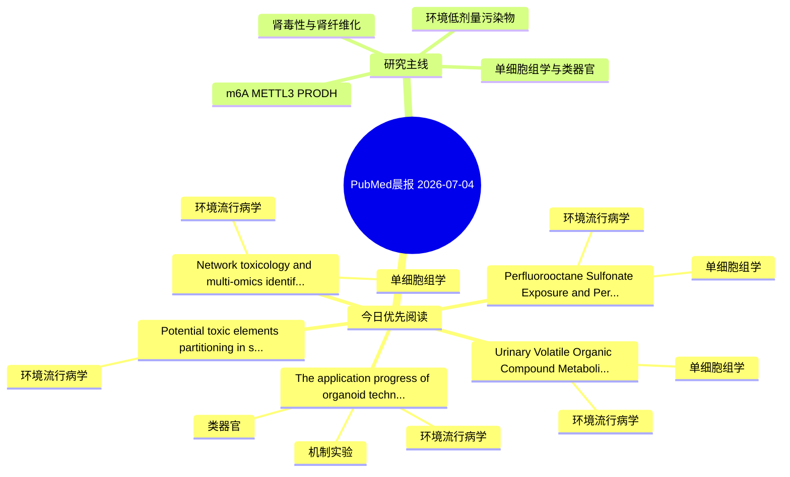

# PubMed 文献晨报｜2026-07-04

- 生成日期：2026-07-04 UTC
- 检索窗口：近 24 小时
- 高质量阈值：规则评分 ≥ 7
- 近 24 小时原始命中数：6

## 今日总体判断

今日筛选出 5 篇优先阅读文献，主要集中在：环境流行病学、单细胞组学、机制实验。

## 今日最值得读的 5 篇文章

### 1. Urinary Volatile Organic Compound Metabolites and Depressive Symptoms Among U.S. Adults With Cardiovascular-Kidney-Metabolic Syndrome Stages 0-3: NHANES-Based Associations and In Silico Multi-Omics Insights.

- 题目：Urinary Volatile Organic Compound Metabolites and Depressive Symptoms Among U.S. Adults With Cardiovascular-Kidney-Metabolic Syndrome Stages 0-3: NHANES-Based Associations and In Silico Multi-Omics Insights.
- 期刊：Neurotoxicology
- 年份：2026
- PMID：[42398862](https://pubmed.ncbi.nlm.nih.gov/42398862/)
- DOI：[10.1016/j.neuro.2026.103508](https://doi.org/10.1016/j.neuro.2026.103508)
- 分类：环境流行病学、单细胞组学
- 规则评分：18
- 研究对象：人群/队列或环境暴露人群
- 核心方法：环境流行病学/队列或人群数据；单细胞或空间组学
- 主要发现：摘要提示研究重点涉及环境污染物暴露、单细胞或空间组学；结论线索为：CONCLUSIONS: Higher urinary VOC metabolite levels were associated with higher odds of PHQ-9-defined depressive symptoms among adults with CKM stages 0-3.In silico multi-omics analyses suggested potential involvement of PI3K/AKT-related neuroimmune pathways.
- 为什么值得读：可帮助寻找细胞类型特异性机制；关键词匹配度较高

### 2. Perfluorooctane Sulfonate Exposure and Peripheral Artery Disease: Mendelian Randomization and Integrative Multi-Omics Systems Toxicology With Machine Learning.

- 题目：Perfluorooctane Sulfonate Exposure and Peripheral Artery Disease: Mendelian Randomization and Integrative Multi-Omics Systems Toxicology With Machine Learning.
- 期刊：Chemical biology & drug design
- 年份：2026
- PMID：[42396897](https://pubmed.ncbi.nlm.nih.gov/42396897/)
- DOI：[10.1111/cbdd.70352](https://doi.org/10.1111/cbdd.70352)
- 分类：环境流行病学、单细胞组学
- 规则评分：13
- 研究对象：题名和摘要未明确，建议阅读全文确认
- 核心方法：单细胞或空间组学
- 主要发现：摘要提示研究重点涉及环境污染物暴露、单细胞或空间组学；结论线索为：These findings suggest a potential PFOS-PAD association and provide candidate biomarkers for further validation.
- 为什么值得读：可帮助寻找细胞类型特异性机制；关键词匹配度较高

### 3. The application progress of organoid technology in the toxicity assessment of environmental pollutants.

- 题目：The application progress of organoid technology in the toxicity assessment of environmental pollutants.
- 期刊：Cell biology and toxicology
- 年份：2026
- PMID：[42399588](https://pubmed.ncbi.nlm.nih.gov/42399588/)
- DOI：[10.1007/s10565-026-10224-w](https://doi.org/10.1007/s10565-026-10224-w)
- 分类：环境流行病学、机制实验、类器官
- 规则评分：12
- 研究对象：人群/队列或环境暴露人群
- 核心方法：类器官/干细胞模型；细胞与动物机制实验
- 主要发现：摘要提示研究重点涉及环境污染物暴露、类器官模型；结论线索为：Therefore, this review aims to advance organoid technology, and provide new insights into the toxicity assessment of environmental pollutants and the exploration of relevant toxic mechanisms.
- 为什么值得读：同时连接环境暴露与机制线索；对建立更接近人体的模型有参考价值；关键词匹配度较高

### 4. Potential toxic elements partitioning in soil and grains and human health risks in a CKDu-endemic region of Sri Lanka.

- 题目：Potential toxic elements partitioning in soil and grains and human health risks in a CKDu-endemic region of Sri Lanka.
- 期刊：Environmental geochemistry and health
- 年份：2026
- PMID：[42397636](https://pubmed.ncbi.nlm.nih.gov/42397636/)
- DOI：[10.1007/s10653-026-03318-1](https://doi.org/10.1007/s10653-026-03318-1)
- 分类：环境流行病学
- 规则评分：12
- 研究对象：人群/队列或环境暴露人群
- 核心方法：基于题名/摘要的常规实验或文献分析，需阅读全文确认
- 主要发现：摘要提示研究重点涉及环境污染物暴露；结论线索为：The health risk assessment revealed that the THQ and CR values for Cd, especially via rice consumption, were above acceptable safety thresholds.
- 为什么值得读：关键词匹配度较高

### 5. Network toxicology and multi-omics identify potential interactions between between air pollutants and interferon-related signaling in tuberculosis.

- 题目：Network toxicology and multi-omics identify potential interactions between between air pollutants and interferon-related signaling in tuberculosis.
- 期刊：Molecular biology reports
- 年份：2026
- PMID：[42397593](https://pubmed.ncbi.nlm.nih.gov/42397593/)
- DOI：[10.1007/s11033-026-12289-6](https://doi.org/10.1007/s11033-026-12289-6)
- 分类：环境流行病学、单细胞组学
- 规则评分：10
- 研究对象：人群/队列或环境暴露人群
- 核心方法：环境流行病学/队列或人群数据；单细胞或空间组学；细胞与动物机制实验
- 主要发现：摘要提示研究重点涉及环境污染物暴露、单细胞或空间组学；结论线索为：CONCLUSION: Air pollutants, particularly toluene and benzene, may contribute to TB susceptibility by interacting with interferon-related immune proteins.
- 为什么值得读：可帮助寻找细胞类型特异性机制

## 分类归档

### 环境流行病学
- [Urinary Volatile Organic Compound Metabolites and Depressive Symptoms Among U.S. Adults With Cardiovascular-Kidney-Metabolic Syndrome Stages 0-3: NHANES-Based Associations and In Silico Multi-Omics Insights.](https://pubmed.ncbi.nlm.nih.gov/42398862/)（PMID: 42398862）
- [Perfluorooctane Sulfonate Exposure and Peripheral Artery Disease: Mendelian Randomization and Integrative Multi-Omics Systems Toxicology With Machine Learning.](https://pubmed.ncbi.nlm.nih.gov/42396897/)（PMID: 42396897）
- [The application progress of organoid technology in the toxicity assessment of environmental pollutants.](https://pubmed.ncbi.nlm.nih.gov/42399588/)（PMID: 42399588）
- [Potential toxic elements partitioning in soil and grains and human health risks in a CKDu-endemic region of Sri Lanka.](https://pubmed.ncbi.nlm.nih.gov/42397636/)（PMID: 42397636）
- [Network toxicology and multi-omics identify potential interactions between between air pollutants and interferon-related signaling in tuberculosis.](https://pubmed.ncbi.nlm.nih.gov/42397593/)（PMID: 42397593）

### 机制实验
- [The application progress of organoid technology in the toxicity assessment of environmental pollutants.](https://pubmed.ncbi.nlm.nih.gov/42399588/)（PMID: 42399588）

### 单细胞组学
- [Urinary Volatile Organic Compound Metabolites and Depressive Symptoms Among U.S. Adults With Cardiovascular-Kidney-Metabolic Syndrome Stages 0-3: NHANES-Based Associations and In Silico Multi-Omics Insights.](https://pubmed.ncbi.nlm.nih.gov/42398862/)（PMID: 42398862）
- [Perfluorooctane Sulfonate Exposure and Peripheral Artery Disease: Mendelian Randomization and Integrative Multi-Omics Systems Toxicology With Machine Learning.](https://pubmed.ncbi.nlm.nih.gov/42396897/)（PMID: 42396897）
- [Network toxicology and multi-omics identify potential interactions between between air pollutants and interferon-related signaling in tuberculosis.](https://pubmed.ncbi.nlm.nih.gov/42397593/)（PMID: 42397593）

### 类器官
- [The application progress of organoid technology in the toxicity assessment of environmental pollutants.](https://pubmed.ncbi.nlm.nih.gov/42399588/)（PMID: 42399588）

### 肾毒性
- 今日暂无高质量新文献。

### m6A-METTL3-PRODH
- 今日暂无高质量新文献。

## 今日阅读优先级

1. Urinary Volatile Organic Compound Metabolites and Depressive Symptoms Among U.S. Adults With Cardiovascular-Kidney-Metabolic Syndrome Stages 0-3: NHANES-Based Associations and In Silico Multi-Omics Insights.（优先理由：可帮助寻找细胞类型特异性机制；关键词匹配度较高）
2. Perfluorooctane Sulfonate Exposure and Peripheral Artery Disease: Mendelian Randomization and Integrative Multi-Omics Systems Toxicology With Machine Learning.（优先理由：可帮助寻找细胞类型特异性机制；关键词匹配度较高）
3. The application progress of organoid technology in the toxicity assessment of environmental pollutants.（优先理由：同时连接环境暴露与机制线索；对建立更接近人体的模型有参考价值；关键词匹配度较高）
4. Potential toxic elements partitioning in soil and grains and human health risks in a CKDu-endemic region of Sri Lanka.（优先理由：关键词匹配度较高）
5. Network toxicology and multi-omics identify potential interactions between between air pollutants and interferon-related signaling in tuberculosis.（优先理由：可帮助寻找细胞类型特异性机制）

## Mermaid 思维导图

