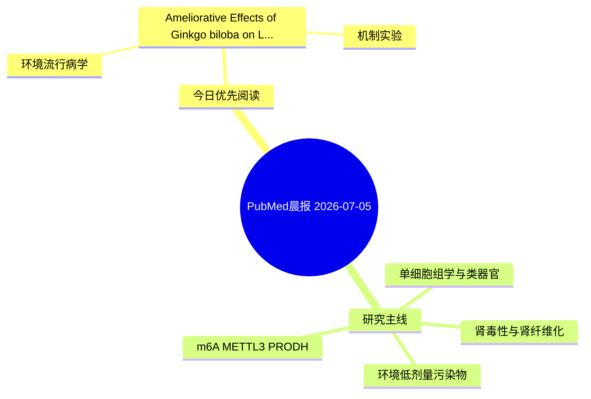

# PubMed 文献晨报｜2026-07-05

- 生成日期：2026-07-05 UTC
- 检索窗口：近 24 小时
- 高质量阈值：规则评分 ≥ 7
- 近 24 小时原始命中数：3

## 今日总体判断

今日筛选出 1 篇优先阅读文献，主要集中在：环境流行病学、机制实验。

## 今日最值得读的 5 篇文章

### 1. Ameliorative Effects of Ginkgo biloba on Lead Acetate-Induced Oxidative Stress and Histopathological Damages in Rat Liver, Kidney, and Testis.

- 题目：Ameliorative Effects of Ginkgo biloba on Lead Acetate-Induced Oxidative Stress and Histopathological Damages in Rat Liver, Kidney, and Testis.
- 期刊：Environmental toxicology
- 年份：2026
- PMID：[42400455](https://pubmed.ncbi.nlm.nih.gov/42400455/)
- DOI：[10.1002/tox.70152](https://doi.org/10.1002/tox.70152)
- 分类：环境流行病学、机制实验
- 规则评分：15
- 研究对象：小鼠或大鼠肾损伤模型
- 核心方法：细胞与动物机制实验
- 主要发现：摘要提示研究重点涉及环境污染物暴露、肾纤维化；结论线索为：These results indicate that Ginkgo biloba may serve as a valuable adjunct therapy for mitigating lead-associated organ damage.
- 为什么值得读：同时连接环境暴露与机制线索；关键词匹配度较高

## 分类归档

### 环境流行病学
- [Ameliorative Effects of Ginkgo biloba on Lead Acetate-Induced Oxidative Stress and Histopathological Damages in Rat Liver, Kidney, and Testis.](https://pubmed.ncbi.nlm.nih.gov/42400455/)（PMID: 42400455）

### 机制实验
- [Ameliorative Effects of Ginkgo biloba on Lead Acetate-Induced Oxidative Stress and Histopathological Damages in Rat Liver, Kidney, and Testis.](https://pubmed.ncbi.nlm.nih.gov/42400455/)（PMID: 42400455）

### 单细胞组学
- 今日暂无高质量新文献。

### 类器官
- 今日暂无高质量新文献。

### 肾毒性
- 今日暂无高质量新文献。

### m6A-METTL3-PRODH
- 今日暂无高质量新文献。

## 今日阅读优先级

1. Ameliorative Effects of Ginkgo biloba on Lead Acetate-Induced Oxidative Stress and Histopathological Damages in Rat Liver, Kidney, and Testis.（优先理由：同时连接环境暴露与机制线索；关键词匹配度较高）

## Mermaid 思维导图

