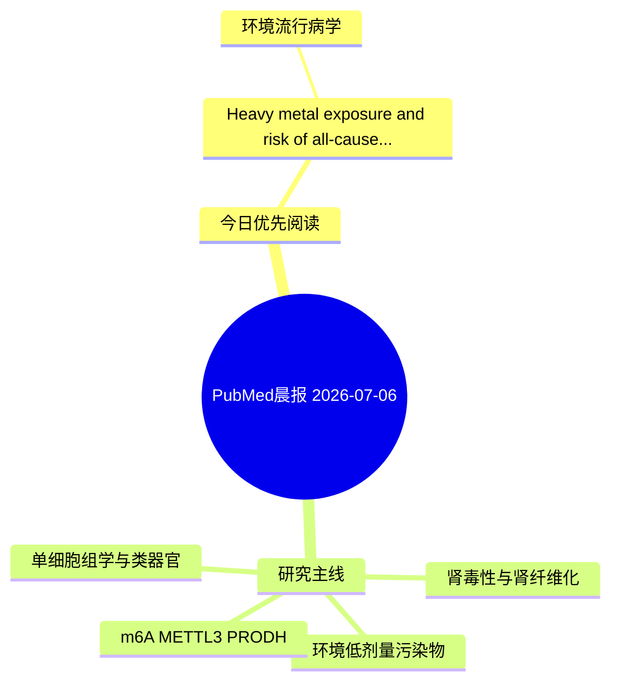

# PubMed 文献晨报｜2026-07-06

- 生成日期：2026-07-06 UTC
- 检索窗口：近 24 小时
- 高质量阈值：规则评分 ≥ 7
- 近 24 小时原始命中数：3

## 今日总体判断

今日筛选出 1 篇优先阅读文献，主要集中在：环境流行病学。

## 今日最值得读的 5 篇文章

### 1. Heavy metal exposure and risk of all-cause and cardiovascular mortality in population with cardiovascular-kidney-metabolic syndrome stage 0-3: a cohort study.

- 题目：Heavy metal exposure and risk of all-cause and cardiovascular mortality in population with cardiovascular-kidney-metabolic syndrome stage 0-3: a cohort study.
- 期刊：Environmental health and preventive medicine
- 年份：2026
- PMID：[42402419](https://pubmed.ncbi.nlm.nih.gov/42402419/)
- DOI：[10.1265/ehpm.26-00065](https://doi.org/10.1265/ehpm.26-00065)
- 分类：环境流行病学
- 规则评分：9
- 研究对象：人群/队列或环境暴露人群
- 核心方法：环境流行病学/队列或人群数据
- 主要发现：摘要提示研究重点涉及环境污染物暴露；结论线索为：CONCLUSIONS: Among U.S.
- 为什么值得读：与检索主题有交集，可作为背景或线索文献扫读

## 分类归档

### 环境流行病学
- [Heavy metal exposure and risk of all-cause and cardiovascular mortality in population with cardiovascular-kidney-metabolic syndrome stage 0-3: a cohort study.](https://pubmed.ncbi.nlm.nih.gov/42402419/)（PMID: 42402419）

### 机制实验
- 今日暂无高质量新文献。

### 单细胞组学
- 今日暂无高质量新文献。

### 类器官
- 今日暂无高质量新文献。

### 肾毒性
- 今日暂无高质量新文献。

### m6A-METTL3-PRODH
- 今日暂无高质量新文献。

## 今日阅读优先级

1. Heavy metal exposure and risk of all-cause and cardiovascular mortality in population with cardiovascular-kidney-metabolic syndrome stage 0-3: a cohort study.（优先理由：与检索主题有交集，可作为背景或线索文献扫读）

## Mermaid 思维导图

