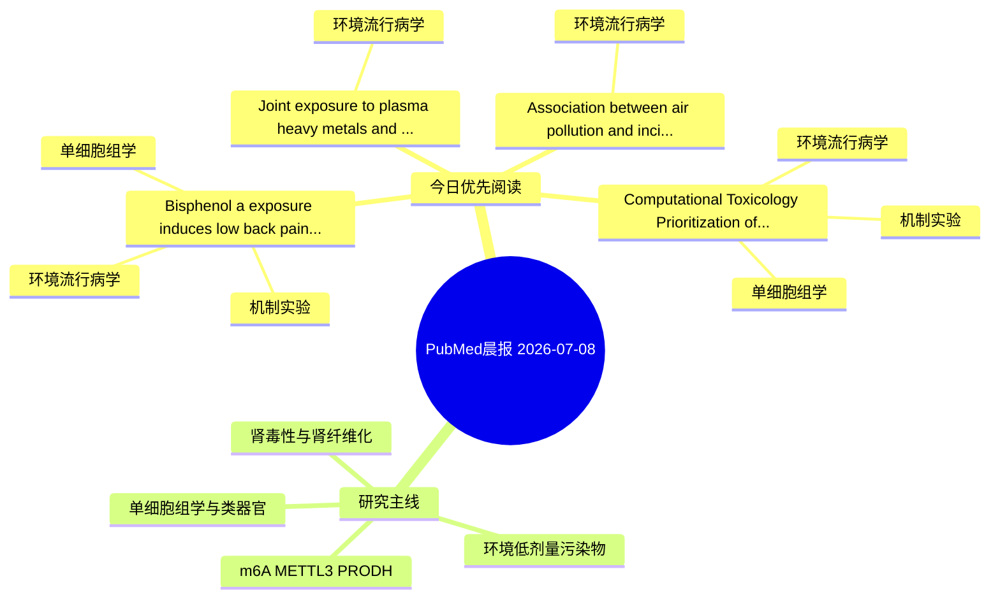

# PubMed 文献晨报｜2026-07-08

- 生成日期：2026-07-08 UTC
- 检索窗口：近 24 小时
- 高质量阈值：规则评分 ≥ 7
- 近 24 小时原始命中数：6

## 今日总体判断

今日筛选出 4 篇优先阅读文献，主要集中在：环境流行病学、机制实验、单细胞组学。

## 今日最值得读的 5 篇文章

### 1. Bisphenol a exposure induces low back pain associated with intervertebral disc degeneration via BIRC3-mediated nucleus pulposus cell senescence.

- 题目：Bisphenol a exposure induces low back pain associated with intervertebral disc degeneration via BIRC3-mediated nucleus pulposus cell senescence.
- 期刊：Toxicology and applied pharmacology
- 年份：2026
- PMID：[42413735](https://pubmed.ncbi.nlm.nih.gov/42413735/)
- DOI：[10.1016/j.taap.2026.117938](https://doi.org/10.1016/j.taap.2026.117938)
- 分类：环境流行病学、机制实验、单细胞组学
- 规则评分：14
- 研究对象：题名和摘要未明确，建议阅读全文确认
- 核心方法：单细胞或空间组学；细胞与动物机制实验
- 主要发现：摘要提示研究重点涉及单细胞或空间组学；结论线索为：CONCLUSION: This study demonstrated that BPA exposure is a potential risk factor for LBP and identified the BPA-IDD-LBP axis.
- 为什么值得读：同时连接环境暴露与机制线索；可帮助寻找细胞类型特异性机制；关键词匹配度较高

### 2. Computational Toxicology Prioritization of CYP3A4 and DPP7 as Candidate Triclosan-Relevant Molecular Targets in Ulcerative Colitis.

- 题目：Computational Toxicology Prioritization of CYP3A4 and DPP7 as Candidate Triclosan-Relevant Molecular Targets in Ulcerative Colitis.
- 期刊：Toxicology mechanisms and methods
- 年份：2026
- PMID：[42414864](https://pubmed.ncbi.nlm.nih.gov/42414864/)
- DOI：[10.1080/15376516.2026.2698865](https://doi.org/10.1080/15376516.2026.2698865)
- 分类：环境流行病学、机制实验、单细胞组学
- 规则评分：10
- 研究对象：人群/队列或环境暴露人群
- 核心方法：环境流行病学/队列或人群数据；单细胞或空间组学
- 主要发现：摘要提示研究重点涉及环境污染物暴露、单细胞或空间组学；结论线索为：Together, these analyses computationally prioritize CYP3A4 and DPP7 as candidate TCS-relevant targets in UC and generate testable hypotheses for future experimental validation; they do not by themselves establish direct target engagement, inhibition, or cau...
- 为什么值得读：同时连接环境暴露与机制线索；可帮助寻找细胞类型特异性机制

### 3. Joint exposure to plasma heavy metals and the risk of kidney graft failure.

- 题目：Joint exposure to plasma heavy metals and the risk of kidney graft failure.
- 期刊：Transplant international : official journal of the European Society for Organ Transplantation
- 年份：2026
- PMID：[42416385](https://pubmed.ncbi.nlm.nih.gov/42416385/)
- DOI：[10.3389/ti.2026.16919](https://doi.org/10.3389/ti.2026.16919)
- 分类：环境流行病学
- 规则评分：10
- 研究对象：题名和摘要未明确，建议阅读全文确认
- 核心方法：基于题名/摘要的常规实验或文献分析，需阅读全文确认
- 主要发现：题名和关键词提示该文关注环境污染物暴露，需要阅读全文确认具体结果。
- 为什么值得读：与检索主题有交集，可作为背景或线索文献扫读

### 4. Association between air pollution and incident cardiovascular diseases among a population with cardiovascular-kidney-metabolic syndrome stages 0-3: the first evidence from the China Health and Retirement Longitudinal Study.

- 题目：Association between air pollution and incident cardiovascular diseases among a population with cardiovascular-kidney-metabolic syndrome stages 0-3: the first evidence from the China Health and Retirement Longitudinal Study.
- 期刊：Frontiers in endocrinology
- 年份：2026
- PMID：[42416905](https://pubmed.ncbi.nlm.nih.gov/42416905/)
- DOI：[10.3389/fendo.2026.1852623](https://doi.org/10.3389/fendo.2026.1852623)
- 分类：环境流行病学
- 规则评分：9
- 研究对象：人群/队列或环境暴露人群
- 核心方法：环境流行病学/队列或人群数据
- 主要发现：摘要提示研究重点涉及环境污染物暴露；结论线索为：CONCLUSIONS: In this nationwide cohort, long-term exposure to PM1, PM2.5, PM10, and NO2 was associated with a higher risk of incident CVD among middle-aged and older Chinese adults with CKM syndrome stages 0-3, which was partially mediated by metabolic synd...
- 为什么值得读：与检索主题有交集，可作为背景或线索文献扫读

## 分类归档

### 环境流行病学
- [Bisphenol a exposure induces low back pain associated with intervertebral disc degeneration via BIRC3-mediated nucleus pulposus cell senescence.](https://pubmed.ncbi.nlm.nih.gov/42413735/)（PMID: 42413735）
- [Computational Toxicology Prioritization of CYP3A4 and DPP7 as Candidate Triclosan-Relevant Molecular Targets in Ulcerative Colitis.](https://pubmed.ncbi.nlm.nih.gov/42414864/)（PMID: 42414864）
- [Joint exposure to plasma heavy metals and the risk of kidney graft failure.](https://pubmed.ncbi.nlm.nih.gov/42416385/)（PMID: 42416385）
- [Association between air pollution and incident cardiovascular diseases among a population with cardiovascular-kidney-metabolic syndrome stages 0-3: the first evidence from the China Health and Retirement Longitudinal Study.](https://pubmed.ncbi.nlm.nih.gov/42416905/)（PMID: 42416905）

### 机制实验
- [Bisphenol a exposure induces low back pain associated with intervertebral disc degeneration via BIRC3-mediated nucleus pulposus cell senescence.](https://pubmed.ncbi.nlm.nih.gov/42413735/)（PMID: 42413735）
- [Computational Toxicology Prioritization of CYP3A4 and DPP7 as Candidate Triclosan-Relevant Molecular Targets in Ulcerative Colitis.](https://pubmed.ncbi.nlm.nih.gov/42414864/)（PMID: 42414864）

### 单细胞组学
- [Bisphenol a exposure induces low back pain associated with intervertebral disc degeneration via BIRC3-mediated nucleus pulposus cell senescence.](https://pubmed.ncbi.nlm.nih.gov/42413735/)（PMID: 42413735）
- [Computational Toxicology Prioritization of CYP3A4 and DPP7 as Candidate Triclosan-Relevant Molecular Targets in Ulcerative Colitis.](https://pubmed.ncbi.nlm.nih.gov/42414864/)（PMID: 42414864）

### 类器官
- 今日暂无高质量新文献。

### 肾毒性
- 今日暂无高质量新文献。

### m6A-METTL3-PRODH
- 今日暂无高质量新文献。

## 今日阅读优先级

1. Bisphenol a exposure induces low back pain associated with intervertebral disc degeneration via BIRC3-mediated nucleus pulposus cell senescence.（优先理由：同时连接环境暴露与机制线索；可帮助寻找细胞类型特异性机制；关键词匹配度较高）
2. Computational Toxicology Prioritization of CYP3A4 and DPP7 as Candidate Triclosan-Relevant Molecular Targets in Ulcerative Colitis.（优先理由：同时连接环境暴露与机制线索；可帮助寻找细胞类型特异性机制）
3. Joint exposure to plasma heavy metals and the risk of kidney graft failure.（优先理由：与检索主题有交集，可作为背景或线索文献扫读）
4. Association between air pollution and incident cardiovascular diseases among a population with cardiovascular-kidney-metabolic syndrome stages 0-3: the first evidence from the China Health and Retirement Longitudinal Study.（优先理由：与检索主题有交集，可作为背景或线索文献扫读）

## Mermaid 思维导图

