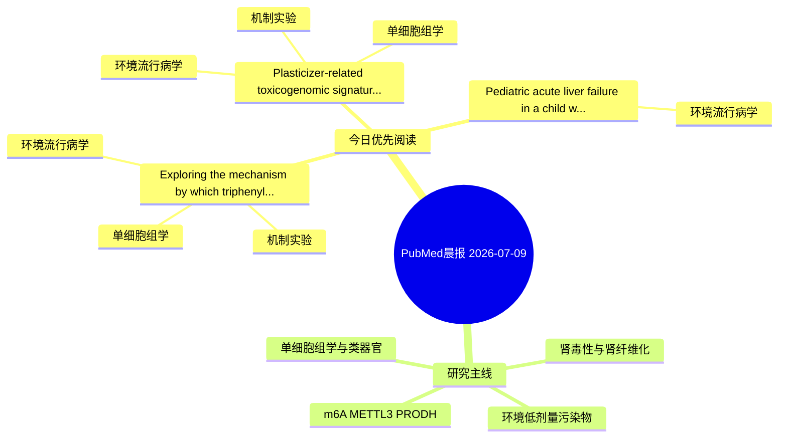

# PubMed 文献晨报｜2026-07-09

- 生成日期：2026-07-09 UTC
- 检索窗口：近 24 小时
- 高质量阈值：规则评分 ≥ 7
- 近 24 小时原始命中数：9

## 今日总体判断

今日筛选出 3 篇优先阅读文献，主要集中在：环境流行病学、机制实验、单细胞组学。

## 今日最值得读的 5 篇文章

### 1. Exploring the mechanism by which triphenyl phosphate promotes malignant phenotypes in bladder and kidney cancer through MMP9 based on bioinformatics analysis and experimental validation.

- 题目：Exploring the mechanism by which triphenyl phosphate promotes malignant phenotypes in bladder and kidney cancer through MMP9 based on bioinformatics analysis and experimental validation.
- 期刊：Clinical and experimental medicine
- 年份：2026
- PMID：[42418064](https://pubmed.ncbi.nlm.nih.gov/42418064/)
- DOI：[10.1007/s10238-026-02159-7](https://doi.org/10.1007/s10238-026-02159-7)
- 分类：环境流行病学、机制实验、单细胞组学
- 规则评分：13
- 研究对象：人群/队列或环境暴露人群
- 核心方法：环境流行病学/队列或人群数据；单细胞或空间组学；细胞与动物机制实验
- 主要发现：摘要提示研究重点涉及单细胞或空间组学；结论线索为：Conclusions TPP promotes the malignant phenotypes of bladder and kidney cancer via MMP9, which is validated by virtual knockout and in vitro experiments.
- 为什么值得读：同时连接环境暴露与机制线索；可帮助寻找细胞类型特异性机制；关键词匹配度较高

### 2. Plasticizer-related toxicogenomic signatures in gestational diabetes: Mendelian randomization, placental single-cell transcriptomics and trophoblast validation.

- 题目：Plasticizer-related toxicogenomic signatures in gestational diabetes: Mendelian randomization, placental single-cell transcriptomics and trophoblast validation.
- 期刊：Ecotoxicology and environmental safety
- 年份：2026
- PMID：[42418975](https://pubmed.ncbi.nlm.nih.gov/42418975/)
- DOI：[10.1016/j.ecoenv.2026.120486](https://doi.org/10.1016/j.ecoenv.2026.120486)
- 分类：环境流行病学、机制实验、单细胞组学
- 规则评分：10
- 研究对象：题名和摘要未明确，建议阅读全文确认
- 核心方法：单细胞或空间组学
- 主要发现：摘要提示研究重点涉及单细胞或空间组学；结论线索为：The two-dose design did not support a formal concentration-response conclusion.
- 为什么值得读：同时连接环境暴露与机制线索；可帮助寻找细胞类型特异性机制

### 3. Pediatric acute liver failure in a child with arsenic toxicity and underlying rotor syndrome.

- 题目：Pediatric acute liver failure in a child with arsenic toxicity and underlying rotor syndrome.
- 期刊：Oxford medical case reports
- 年份：2026
- PMID：[42422268](https://pubmed.ncbi.nlm.nih.gov/42422268/)
- DOI：[10.1093/omcr/omag111](https://doi.org/10.1093/omcr/omag111)
- 分类：环境流行病学
- 规则评分：9
- 研究对象：题名和摘要未明确，建议阅读全文确认
- 核心方法：基于题名/摘要的常规实验或文献分析，需阅读全文确认
- 主要发现：摘要提示研究重点涉及环境污染物暴露；结论线索为：His toxicology screen revealed high levels of arsenic and lead in serum and urine.
- 为什么值得读：与检索主题有交集，可作为背景或线索文献扫读

## 分类归档

### 环境流行病学
- [Exploring the mechanism by which triphenyl phosphate promotes malignant phenotypes in bladder and kidney cancer through MMP9 based on bioinformatics analysis and experimental validation.](https://pubmed.ncbi.nlm.nih.gov/42418064/)（PMID: 42418064）
- [Plasticizer-related toxicogenomic signatures in gestational diabetes: Mendelian randomization, placental single-cell transcriptomics and trophoblast validation.](https://pubmed.ncbi.nlm.nih.gov/42418975/)（PMID: 42418975）
- [Pediatric acute liver failure in a child with arsenic toxicity and underlying rotor syndrome.](https://pubmed.ncbi.nlm.nih.gov/42422268/)（PMID: 42422268）

### 机制实验
- [Exploring the mechanism by which triphenyl phosphate promotes malignant phenotypes in bladder and kidney cancer through MMP9 based on bioinformatics analysis and experimental validation.](https://pubmed.ncbi.nlm.nih.gov/42418064/)（PMID: 42418064）
- [Plasticizer-related toxicogenomic signatures in gestational diabetes: Mendelian randomization, placental single-cell transcriptomics and trophoblast validation.](https://pubmed.ncbi.nlm.nih.gov/42418975/)（PMID: 42418975）

### 单细胞组学
- [Exploring the mechanism by which triphenyl phosphate promotes malignant phenotypes in bladder and kidney cancer through MMP9 based on bioinformatics analysis and experimental validation.](https://pubmed.ncbi.nlm.nih.gov/42418064/)（PMID: 42418064）
- [Plasticizer-related toxicogenomic signatures in gestational diabetes: Mendelian randomization, placental single-cell transcriptomics and trophoblast validation.](https://pubmed.ncbi.nlm.nih.gov/42418975/)（PMID: 42418975）

### 类器官
- 今日暂无高质量新文献。

### 肾毒性
- 今日暂无高质量新文献。

### m6A-METTL3-PRODH
- 今日暂无高质量新文献。

## 今日阅读优先级

1. Exploring the mechanism by which triphenyl phosphate promotes malignant phenotypes in bladder and kidney cancer through MMP9 based on bioinformatics analysis and experimental validation.（优先理由：同时连接环境暴露与机制线索；可帮助寻找细胞类型特异性机制；关键词匹配度较高）
2. Plasticizer-related toxicogenomic signatures in gestational diabetes: Mendelian randomization, placental single-cell transcriptomics and trophoblast validation.（优先理由：同时连接环境暴露与机制线索；可帮助寻找细胞类型特异性机制）
3. Pediatric acute liver failure in a child with arsenic toxicity and underlying rotor syndrome.（优先理由：与检索主题有交集，可作为背景或线索文献扫读）

## Mermaid 思维导图

