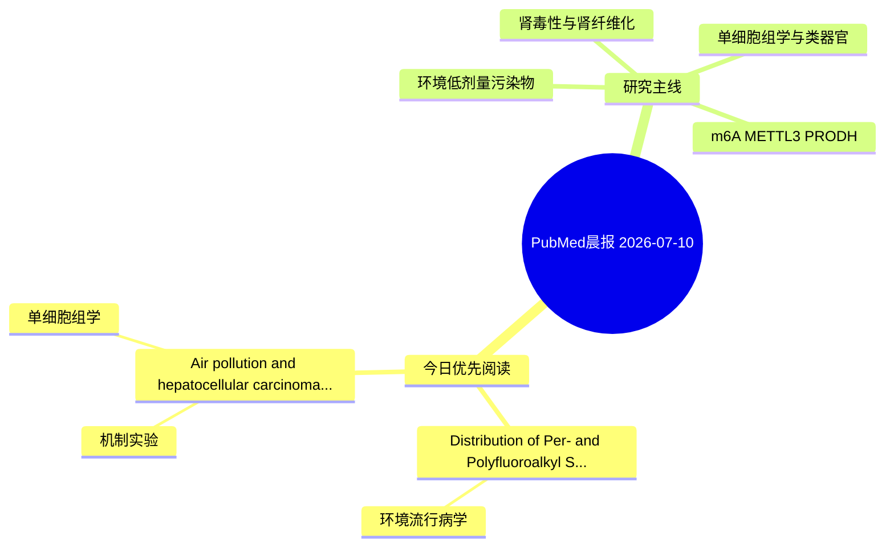

# PubMed 文献晨报｜2026-07-10

- 生成日期：2026-07-10 UTC
- 检索窗口：近 24 小时
- 高质量阈值：规则评分 ≥ 7
- 近 24 小时原始命中数：4

## 今日总体判断

今日筛选出 2 篇优先阅读文献，主要集中在：环境流行病学、机制实验、单细胞组学。

## 今日最值得读的 5 篇文章

### 1. Distribution of Per- and Polyfluoroalkyl Substances in Renal Vascular Tissues from Donors after Brain Death and Association with Post-Transplant Delayed Graft Function Risk.

- 题目：Distribution of Per- and Polyfluoroalkyl Substances in Renal Vascular Tissues from Donors after Brain Death and Association with Post-Transplant Delayed Graft Function Risk.
- 期刊：Environmental pollution (Barking, Essex : 1987)
- 年份：2026
- PMID：[42425288](https://pubmed.ncbi.nlm.nih.gov/42425288/)
- DOI：[10.1016/j.envpol.2026.128709](https://doi.org/10.1016/j.envpol.2026.128709)
- 分类：环境流行病学
- 规则评分：12
- 研究对象：题名和摘要未明确，建议阅读全文确认
- 核心方法：基于题名/摘要的常规实验或文献分析，需阅读全文确认
- 主要发现：摘要提示研究重点涉及环境污染物暴露；结论线索为：Regression analysis revealed that in renal arterial tissue, PFOA (OR=2.004, 95%CI:1.035-3.880), PFDA (OR=1.762, 95%CI:1.012-3.066), PFOS (OR=1.706, 95%CI:1.006-2.893), PFNA (OR=1.673, 95%CI:1.010-2.774), PFUnDA (OR=1.722, 95%CI:1.018-2.910), PFHxS (OR=1.619...
- 为什么值得读：关键词匹配度较高

### 2. Air pollution and hepatocellular carcinoma: Integrated network toxicology, machine learning, molecular docking and multiomics analysis.

- 题目：Air pollution and hepatocellular carcinoma: Integrated network toxicology, machine learning, molecular docking and multiomics analysis.
- 期刊：Oncology letters
- 年份：2026
- PMID：[42428344](https://pubmed.ncbi.nlm.nih.gov/42428344/)
- DOI：[10.3892/ol.2026.15737](https://doi.org/10.3892/ol.2026.15737)
- 分类：机制实验、单细胞组学
- 规则评分：7
- 研究对象：题名和摘要未明确，建议阅读全文确认
- 核心方法：单细胞或空间组学
- 主要发现：摘要提示研究重点涉及单细胞或空间组学；结论线索为：The present study provided a multi-dimensional analytical framework for identifying candidate genes and pathways potentially linking APs to HCC, thereby advancing hypotheses regarding environmental carcinogenesis.
- 为什么值得读：可帮助寻找细胞类型特异性机制

## 分类归档

### 环境流行病学
- [Distribution of Per- and Polyfluoroalkyl Substances in Renal Vascular Tissues from Donors after Brain Death and Association with Post-Transplant Delayed Graft Function Risk.](https://pubmed.ncbi.nlm.nih.gov/42425288/)（PMID: 42425288）

### 机制实验
- [Air pollution and hepatocellular carcinoma: Integrated network toxicology, machine learning, molecular docking and multiomics analysis.](https://pubmed.ncbi.nlm.nih.gov/42428344/)（PMID: 42428344）

### 单细胞组学
- [Air pollution and hepatocellular carcinoma: Integrated network toxicology, machine learning, molecular docking and multiomics analysis.](https://pubmed.ncbi.nlm.nih.gov/42428344/)（PMID: 42428344）

### 类器官
- 今日暂无高质量新文献。

### 肾毒性
- 今日暂无高质量新文献。

### m6A-METTL3-PRODH
- 今日暂无高质量新文献。

## 今日阅读优先级

1. Distribution of Per- and Polyfluoroalkyl Substances in Renal Vascular Tissues from Donors after Brain Death and Association with Post-Transplant Delayed Graft Function Risk.（优先理由：关键词匹配度较高）
2. Air pollution and hepatocellular carcinoma: Integrated network toxicology, machine learning, molecular docking and multiomics analysis.（优先理由：可帮助寻找细胞类型特异性机制）

## Mermaid 思维导图

