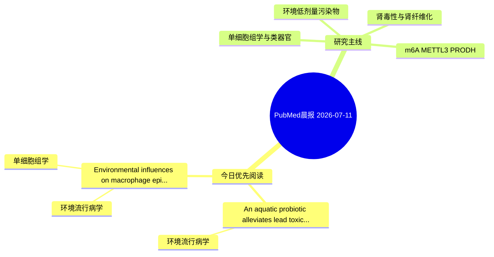

# PubMed 文献晨报｜2026-07-11

- 生成日期：2026-07-11 UTC
- 检索窗口：近 24 小时
- 高质量阈值：规则评分 ≥ 7
- 近 24 小时原始命中数：4

## 今日总体判断

今日筛选出 2 篇优先阅读文献，主要集中在：环境流行病学、单细胞组学。

## 今日最值得读的 5 篇文章

### 1. An aquatic probiotic alleviates lead toxicity in grass carp (Ctenopharyngodon idella) via improved intestinal barrier function and reduced Pb bioaccumulation.

- 题目：An aquatic probiotic alleviates lead toxicity in grass carp (Ctenopharyngodon idella) via improved intestinal barrier function and reduced Pb bioaccumulation.
- 期刊：Ecotoxicology and environmental safety
- 年份：2026
- PMID：[42431064](https://pubmed.ncbi.nlm.nih.gov/42431064/)
- DOI：[10.1016/j.ecoenv.2026.120491](https://doi.org/10.1016/j.ecoenv.2026.120491)
- 分类：环境流行病学
- 规则评分：9
- 研究对象：题名和摘要未明确，建议阅读全文确认
- 核心方法：基于题名/摘要的常规实验或文献分析，需阅读全文确认
- 主要发现：摘要提示研究重点涉及环境污染物暴露；结论线索为：Taken together, these findings demonstrate that RSSC01 effectively mitigates Pb toxicity in grass carp through regulation of intestinal microbiota.
- 为什么值得读：与检索主题有交集，可作为背景或线索文献扫读

### 2. Environmental influences on macrophage epigenetics and trained immunity: a review.

- 题目：Environmental influences on macrophage epigenetics and trained immunity: a review.
- 期刊：Molecular biology reports
- 年份：2026
- PMID：[42430007](https://pubmed.ncbi.nlm.nih.gov/42430007/)
- DOI：[10.1007/s11033-026-12318-4](https://doi.org/10.1007/s11033-026-12318-4)
- 分类：环境流行病学、单细胞组学
- 规则评分：9
- 研究对象：题名和摘要未明确，建议阅读全文确认
- 核心方法：单细胞或空间组学；m6A RNA修饰检测
- 主要发现：摘要提示研究重点涉及环境污染物暴露、单细胞或空间组学；结论线索为：By connecting molecular mechanisms with broader public health implications, this review provides a critical framework for understanding environmentally driven immune dysregulation and outlines future research directions, including mixture toxicology, single...
- 为什么值得读：可帮助寻找细胞类型特异性机制

## 分类归档

### 环境流行病学
- [An aquatic probiotic alleviates lead toxicity in grass carp (Ctenopharyngodon idella) via improved intestinal barrier function and reduced Pb bioaccumulation.](https://pubmed.ncbi.nlm.nih.gov/42431064/)（PMID: 42431064）
- [Environmental influences on macrophage epigenetics and trained immunity: a review.](https://pubmed.ncbi.nlm.nih.gov/42430007/)（PMID: 42430007）

### 机制实验
- 今日暂无高质量新文献。

### 单细胞组学
- [Environmental influences on macrophage epigenetics and trained immunity: a review.](https://pubmed.ncbi.nlm.nih.gov/42430007/)（PMID: 42430007）

### 类器官
- 今日暂无高质量新文献。

### 肾毒性
- 今日暂无高质量新文献。

### m6A-METTL3-PRODH
- 今日暂无高质量新文献。

## 今日阅读优先级

1. An aquatic probiotic alleviates lead toxicity in grass carp (Ctenopharyngodon idella) via improved intestinal barrier function and reduced Pb bioaccumulation.（优先理由：与检索主题有交集，可作为背景或线索文献扫读）
2. Environmental influences on macrophage epigenetics and trained immunity: a review.（优先理由：可帮助寻找细胞类型特异性机制）

## Mermaid 思维导图

