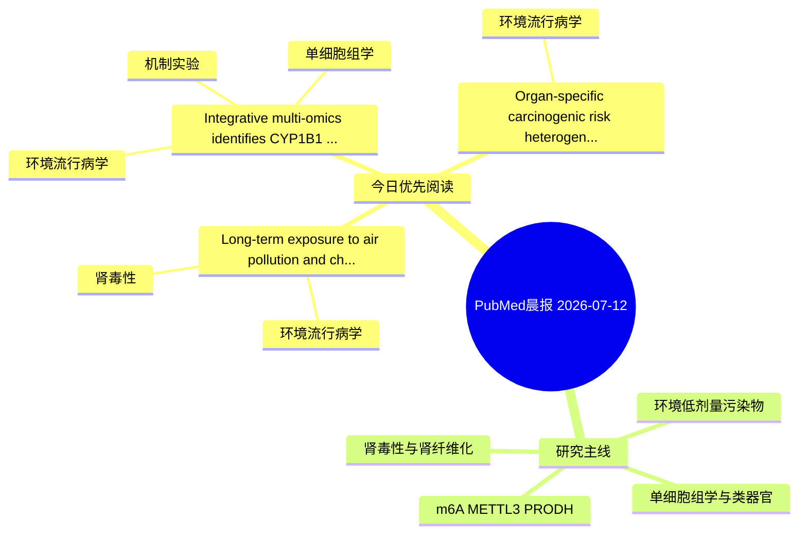

# PubMed 文献晨报｜2026-07-12

- 生成日期：2026-07-12 UTC
- 检索窗口：近 24 小时
- 高质量阈值：规则评分 ≥ 7
- 近 24 小时原始命中数：4

## 今日总体判断

今日筛选出 3 篇优先阅读文献，主要集中在：环境流行病学、肾毒性、机制实验。

## 今日最值得读的 5 篇文章

### 1. Long-term exposure to air pollution and chronic kidney disease incidence in adults: The Danish Nurse Cohort.

- 题目：Long-term exposure to air pollution and chronic kidney disease incidence in adults: The Danish Nurse Cohort.
- 期刊：Journal of exposure science & environmental epidemiology
- 年份：2026
- PMID：[42436292](https://pubmed.ncbi.nlm.nih.gov/42436292/)
- DOI：[10.1038/s41370-026-00943-x](https://doi.org/10.1038/s41370-026-00943-x)
- 分类：环境流行病学、肾毒性
- 规则评分：12
- 研究对象：人群/队列或环境暴露人群
- 核心方法：环境流行病学/队列或人群数据
- 主要发现：摘要提示研究重点涉及环境污染物暴露、肾毒性/肾损伤；结论线索为：Stronger associations among never-smokers suggest that environmental exposures may independently influence kidney health.
- 为什么值得读：与肾毒性/肾损伤主线直接相关；关键词匹配度较高

### 2. Integrative multi-omics identifies CYP1B1 as a candidate molecular link between toxicant exposure and ferroptosis-related epithelial stress in COPD.

- 题目：Integrative multi-omics identifies CYP1B1 as a candidate molecular link between toxicant exposure and ferroptosis-related epithelial stress in COPD.
- 期刊：Inflammation research : official journal of the European Histamine Research Society ... [et al.]
- 年份：2026
- PMID：[42435052](https://pubmed.ncbi.nlm.nih.gov/42435052/)
- DOI：[10.1007/s00011-026-02294-7](https://doi.org/10.1007/s00011-026-02294-7)
- 分类：环境流行病学、机制实验、单细胞组学
- 规则评分：10
- 研究对象：人群/队列或环境暴露人群
- 核心方法：环境流行病学/队列或人群数据；单细胞或空间组学；细胞与动物机制实验
- 主要发现：摘要提示研究重点涉及环境污染物暴露、单细胞或空间组学；结论线索为：The findings suggest a potential association between cigarette-smoke-induced CYP1B1 upregulation, lipid peroxidation-related epithelial injury, and epithelial remodeling in COPD.
- 为什么值得读：同时连接环境暴露与机制线索；可帮助寻找细胞类型特异性机制

### 3. Organ-specific carcinogenic risk heterogeneity of perfluorooctanoic acid exposure: Global evidence from bibliometric mapping, meta-analysis, and nonlinear dose-response modeling.

- 题目：Organ-specific carcinogenic risk heterogeneity of perfluorooctanoic acid exposure: Global evidence from bibliometric mapping, meta-analysis, and nonlinear dose-response modeling.
- 期刊：Journal of hazardous materials
- 年份：2026
- PMID：[42435682](https://pubmed.ncbi.nlm.nih.gov/42435682/)
- DOI：[10.1016/j.jhazmat.2026.142831](https://doi.org/10.1016/j.jhazmat.2026.142831)
- 分类：环境流行病学
- 规则评分：9
- 研究对象：题名和摘要未明确，建议阅读全文确认
- 核心方法：环境流行病学/队列或人群数据
- 主要发现：摘要提示研究重点涉及环境污染物暴露；结论线索为：Bibliometric results revealed a recent frontier shift from organ-specific cancer risks toward serum PFOA biomonitoring, mixed exposure assessment, and endocrine-disruptive mechanisms, providing the conceptual basis for organ-oriented evaluation.
- 为什么值得读：与检索主题有交集，可作为背景或线索文献扫读

## 分类归档

### 环境流行病学
- [Long-term exposure to air pollution and chronic kidney disease incidence in adults: The Danish Nurse Cohort.](https://pubmed.ncbi.nlm.nih.gov/42436292/)（PMID: 42436292）
- [Integrative multi-omics identifies CYP1B1 as a candidate molecular link between toxicant exposure and ferroptosis-related epithelial stress in COPD.](https://pubmed.ncbi.nlm.nih.gov/42435052/)（PMID: 42435052）
- [Organ-specific carcinogenic risk heterogeneity of perfluorooctanoic acid exposure: Global evidence from bibliometric mapping, meta-analysis, and nonlinear dose-response modeling.](https://pubmed.ncbi.nlm.nih.gov/42435682/)（PMID: 42435682）

### 机制实验
- [Integrative multi-omics identifies CYP1B1 as a candidate molecular link between toxicant exposure and ferroptosis-related epithelial stress in COPD.](https://pubmed.ncbi.nlm.nih.gov/42435052/)（PMID: 42435052）

### 单细胞组学
- [Integrative multi-omics identifies CYP1B1 as a candidate molecular link between toxicant exposure and ferroptosis-related epithelial stress in COPD.](https://pubmed.ncbi.nlm.nih.gov/42435052/)（PMID: 42435052）

### 类器官
- 今日暂无高质量新文献。

### 肾毒性
- [Long-term exposure to air pollution and chronic kidney disease incidence in adults: The Danish Nurse Cohort.](https://pubmed.ncbi.nlm.nih.gov/42436292/)（PMID: 42436292）

### m6A-METTL3-PRODH
- 今日暂无高质量新文献。

## 今日阅读优先级

1. Long-term exposure to air pollution and chronic kidney disease incidence in adults: The Danish Nurse Cohort.（优先理由：与肾毒性/肾损伤主线直接相关；关键词匹配度较高）
2. Integrative multi-omics identifies CYP1B1 as a candidate molecular link between toxicant exposure and ferroptosis-related epithelial stress in COPD.（优先理由：同时连接环境暴露与机制线索；可帮助寻找细胞类型特异性机制）
3. Organ-specific carcinogenic risk heterogeneity of perfluorooctanoic acid exposure: Global evidence from bibliometric mapping, meta-analysis, and nonlinear dose-response modeling.（优先理由：与检索主题有交集，可作为背景或线索文献扫读）

## Mermaid 思维导图

