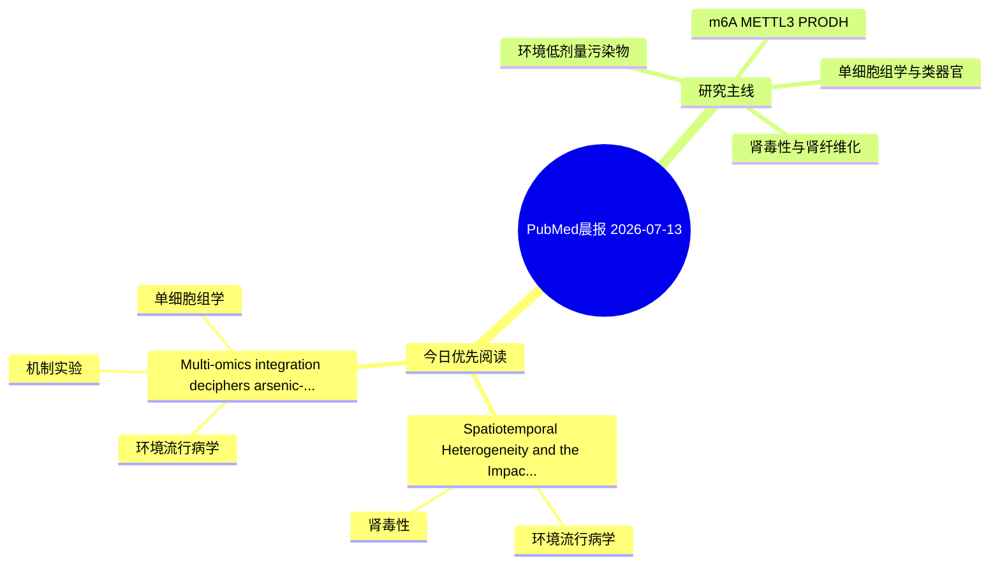

# PubMed 文献晨报｜2026-07-13

- 生成日期：2026-07-13 UTC
- 检索窗口：近 24 小时
- 高质量阈值：规则评分 ≥ 7
- 近 24 小时原始命中数：5

## 今日总体判断

今日筛选出 2 篇优先阅读文献，主要集中在：环境流行病学、肾毒性、机制实验。

## 今日最值得读的 5 篇文章

### 1. Spatiotemporal Heterogeneity and the Impact of PM1 and Nitrogen Oxides on Chronic Kidney Disease Mortality in 39 European Countries (1990-2022): A Multi-Model Analysis.

- 题目：Spatiotemporal Heterogeneity and the Impact of PM1 and Nitrogen Oxides on Chronic Kidney Disease Mortality in 39 European Countries (1990-2022): A Multi-Model Analysis.
- 期刊：International journal of nephrology and renovascular disease
- 年份：2026
- PMID：[42438792](https://pubmed.ncbi.nlm.nih.gov/42438792/)
- DOI：[10.2147/IJNRD.S609735](https://doi.org/10.2147/IJNRD.S609735)
- 分类：环境流行病学、肾毒性
- 规则评分：10
- 研究对象：人群/队列或环境暴露人群
- 核心方法：环境流行病学/队列或人群数据
- 主要发现：摘要提示研究重点涉及环境污染物暴露、肾毒性/肾损伤；结论线索为：These findings support further evaluation of submicron particulate matter in environmental monitoring frameworks and suggest that transport-related pollution and heat-related climatic conditions warrant attention in strategies aimed at reducing regional CKD...
- 为什么值得读：与肾毒性/肾损伤主线直接相关

### 2. Multi-omics integration deciphers arsenic-induced multi-organ toxicity and the novel ferroptosis axis.

- 题目：Multi-omics integration deciphers arsenic-induced multi-organ toxicity and the novel ferroptosis axis.
- 期刊：Toxicology reports
- 年份：2026
- PMID：[42438480](https://pubmed.ncbi.nlm.nih.gov/42438480/)
- DOI：[10.1016/j.toxrep.2026.102308](https://doi.org/10.1016/j.toxrep.2026.102308)
- 分类：环境流行病学、机制实验、单细胞组学
- 规则评分：9
- 研究对象：人群/队列或环境暴露人群
- 核心方法：环境流行病学/队列或人群数据；单细胞或空间组学
- 主要发现：摘要提示研究重点涉及环境污染物暴露、单细胞或空间组学；结论线索为：We also discuss prospects for AI-driven toxicity prediction models.
- 为什么值得读：同时连接环境暴露与机制线索；可帮助寻找细胞类型特异性机制

## 分类归档

### 环境流行病学
- [Spatiotemporal Heterogeneity and the Impact of PM1 and Nitrogen Oxides on Chronic Kidney Disease Mortality in 39 European Countries (1990-2022): A Multi-Model Analysis.](https://pubmed.ncbi.nlm.nih.gov/42438792/)（PMID: 42438792）
- [Multi-omics integration deciphers arsenic-induced multi-organ toxicity and the novel ferroptosis axis.](https://pubmed.ncbi.nlm.nih.gov/42438480/)（PMID: 42438480）

### 机制实验
- [Multi-omics integration deciphers arsenic-induced multi-organ toxicity and the novel ferroptosis axis.](https://pubmed.ncbi.nlm.nih.gov/42438480/)（PMID: 42438480）

### 单细胞组学
- [Multi-omics integration deciphers arsenic-induced multi-organ toxicity and the novel ferroptosis axis.](https://pubmed.ncbi.nlm.nih.gov/42438480/)（PMID: 42438480）

### 类器官
- 今日暂无高质量新文献。

### 肾毒性
- [Spatiotemporal Heterogeneity and the Impact of PM1 and Nitrogen Oxides on Chronic Kidney Disease Mortality in 39 European Countries (1990-2022): A Multi-Model Analysis.](https://pubmed.ncbi.nlm.nih.gov/42438792/)（PMID: 42438792）

### m6A-METTL3-PRODH
- 今日暂无高质量新文献。

## 今日阅读优先级

1. Spatiotemporal Heterogeneity and the Impact of PM1 and Nitrogen Oxides on Chronic Kidney Disease Mortality in 39 European Countries (1990-2022): A Multi-Model Analysis.（优先理由：与肾毒性/肾损伤主线直接相关）
2. Multi-omics integration deciphers arsenic-induced multi-organ toxicity and the novel ferroptosis axis.（优先理由：同时连接环境暴露与机制线索；可帮助寻找细胞类型特异性机制）

## Mermaid 思维导图

