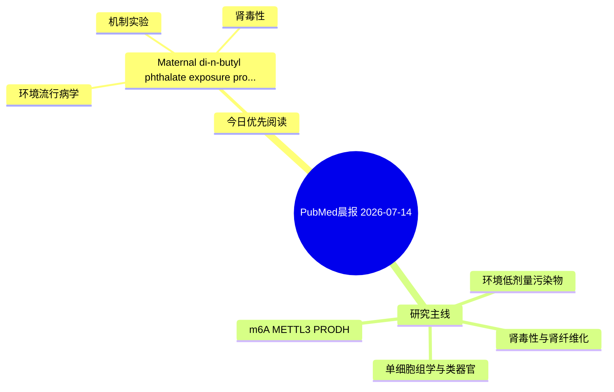

# PubMed 文献晨报｜2026-07-14

- 生成日期：2026-07-14 UTC
- 检索窗口：近 24 小时
- 高质量阈值：规则评分 ≥ 7
- 近 24 小时原始命中数：3

## 今日总体判断

今日筛选出 1 篇优先阅读文献，主要集中在：环境流行病学、机制实验、肾毒性。

## 今日最值得读的 5 篇文章

### 1. Maternal di-n-butyl phthalate exposure promotes renal fibrosis in IUGR offspring rats via HBB downregulation and Nrf2 pathway activation.

- 题目：Maternal di-n-butyl phthalate exposure promotes renal fibrosis in IUGR offspring rats via HBB downregulation and Nrf2 pathway activation.
- 期刊：Ecotoxicology and environmental safety
- 年份：2026
- PMID：[42442276](https://pubmed.ncbi.nlm.nih.gov/42442276/)
- DOI：[10.1016/j.ecoenv.2026.120449](https://doi.org/10.1016/j.ecoenv.2026.120449)
- 分类：环境流行病学、机制实验、肾毒性
- 规则评分：27
- 研究对象：HK-2 近端肾小管上皮细胞
- 核心方法：细胞与动物机制实验
- 主要发现：摘要提示研究重点涉及肾毒性/肾损伤、肾纤维化；结论线索为：These findings indicate that maternal DBP exposure is associated with adult renal fibrotic remodeling in male offspring, with HBB downregulation, oxidative stress, NRF2-related antioxidant responses, and EMT-related alterations as key molecular features.
- 为什么值得读：同时连接环境暴露与机制线索；与肾毒性/肾损伤主线直接相关；关键词匹配度较高

## 分类归档

### 环境流行病学
- [Maternal di-n-butyl phthalate exposure promotes renal fibrosis in IUGR offspring rats via HBB downregulation and Nrf2 pathway activation.](https://pubmed.ncbi.nlm.nih.gov/42442276/)（PMID: 42442276）

### 机制实验
- [Maternal di-n-butyl phthalate exposure promotes renal fibrosis in IUGR offspring rats via HBB downregulation and Nrf2 pathway activation.](https://pubmed.ncbi.nlm.nih.gov/42442276/)（PMID: 42442276）

### 单细胞组学
- 今日暂无高质量新文献。

### 类器官
- 今日暂无高质量新文献。

### 肾毒性
- [Maternal di-n-butyl phthalate exposure promotes renal fibrosis in IUGR offspring rats via HBB downregulation and Nrf2 pathway activation.](https://pubmed.ncbi.nlm.nih.gov/42442276/)（PMID: 42442276）

### m6A-METTL3-PRODH
- 今日暂无高质量新文献。

## 今日阅读优先级

1. Maternal di-n-butyl phthalate exposure promotes renal fibrosis in IUGR offspring rats via HBB downregulation and Nrf2 pathway activation.（优先理由：同时连接环境暴露与机制线索；与肾毒性/肾损伤主线直接相关；关键词匹配度较高）

## Mermaid 思维导图

