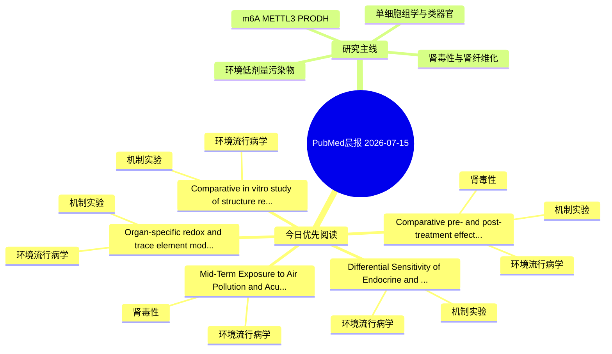

# PubMed 文献晨报｜2026-07-15

- 生成日期：2026-07-15 UTC
- 检索窗口：近 24 小时
- 高质量阈值：规则评分 ≥ 7
- 近 24 小时原始命中数：7

## 今日总体判断

今日筛选出 5 篇优先阅读文献，主要集中在：环境流行病学、机制实验、肾毒性。

## 今日最值得读的 5 篇文章

### 1. Comparative pre- and post-treatment effects of aqueous Zingiber officinale Lsfunction in wistar rats: insights into NF-κB, Nrf2, and caspase-3 pathways.

- 题目：Comparative pre- and post-treatment effects of aqueous Zingiber officinale Lsfunction in wistar rats: insights into NF-κB, Nrf2, and caspase-3 pathways.
- 期刊：Journal of molecular histology
- 年份：2026
- PMID：[42446780](https://pubmed.ncbi.nlm.nih.gov/42446780/)
- DOI：[10.1007/s10735-026-10900-5](https://doi.org/10.1007/s10735-026-10900-5)
- 分类：环境流行病学、机制实验、肾毒性
- 规则评分：17
- 研究对象：小鼠或大鼠肾损伤模型
- 核心方法：基于题名/摘要的常规实验或文献分析，需阅读全文确认
- 主要发现：摘要提示研究重点涉及环境污染物暴露、肾毒性/肾损伤；结论线索为：These findings support ginger as a promising natural agent for mitigating heavy metal nephrotoxicity.
- 为什么值得读：同时连接环境暴露与机制线索；与肾毒性/肾损伤主线直接相关；关键词匹配度较高

### 2. Mid-Term Exposure to Air Pollution and Acute Kidney Injury Incidence: A 10-Year Study in Eastern Poland.

- 题目：Mid-Term Exposure to Air Pollution and Acute Kidney Injury Incidence: A 10-Year Study in Eastern Poland.
- 期刊：Journal of clinical medicine
- 年份：2026
- PMID：[42452391](https://pubmed.ncbi.nlm.nih.gov/42452391/)
- DOI：[10.3390/jcm15134929](https://doi.org/10.3390/jcm15134929)
- 分类：环境流行病学、肾毒性
- 规则评分：12
- 研究对象：人群/队列或环境暴露人群
- 核心方法：环境流行病学/队列或人群数据
- 主要发现：摘要提示研究重点涉及环境污染物暴露、肾毒性/肾损伤；结论线索为：Conclusions: Mid-term exposure to ambient air pollution is associated with an increased risk of AKI-related hospitalizations, with NO2 showing the strongest effects.
- 为什么值得读：与肾毒性/肾损伤主线直接相关；关键词匹配度较高

### 3. Comparative in vitro study of structure related uptake of ten perfluoroalkyl substances by human and rat renal transporters.

- 题目：Comparative in vitro study of structure related uptake of ten perfluoroalkyl substances by human and rat renal transporters.
- 期刊：Archives of toxicology
- 年份：2026
- PMID：[42446666](https://pubmed.ncbi.nlm.nih.gov/42446666/)
- DOI：[10.1007/s00204-026-04508-7](https://doi.org/10.1007/s00204-026-04508-7)
- 分类：环境流行病学、机制实验
- 规则评分：9
- 研究对象：人群/队列或环境暴露人群
- 核心方法：细胞与动物机制实验
- 主要发现：摘要提示研究重点涉及环境污染物暴露；结论线索为：The comparable PFAS chain-length threshold for the uptake of PFASs by homologous human and rat renal transporters suggests that additional mechanisms may account for interspecies differences in PFAS renal clearance.
- 为什么值得读：同时连接环境暴露与机制线索

### 4. Differential Sensitivity of Endocrine and Non-Endocrine Tissues to Cadmium-Induced Lipid Peroxidation and the Protective Role of Melatonin.

- 题目：Differential Sensitivity of Endocrine and Non-Endocrine Tissues to Cadmium-Induced Lipid Peroxidation and the Protective Role of Melatonin.
- 期刊：International journal of molecular sciences
- 年份：2026
- PMID：[42450258](https://pubmed.ncbi.nlm.nih.gov/42450258/)
- DOI：[10.3390/ijms27135991](https://doi.org/10.3390/ijms27135991)
- 分类：环境流行病学、机制实验
- 规则评分：9
- 研究对象：人群/队列或环境暴露人群
- 核心方法：基于题名/摘要的常规实验或文献分析，需阅读全文确认
- 主要发现：摘要提示研究重点涉及环境污染物暴露；结论线索为：The findings demonstrate pronounced tissue-specific differences in susceptibility to cadmium-induced oxidative stress and support the potential of melatonin as a preventive agent against heavy metal-induced oxidative stress, particularly in non-endocrine or...
- 为什么值得读：同时连接环境暴露与机制线索

### 5. Organ-specific redox and trace element modulation and hematological adaptation following hyperbaric oxygenation and physical activity in rats.

- 题目：Organ-specific redox and trace element modulation and hematological adaptation following hyperbaric oxygenation and physical activity in rats.
- 期刊：Frontiers in medicine
- 年份：2026
- PMID：[42445137](https://pubmed.ncbi.nlm.nih.gov/42445137/)
- DOI：[10.3389/fmed.2026.1820821](https://doi.org/10.3389/fmed.2026.1820821)
- 分类：环境流行病学、机制实验
- 规则评分：9
- 研究对象：小鼠或大鼠肾损伤模型
- 核心方法：基于题名/摘要的常规实验或文献分析，需阅读全文确认
- 主要发现：摘要提示研究重点涉及环境污染物暴露；结论线索为：CONCLUSION: Collectively, these findings suggest that short-term HBO and acute PA are associated with distinct organ-specific responses in redox balance and elemental homeostasis, predominantly through independent rather than interactive mechanisms.
- 为什么值得读：同时连接环境暴露与机制线索

## 分类归档

### 环境流行病学
- [Comparative pre- and post-treatment effects of aqueous Zingiber officinale Lsfunction in wistar rats: insights into NF-κB, Nrf2, and caspase-3 pathways.](https://pubmed.ncbi.nlm.nih.gov/42446780/)（PMID: 42446780）
- [Mid-Term Exposure to Air Pollution and Acute Kidney Injury Incidence: A 10-Year Study in Eastern Poland.](https://pubmed.ncbi.nlm.nih.gov/42452391/)（PMID: 42452391）
- [Comparative in vitro study of structure related uptake of ten perfluoroalkyl substances by human and rat renal transporters.](https://pubmed.ncbi.nlm.nih.gov/42446666/)（PMID: 42446666）
- [Differential Sensitivity of Endocrine and Non-Endocrine Tissues to Cadmium-Induced Lipid Peroxidation and the Protective Role of Melatonin.](https://pubmed.ncbi.nlm.nih.gov/42450258/)（PMID: 42450258）
- [Organ-specific redox and trace element modulation and hematological adaptation following hyperbaric oxygenation and physical activity in rats.](https://pubmed.ncbi.nlm.nih.gov/42445137/)（PMID: 42445137）

### 机制实验
- [Comparative pre- and post-treatment effects of aqueous Zingiber officinale Lsfunction in wistar rats: insights into NF-κB, Nrf2, and caspase-3 pathways.](https://pubmed.ncbi.nlm.nih.gov/42446780/)（PMID: 42446780）
- [Comparative in vitro study of structure related uptake of ten perfluoroalkyl substances by human and rat renal transporters.](https://pubmed.ncbi.nlm.nih.gov/42446666/)（PMID: 42446666）
- [Differential Sensitivity of Endocrine and Non-Endocrine Tissues to Cadmium-Induced Lipid Peroxidation and the Protective Role of Melatonin.](https://pubmed.ncbi.nlm.nih.gov/42450258/)（PMID: 42450258）
- [Organ-specific redox and trace element modulation and hematological adaptation following hyperbaric oxygenation and physical activity in rats.](https://pubmed.ncbi.nlm.nih.gov/42445137/)（PMID: 42445137）

### 单细胞组学
- 今日暂无高质量新文献。

### 类器官
- 今日暂无高质量新文献。

### 肾毒性
- [Comparative pre- and post-treatment effects of aqueous Zingiber officinale Lsfunction in wistar rats: insights into NF-κB, Nrf2, and caspase-3 pathways.](https://pubmed.ncbi.nlm.nih.gov/42446780/)（PMID: 42446780）
- [Mid-Term Exposure to Air Pollution and Acute Kidney Injury Incidence: A 10-Year Study in Eastern Poland.](https://pubmed.ncbi.nlm.nih.gov/42452391/)（PMID: 42452391）

### m6A-METTL3-PRODH
- 今日暂无高质量新文献。

## 今日阅读优先级

1. Comparative pre- and post-treatment effects of aqueous Zingiber officinale Lsfunction in wistar rats: insights into NF-κB, Nrf2, and caspase-3 pathways.（优先理由：同时连接环境暴露与机制线索；与肾毒性/肾损伤主线直接相关；关键词匹配度较高）
2. Mid-Term Exposure to Air Pollution and Acute Kidney Injury Incidence: A 10-Year Study in Eastern Poland.（优先理由：与肾毒性/肾损伤主线直接相关；关键词匹配度较高）
3. Comparative in vitro study of structure related uptake of ten perfluoroalkyl substances by human and rat renal transporters.（优先理由：同时连接环境暴露与机制线索）
4. Differential Sensitivity of Endocrine and Non-Endocrine Tissues to Cadmium-Induced Lipid Peroxidation and the Protective Role of Melatonin.（优先理由：同时连接环境暴露与机制线索）
5. Organ-specific redox and trace element modulation and hematological adaptation following hyperbaric oxygenation and physical activity in rats.（优先理由：同时连接环境暴露与机制线索）

## Mermaid 思维导图

