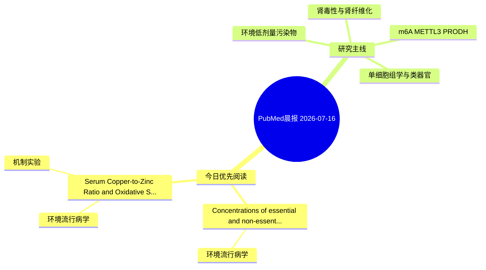

# PubMed 文献晨报｜2026-07-16

- 生成日期：2026-07-16 UTC
- 检索窗口：近 24 小时
- 高质量阈值：规则评分 ≥ 7
- 近 24 小时原始命中数：4

## 今日总体判断

今日筛选出 2 篇优先阅读文献，主要集中在：环境流行病学、机制实验。

## 今日最值得读的 5 篇文章

### 1. Concentrations of essential and non-essential elements in eastern North Pacific killer whales (Orcinus orca).

- 题目：Concentrations of essential and non-essential elements in eastern North Pacific killer whales (Orcinus orca).
- 期刊：PloS one
- 年份：2026
- PMID：[42455828](https://pubmed.ncbi.nlm.nih.gov/42455828/)
- DOI：[10.1371/journal.pone.0353196](https://doi.org/10.1371/journal.pone.0353196)
- 分类：环境流行病学
- 规则评分：12
- 研究对象：人群/队列或环境暴露人群
- 核心方法：环境流行病学/队列或人群数据
- 主要发现：摘要提示研究重点涉及环境污染物暴露；结论线索为：A prior study found no microscopic evidence of toxicosis in the tissues of examined animals.
- 为什么值得读：关键词匹配度较高

### 2. Serum Copper-to-Zinc Ratio and Oxidative Stress Are Associated with Anemia in Older Adults with Cardiovascular-Kidney-Metabolic Syndrome.

- 题目：Serum Copper-to-Zinc Ratio and Oxidative Stress Are Associated with Anemia in Older Adults with Cardiovascular-Kidney-Metabolic Syndrome.
- 期刊：International journal of molecular sciences
- 年份：2026
- PMID：[42450113](https://pubmed.ncbi.nlm.nih.gov/42450113/)
- DOI：[10.3390/ijms27135840](https://doi.org/10.3390/ijms27135840)
- 分类：环境流行病学、机制实验
- 规则评分：9
- 研究对象：人群/队列或环境暴露人群
- 核心方法：环境流行病学/队列或人群数据
- 主要发现：摘要提示研究重点涉及环境污染物暴露；结论线索为：Together with selenium, cadmium, RDW, and uric acid, it defines an oxidative stress-driven hematological pathway that may contribute to the development and progression of anemia in patients with CKM syndrome.
- 为什么值得读：同时连接环境暴露与机制线索

## 分类归档

### 环境流行病学
- [Concentrations of essential and non-essential elements in eastern North Pacific killer whales (Orcinus orca).](https://pubmed.ncbi.nlm.nih.gov/42455828/)（PMID: 42455828）
- [Serum Copper-to-Zinc Ratio and Oxidative Stress Are Associated with Anemia in Older Adults with Cardiovascular-Kidney-Metabolic Syndrome.](https://pubmed.ncbi.nlm.nih.gov/42450113/)（PMID: 42450113）

### 机制实验
- [Serum Copper-to-Zinc Ratio and Oxidative Stress Are Associated with Anemia in Older Adults with Cardiovascular-Kidney-Metabolic Syndrome.](https://pubmed.ncbi.nlm.nih.gov/42450113/)（PMID: 42450113）

### 单细胞组学
- 今日暂无高质量新文献。

### 类器官
- 今日暂无高质量新文献。

### 肾毒性
- 今日暂无高质量新文献。

### m6A-METTL3-PRODH
- 今日暂无高质量新文献。

## 今日阅读优先级

1. Concentrations of essential and non-essential elements in eastern North Pacific killer whales (Orcinus orca).（优先理由：关键词匹配度较高）
2. Serum Copper-to-Zinc Ratio and Oxidative Stress Are Associated with Anemia in Older Adults with Cardiovascular-Kidney-Metabolic Syndrome.（优先理由：同时连接环境暴露与机制线索）

## Mermaid 思维导图

