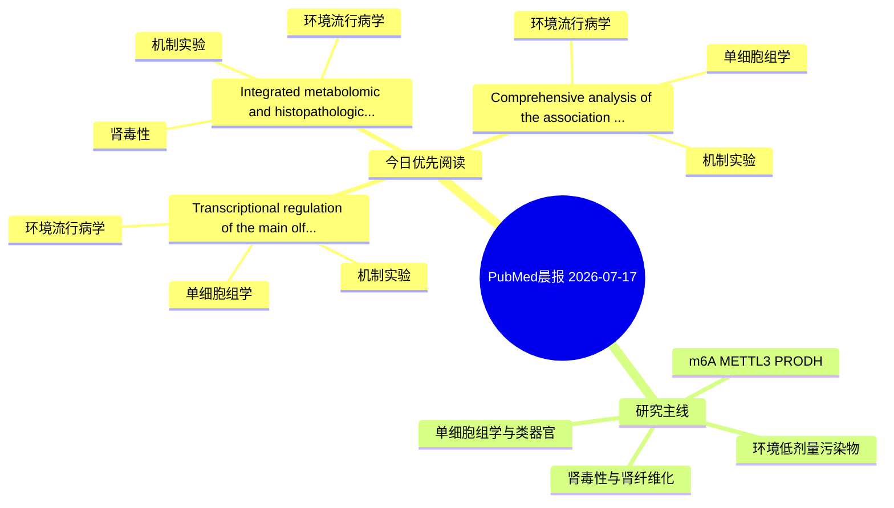

# PubMed 文献晨报｜2026-07-17

- 生成日期：2026-07-17 UTC
- 检索窗口：近 24 小时
- 高质量阈值：规则评分 ≥ 7
- 近 24 小时原始命中数：3

## 今日总体判断

今日筛选出 3 篇优先阅读文献，主要集中在：环境流行病学、机制实验、单细胞组学。

## 今日最值得读的 5 篇文章

### 1. Transcriptional regulation of the main olfactory epithelium by environmental olfactory exposures.

- 题目：Transcriptional regulation of the main olfactory epithelium by environmental olfactory exposures.
- 期刊：Scientific reports
- 年份：2026
- PMID：[42463899](https://pubmed.ncbi.nlm.nih.gov/42463899/)
- DOI：[10.1038/s41598-026-62127-9](https://doi.org/10.1038/s41598-026-62127-9)
- 分类：环境流行病学、机制实验、单细胞组学
- 规则评分：15
- 研究对象：小鼠或大鼠肾损伤模型
- 核心方法：单细胞或空间组学；细胞与动物机制实验
- 主要发现：摘要提示研究重点涉及环境污染物暴露、单细胞或空间组学；结论线索为：These findings highlight the potential importance of multi-cellular interactions and communication in regulation of the olfactory epithelium.
- 为什么值得读：同时连接环境暴露与机制线索；可帮助寻找细胞类型特异性机制；关键词匹配度较高

### 2. Integrated metabolomic and histopathological analysis of renal alterations in mice following chronic bisphenol A (BPA) exposure.

- 题目：Integrated metabolomic and histopathological analysis of renal alterations in mice following chronic bisphenol A (BPA) exposure.
- 期刊：Scientific reports
- 年份：2026
- PMID：[42463785](https://pubmed.ncbi.nlm.nih.gov/42463785/)
- DOI：[10.1038/s41598-026-62758-y](https://doi.org/10.1038/s41598-026-62758-y)
- 分类：环境流行病学、机制实验、肾毒性
- 规则评分：12
- 研究对象：小鼠或大鼠肾损伤模型
- 核心方法：细胞与动物机制实验
- 主要发现：摘要提示研究重点涉及肾毒性/肾损伤；结论线索为：Histopathological analysis revealed structural abnormalities, including tubular epithelial damage and glomerular alterations.
- 为什么值得读：同时连接环境暴露与机制线索；与肾毒性/肾损伤主线直接相关；关键词匹配度较高

### 3. Comprehensive analysis of the association between perfluorooctanoic acid exposure and osteosarcoma progression.

- 题目：Comprehensive analysis of the association between perfluorooctanoic acid exposure and osteosarcoma progression.
- 期刊：Food and chemical toxicology : an international journal published for the British Industrial Biological Research Association
- 年份：2026
- PMID：[42462996](https://pubmed.ncbi.nlm.nih.gov/42462996/)
- DOI：[10.1016/j.fct.2026.116274](https://doi.org/10.1016/j.fct.2026.116274)
- 分类：环境流行病学、机制实验、单细胞组学
- 规则评分：10
- 研究对象：题名和摘要未明确，建议阅读全文确认
- 核心方法：单细胞或空间组学；细胞与动物机制实验
- 主要发现：摘要提示研究重点涉及环境污染物暴露、单细胞或空间组学；结论线索为：Collectively, these findings suggest that long-term PFOA exposure may promote osteosarcoma progression by coupling environmental stress with metabolic reprogramming and immune dysregulation.
- 为什么值得读：同时连接环境暴露与机制线索；可帮助寻找细胞类型特异性机制

## 分类归档

### 环境流行病学
- [Transcriptional regulation of the main olfactory epithelium by environmental olfactory exposures.](https://pubmed.ncbi.nlm.nih.gov/42463899/)（PMID: 42463899）
- [Integrated metabolomic and histopathological analysis of renal alterations in mice following chronic bisphenol A (BPA) exposure.](https://pubmed.ncbi.nlm.nih.gov/42463785/)（PMID: 42463785）
- [Comprehensive analysis of the association between perfluorooctanoic acid exposure and osteosarcoma progression.](https://pubmed.ncbi.nlm.nih.gov/42462996/)（PMID: 42462996）

### 机制实验
- [Transcriptional regulation of the main olfactory epithelium by environmental olfactory exposures.](https://pubmed.ncbi.nlm.nih.gov/42463899/)（PMID: 42463899）
- [Integrated metabolomic and histopathological analysis of renal alterations in mice following chronic bisphenol A (BPA) exposure.](https://pubmed.ncbi.nlm.nih.gov/42463785/)（PMID: 42463785）
- [Comprehensive analysis of the association between perfluorooctanoic acid exposure and osteosarcoma progression.](https://pubmed.ncbi.nlm.nih.gov/42462996/)（PMID: 42462996）

### 单细胞组学
- [Transcriptional regulation of the main olfactory epithelium by environmental olfactory exposures.](https://pubmed.ncbi.nlm.nih.gov/42463899/)（PMID: 42463899）
- [Comprehensive analysis of the association between perfluorooctanoic acid exposure and osteosarcoma progression.](https://pubmed.ncbi.nlm.nih.gov/42462996/)（PMID: 42462996）

### 类器官
- 今日暂无高质量新文献。

### 肾毒性
- [Integrated metabolomic and histopathological analysis of renal alterations in mice following chronic bisphenol A (BPA) exposure.](https://pubmed.ncbi.nlm.nih.gov/42463785/)（PMID: 42463785）

### m6A-METTL3-PRODH
- 今日暂无高质量新文献。

## 今日阅读优先级

1. Transcriptional regulation of the main olfactory epithelium by environmental olfactory exposures.（优先理由：同时连接环境暴露与机制线索；可帮助寻找细胞类型特异性机制；关键词匹配度较高）
2. Integrated metabolomic and histopathological analysis of renal alterations in mice following chronic bisphenol A (BPA) exposure.（优先理由：同时连接环境暴露与机制线索；与肾毒性/肾损伤主线直接相关；关键词匹配度较高）
3. Comprehensive analysis of the association between perfluorooctanoic acid exposure and osteosarcoma progression.（优先理由：同时连接环境暴露与机制线索；可帮助寻找细胞类型特异性机制）

## Mermaid 思维导图

