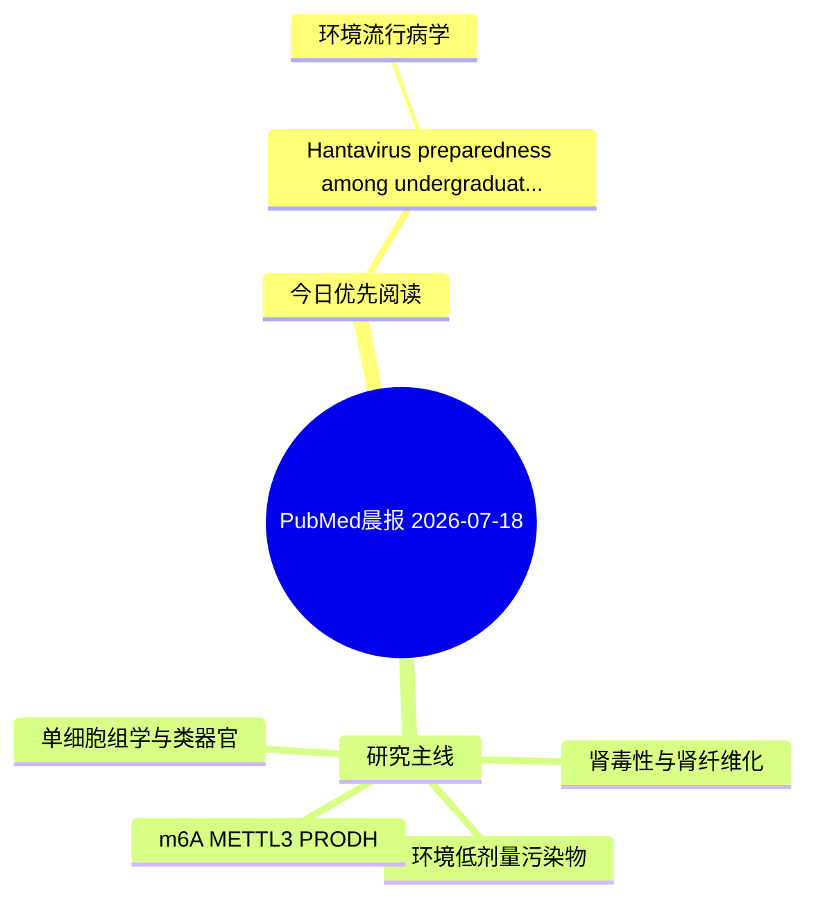

# PubMed 文献晨报｜2026-07-18

- 生成日期：2026-07-18 UTC
- 检索窗口：近 24 小时
- 高质量阈值：规则评分 ≥ 7
- 近 24 小时原始命中数：4

## 今日总体判断

今日筛选出 1 篇优先阅读文献，主要集中在：环境流行病学。

## 今日最值得读的 5 篇文章

### 1. Hantavirus preparedness among undergraduate nursing students in the United Arab Emirates: a cross-sectional study of knowledge, risk perception and preventive practice.

- 题目：Hantavirus preparedness among undergraduate nursing students in the United Arab Emirates: a cross-sectional study of knowledge, risk perception and preventive practice.
- 期刊：BMC nursing
- 年份：2026
- PMID：[42469853](https://pubmed.ncbi.nlm.nih.gov/42469853/)
- DOI：[10.1186/s12912-026-05015-x](https://doi.org/10.1186/s12912-026-05015-x)
- 分类：环境流行病学
- 规则评分：10
- 研究对象：患者样本或临床数据
- 核心方法：基于题名/摘要的常规实验或文献分析，需阅读全文确认
- 主要发现：摘要提示研究重点涉及环境污染物暴露；结论线索为：CONCLUSIONS: Students reported comparatively frequent precautionary practice but had important disease-specific knowledge gaps, particularly regarding safe rodent-contamination cleanup, routine vaccine availability, specific antiviral treatment and person-t...
- 为什么值得读：与检索主题有交集，可作为背景或线索文献扫读

## 分类归档

### 环境流行病学
- [Hantavirus preparedness among undergraduate nursing students in the United Arab Emirates: a cross-sectional study of knowledge, risk perception and preventive practice.](https://pubmed.ncbi.nlm.nih.gov/42469853/)（PMID: 42469853）

### 机制实验
- 今日暂无高质量新文献。

### 单细胞组学
- 今日暂无高质量新文献。

### 类器官
- 今日暂无高质量新文献。

### 肾毒性
- 今日暂无高质量新文献。

### m6A-METTL3-PRODH
- 今日暂无高质量新文献。

## 今日阅读优先级

1. Hantavirus preparedness among undergraduate nursing students in the United Arab Emirates: a cross-sectional study of knowledge, risk perception and preventive practice.（优先理由：与检索主题有交集，可作为背景或线索文献扫读）

## Mermaid 思维导图

