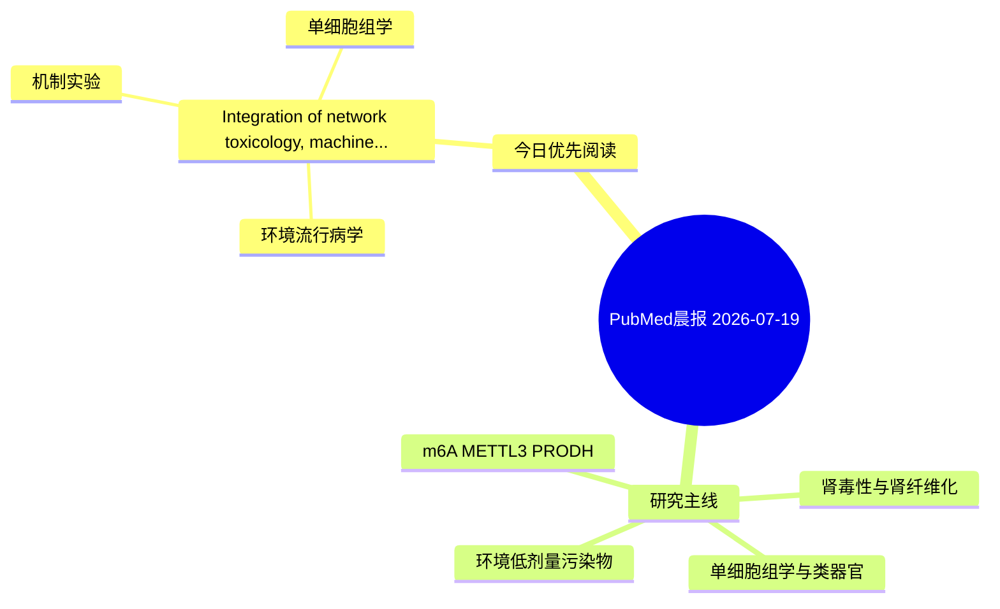

# PubMed 文献晨报｜2026-07-19

- 生成日期：2026-07-19 UTC
- 检索窗口：近 24 小时
- 高质量阈值：规则评分 ≥ 7
- 近 24 小时原始命中数：2

## 今日总体判断

今日筛选出 1 篇优先阅读文献，主要集中在：环境流行病学、机制实验、单细胞组学。

## 今日最值得读的 5 篇文章

### 1. Integration of network toxicology, machine learning and single-cell sequencing identifies candidate molecular links between air pollutants and hepatocellular carcinoma.

- 题目：Integration of network toxicology, machine learning and single-cell sequencing identifies candidate molecular links between air pollutants and hepatocellular carcinoma.
- 期刊：Discover oncology
- 年份：2026
- PMID：[42471526](https://pubmed.ncbi.nlm.nih.gov/42471526/)
- DOI：[10.1007/s12672-026-05569-x](https://doi.org/10.1007/s12672-026-05569-x)
- 分类：环境流行病学、机制实验、单细胞组学
- 规则评分：14
- 研究对象：题名和摘要未明确，建议阅读全文确认
- 核心方法：单细胞或空间组学
- 主要发现：摘要提示研究重点涉及环境污染物暴露、单细胞或空间组学；结论线索为：CONCLUSION: This analysis outlines a potential "pollutant-immune/inflammation-HCC" framework and identifies five transcriptomic signatures for further validation.
- 为什么值得读：同时连接环境暴露与机制线索；可帮助寻找细胞类型特异性机制；关键词匹配度较高

## 分类归档

### 环境流行病学
- [Integration of network toxicology, machine learning and single-cell sequencing identifies candidate molecular links between air pollutants and hepatocellular carcinoma.](https://pubmed.ncbi.nlm.nih.gov/42471526/)（PMID: 42471526）

### 机制实验
- [Integration of network toxicology, machine learning and single-cell sequencing identifies candidate molecular links between air pollutants and hepatocellular carcinoma.](https://pubmed.ncbi.nlm.nih.gov/42471526/)（PMID: 42471526）

### 单细胞组学
- [Integration of network toxicology, machine learning and single-cell sequencing identifies candidate molecular links between air pollutants and hepatocellular carcinoma.](https://pubmed.ncbi.nlm.nih.gov/42471526/)（PMID: 42471526）

### 类器官
- 今日暂无高质量新文献。

### 肾毒性
- 今日暂无高质量新文献。

### m6A-METTL3-PRODH
- 今日暂无高质量新文献。

## 今日阅读优先级

1. Integration of network toxicology, machine learning and single-cell sequencing identifies candidate molecular links between air pollutants and hepatocellular carcinoma.（优先理由：同时连接环境暴露与机制线索；可帮助寻找细胞类型特异性机制；关键词匹配度较高）

## Mermaid 思维导图

