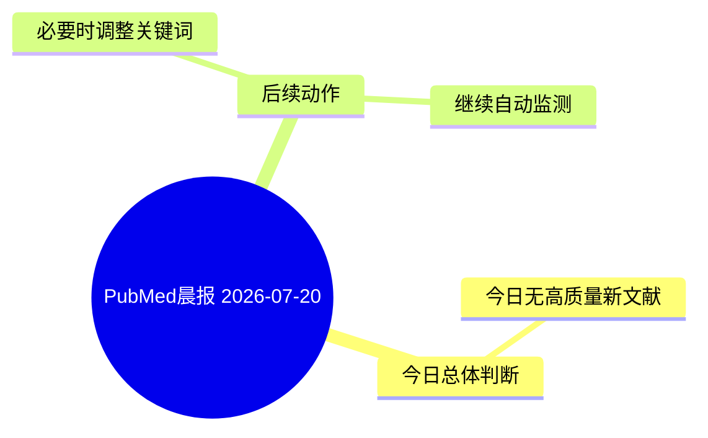

# PubMed 文献晨报｜2026-07-20

- 生成日期：2026-07-20 UTC
- 检索窗口：近 7 天
- 高质量阈值：规则评分 ≥ 7
- 近 24 小时原始命中数：1

## 今日总体判断

今日无高质量新文献。
原因：近 24 小时内没有达到高质量阈值的未推荐文献。

## 今日最值得读的 5 篇文章

今日无高质量新文献，因此不强行推荐 5 篇。

## 分类归档

### 环境流行病学
- 今日暂无高质量新文献。

### 机制实验
- 今日暂无高质量新文献。

### 单细胞组学
- 今日暂无高质量新文献。

### 类器官
- 今日暂无高质量新文献。

### 肾毒性
- 今日暂无高质量新文献。

### m6A-METTL3-PRODH
- 今日暂无高质量新文献。

## 今日阅读优先级

1. 今日不建议安排精读；可以把时间用于复习既往核心文献或优化检索词。

## Mermaid 思维导图

