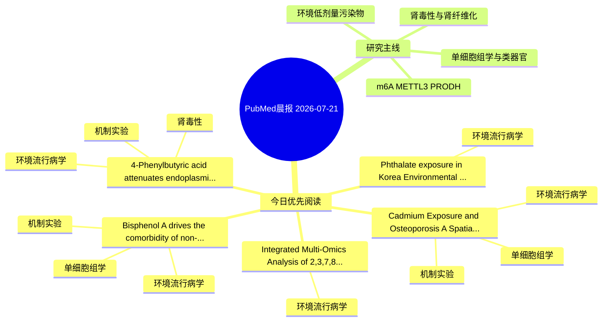

# PubMed 文献晨报｜2026-07-21

- 生成日期：2026-07-21 UTC
- 检索窗口：近 24 小时
- 高质量阈值：规则评分 ≥ 7
- 近 24 小时原始命中数：5

## 今日总体判断

今日筛选出 5 篇优先阅读文献，主要集中在：环境流行病学、机制实验、单细胞组学。

## 今日最值得读的 5 篇文章

### 1. 4-Phenylbutyric acid attenuates endoplasmic reticulum stress-mediated polystyrene microplastic-induced nephrotoxicity in Wistar rats.

- 题目：4-Phenylbutyric acid attenuates endoplasmic reticulum stress-mediated polystyrene microplastic-induced nephrotoxicity in Wistar rats.
- 期刊：Molecular biology reports
- 年份：2026
- PMID：[42474835](https://pubmed.ncbi.nlm.nih.gov/42474835/)
- DOI：[10.1007/s11033-026-12433-2](https://doi.org/10.1007/s11033-026-12433-2)
- 分类：环境流行病学、机制实验、肾毒性
- 规则评分：14
- 研究对象：小鼠或大鼠肾损伤模型
- 核心方法：基于题名/摘要的常规实验或文献分析，需阅读全文确认
- 主要发现：摘要提示研究重点涉及肾毒性/肾损伤；结论线索为：CONCLUSION: The above-mentioned results suggest that 4-PBA may be a therapeutic agent against ER stress-mediated PSMPs-induced nephrotoxicity in rats.
- 为什么值得读：同时连接环境暴露与机制线索；与肾毒性/肾损伤主线直接相关；关键词匹配度较高

### 2. Cadmium Exposure and Osteoporosis: A Spatially Contextualized Adverse Outcome Pathway Integrating Epidemiology, Toxicogenomics and Transcriptomics.

- 题目：Cadmium Exposure and Osteoporosis: A Spatially Contextualized Adverse Outcome Pathway Integrating Epidemiology, Toxicogenomics and Transcriptomics.
- 期刊：Biological trace element research
- 年份：2026
- PMID：[42474879](https://pubmed.ncbi.nlm.nih.gov/42474879/)
- DOI：[10.1007/s12011-026-05249-5](https://doi.org/10.1007/s12011-026-05249-5)
- 分类：环境流行病学、机制实验、单细胞组学
- 规则评分：13
- 研究对象：人群/队列或环境暴露人群
- 核心方法：环境流行病学/队列或人群数据；单细胞或空间组学
- 主要发现：摘要提示研究重点涉及环境污染物暴露、单细胞或空间组学；结论线索为：Spatial transcriptomics further revealed niche-associated module distributions, trabecula-related gradients, and nonrandom spatial clustering, particularly for bone-remodeling, inflammation/cell-fate, and oxidative stress/mitochondrial modules.
- 为什么值得读：同时连接环境暴露与机制线索；可帮助寻找细胞类型特异性机制；关键词匹配度较高

### 3. Bisphenol A drives the comorbidity of non-alcoholic fatty liver disease and osteoarthritis by targeting RHOB: Integrated multi-omics, single-cell analysis, and experimental validation.

- 题目：Bisphenol A drives the comorbidity of non-alcoholic fatty liver disease and osteoarthritis by targeting RHOB: Integrated multi-omics, single-cell analysis, and experimental validation.
- 期刊：Experimental gerontology
- 年份：2026
- PMID：[42476233](https://pubmed.ncbi.nlm.nih.gov/42476233/)
- DOI：[10.1016/j.exger.2026.113242](https://doi.org/10.1016/j.exger.2026.113242)
- 分类：环境流行病学、机制实验、单细胞组学
- 规则评分：10
- 研究对象：题名和摘要未明确，建议阅读全文确认
- 核心方法：单细胞或空间组学；细胞与动物机制实验
- 主要发现：摘要提示研究重点涉及单细胞或空间组学；结论线索为：CONCLUSION: BPA exposure drives the co-morbidity of OA and NAFLD by inhibiting RHOB.
- 为什么值得读：同时连接环境暴露与机制线索；可帮助寻找细胞类型特异性机制

### 4. Integrated Multi-Omics Analysis of 2,3,7,8-TCDD-induced Renal Cell Carcinoma Reveals Core Targets and Mechanistic Pathways.

- 题目：Integrated Multi-Omics Analysis of 2,3,7,8-TCDD-induced Renal Cell Carcinoma Reveals Core Targets and Mechanistic Pathways.
- 期刊：Current medicinal chemistry
- 年份：2026
- PMID：[42474018](https://pubmed.ncbi.nlm.nih.gov/42474018/)
- DOI：[10.2174/0109298673463622260531194726](https://doi.org/10.2174/0109298673463622260531194726)
- 分类：环境流行病学
- 规则评分：9
- 研究对象：肾小管/肾脏细胞与组织
- 核心方法：基于题名/摘要的常规实验或文献分析，需阅读全文确认
- 主要发现：摘要提示研究重点涉及环境污染物暴露；结论线索为：CONCLUSION: Our results suggest that TCDD may help drive the development of RCC through certain signaling pathways and key molecular targets, especially PLA2G7 and CSRP1.
- 为什么值得读：与检索主题有交集，可作为背景或线索文献扫读

### 5. Phthalate exposure in Korea: Environmental contamination, human biomonitoring, health effects, and regulatory responses.

- 题目：Phthalate exposure in Korea: Environmental contamination, human biomonitoring, health effects, and regulatory responses.
- 期刊：Ecotoxicology and environmental safety
- 年份：2026
- PMID：[42475953](https://pubmed.ncbi.nlm.nih.gov/42475953/)
- DOI：[10.1016/j.ecoenv.2026.120520](https://doi.org/10.1016/j.ecoenv.2026.120520)
- 分类：环境流行病学
- 规则评分：8
- 研究对象：人群/队列或环境暴露人群
- 核心方法：环境流行病学/队列或人群数据
- 主要发现：摘要提示研究重点涉及本方向相关问题；结论线索为：Although exposure levels show stable or modest declines following regulatory interventions, environmental contamination is still widespread.
- 为什么值得读：与检索主题有交集，可作为背景或线索文献扫读

## 分类归档

### 环境流行病学
- [4-Phenylbutyric acid attenuates endoplasmic reticulum stress-mediated polystyrene microplastic-induced nephrotoxicity in Wistar rats.](https://pubmed.ncbi.nlm.nih.gov/42474835/)（PMID: 42474835）
- [Cadmium Exposure and Osteoporosis: A Spatially Contextualized Adverse Outcome Pathway Integrating Epidemiology, Toxicogenomics and Transcriptomics.](https://pubmed.ncbi.nlm.nih.gov/42474879/)（PMID: 42474879）
- [Bisphenol A drives the comorbidity of non-alcoholic fatty liver disease and osteoarthritis by targeting RHOB: Integrated multi-omics, single-cell analysis, and experimental validation.](https://pubmed.ncbi.nlm.nih.gov/42476233/)（PMID: 42476233）
- [Integrated Multi-Omics Analysis of 2,3,7,8-TCDD-induced Renal Cell Carcinoma Reveals Core Targets and Mechanistic Pathways.](https://pubmed.ncbi.nlm.nih.gov/42474018/)（PMID: 42474018）
- [Phthalate exposure in Korea: Environmental contamination, human biomonitoring, health effects, and regulatory responses.](https://pubmed.ncbi.nlm.nih.gov/42475953/)（PMID: 42475953）

### 机制实验
- [4-Phenylbutyric acid attenuates endoplasmic reticulum stress-mediated polystyrene microplastic-induced nephrotoxicity in Wistar rats.](https://pubmed.ncbi.nlm.nih.gov/42474835/)（PMID: 42474835）
- [Cadmium Exposure and Osteoporosis: A Spatially Contextualized Adverse Outcome Pathway Integrating Epidemiology, Toxicogenomics and Transcriptomics.](https://pubmed.ncbi.nlm.nih.gov/42474879/)（PMID: 42474879）
- [Bisphenol A drives the comorbidity of non-alcoholic fatty liver disease and osteoarthritis by targeting RHOB: Integrated multi-omics, single-cell analysis, and experimental validation.](https://pubmed.ncbi.nlm.nih.gov/42476233/)（PMID: 42476233）

### 单细胞组学
- [Cadmium Exposure and Osteoporosis: A Spatially Contextualized Adverse Outcome Pathway Integrating Epidemiology, Toxicogenomics and Transcriptomics.](https://pubmed.ncbi.nlm.nih.gov/42474879/)（PMID: 42474879）
- [Bisphenol A drives the comorbidity of non-alcoholic fatty liver disease and osteoarthritis by targeting RHOB: Integrated multi-omics, single-cell analysis, and experimental validation.](https://pubmed.ncbi.nlm.nih.gov/42476233/)（PMID: 42476233）

### 类器官
- 今日暂无高质量新文献。

### 肾毒性
- [4-Phenylbutyric acid attenuates endoplasmic reticulum stress-mediated polystyrene microplastic-induced nephrotoxicity in Wistar rats.](https://pubmed.ncbi.nlm.nih.gov/42474835/)（PMID: 42474835）

### m6A-METTL3-PRODH
- 今日暂无高质量新文献。

## 今日阅读优先级

1. 4-Phenylbutyric acid attenuates endoplasmic reticulum stress-mediated polystyrene microplastic-induced nephrotoxicity in Wistar rats.（优先理由：同时连接环境暴露与机制线索；与肾毒性/肾损伤主线直接相关；关键词匹配度较高）
2. Cadmium Exposure and Osteoporosis: A Spatially Contextualized Adverse Outcome Pathway Integrating Epidemiology, Toxicogenomics and Transcriptomics.（优先理由：同时连接环境暴露与机制线索；可帮助寻找细胞类型特异性机制；关键词匹配度较高）
3. Bisphenol A drives the comorbidity of non-alcoholic fatty liver disease and osteoarthritis by targeting RHOB: Integrated multi-omics, single-cell analysis, and experimental validation.（优先理由：同时连接环境暴露与机制线索；可帮助寻找细胞类型特异性机制）
4. Integrated Multi-Omics Analysis of 2,3,7,8-TCDD-induced Renal Cell Carcinoma Reveals Core Targets and Mechanistic Pathways.（优先理由：与检索主题有交集，可作为背景或线索文献扫读）
5. Phthalate exposure in Korea: Environmental contamination, human biomonitoring, health effects, and regulatory responses.（优先理由：与检索主题有交集，可作为背景或线索文献扫读）

## Mermaid 思维导图

