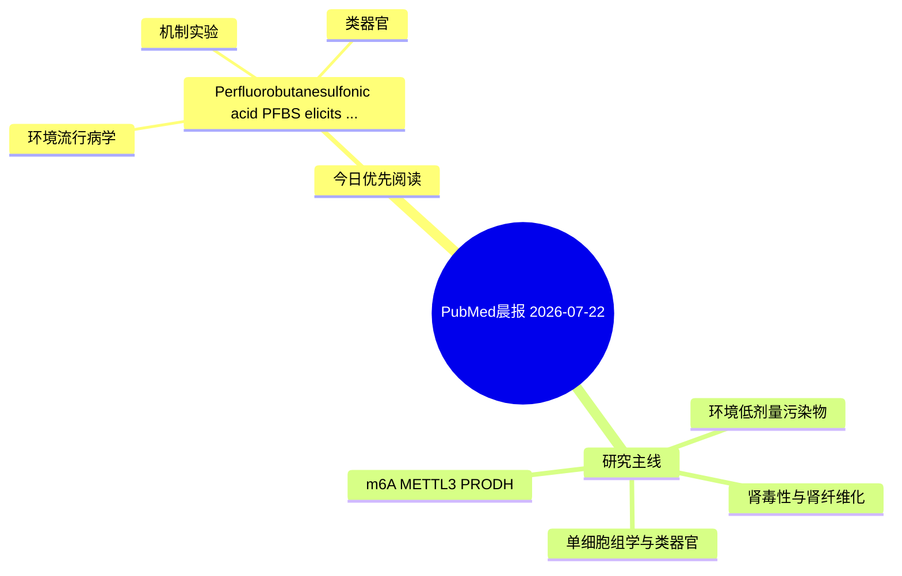

# PubMed 文献晨报｜2026-07-22

- 生成日期：2026-07-22 UTC
- 检索窗口：近 24 小时
- 高质量阈值：规则评分 ≥ 7
- 近 24 小时原始命中数：3

## 今日总体判断

今日筛选出 1 篇优先阅读文献，主要集中在：环境流行病学、机制实验、类器官。

## 今日最值得读的 5 篇文章

### 1. Perfluorobutanesulfonic acid (PFBS) elicits compartment-specific divergent responses in prostate homeostasis: Wnt/β-catenin oncogenic activation in epithelial cells versus mitochondria-mediated ferroptosis susceptibility in stromal cells.

- 题目：Perfluorobutanesulfonic acid (PFBS) elicits compartment-specific divergent responses in prostate homeostasis: Wnt/β-catenin oncogenic activation in epithelial cells versus mitochondria-mediated ferroptosis susceptibility in stromal cells.
- 期刊：Ecotoxicology and environmental safety
- 年份：2026
- PMID：[42480139](https://pubmed.ncbi.nlm.nih.gov/42480139/)
- DOI：[10.1016/j.ecoenv.2026.120519](https://doi.org/10.1016/j.ecoenv.2026.120519)
- 分类：环境流行病学、机制实验、类器官
- 规则评分：10
- 研究对象：人群/队列或环境暴露人群
- 核心方法：类器官/干细胞模型；细胞与动物机制实验
- 主要发现：摘要提示研究重点涉及环境污染物暴露、类器官模型；结论线索为：These findings suggest that, under these in vitro conditions, PFBS can simultaneously activate Wnt signaling in epithelial cells and promote ferroptosis susceptibility in stromal cells, a divergent response pattern not captured by conventional single-endpoi...
- 为什么值得读：同时连接环境暴露与机制线索；对建立更接近人体的模型有参考价值

## 分类归档

### 环境流行病学
- [Perfluorobutanesulfonic acid (PFBS) elicits compartment-specific divergent responses in prostate homeostasis: Wnt/β-catenin oncogenic activation in epithelial cells versus mitochondria-mediated ferroptosis susceptibility in stromal cells.](https://pubmed.ncbi.nlm.nih.gov/42480139/)（PMID: 42480139）

### 机制实验
- [Perfluorobutanesulfonic acid (PFBS) elicits compartment-specific divergent responses in prostate homeostasis: Wnt/β-catenin oncogenic activation in epithelial cells versus mitochondria-mediated ferroptosis susceptibility in stromal cells.](https://pubmed.ncbi.nlm.nih.gov/42480139/)（PMID: 42480139）

### 单细胞组学
- 今日暂无高质量新文献。

### 类器官
- [Perfluorobutanesulfonic acid (PFBS) elicits compartment-specific divergent responses in prostate homeostasis: Wnt/β-catenin oncogenic activation in epithelial cells versus mitochondria-mediated ferroptosis susceptibility in stromal cells.](https://pubmed.ncbi.nlm.nih.gov/42480139/)（PMID: 42480139）

### 肾毒性
- 今日暂无高质量新文献。

### m6A-METTL3-PRODH
- 今日暂无高质量新文献。

## 今日阅读优先级

1. Perfluorobutanesulfonic acid (PFBS) elicits compartment-specific divergent responses in prostate homeostasis: Wnt/β-catenin oncogenic activation in epithelial cells versus mitochondria-mediated ferroptosis susceptibility in stromal cells.（优先理由：同时连接环境暴露与机制线索；对建立更接近人体的模型有参考价值）

## Mermaid 思维导图

