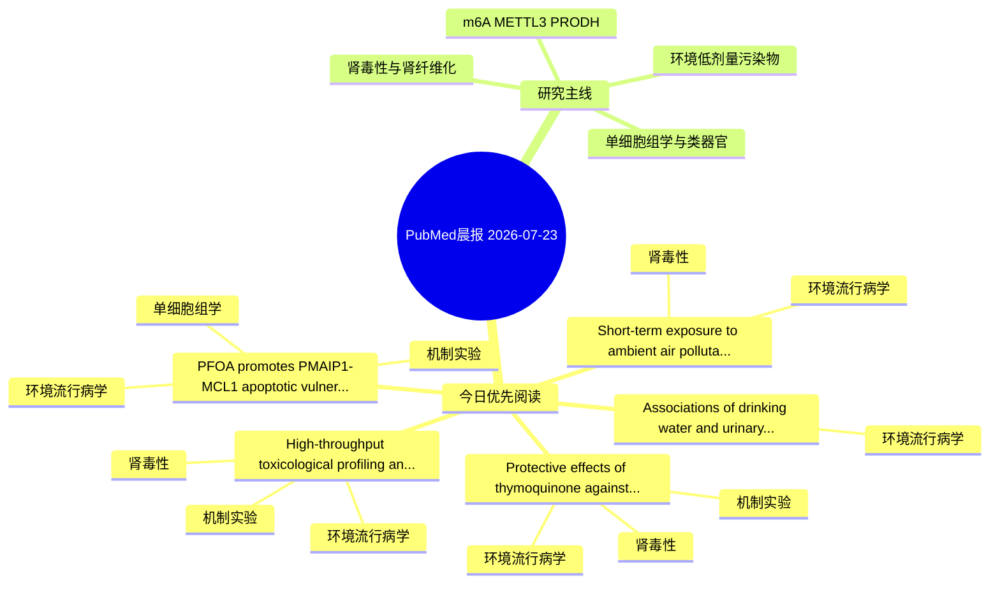

# PubMed 文献晨报｜2026-07-23

- 生成日期：2026-07-23 UTC
- 检索窗口：近 24 小时
- 高质量阈值：规则评分 ≥ 7
- 近 24 小时原始命中数：6

## 今日总体判断

今日筛选出 5 篇优先阅读文献，主要集中在：环境流行病学、机制实验、肾毒性。

## 今日最值得读的 5 篇文章

### 1. Protective effects of thymoquinone against hexavalent chromium-ınduced nephrotoxicity: a multiparametric evaluation of oxidative stress, ınflammation, ferroptosis- and apoptosis-related markers.

- 题目：Protective effects of thymoquinone against hexavalent chromium-ınduced nephrotoxicity: a multiparametric evaluation of oxidative stress, ınflammation, ferroptosis- and apoptosis-related markers.
- 期刊：Molecular and cellular biochemistry
- 年份：2026
- PMID：[42484788](https://pubmed.ncbi.nlm.nih.gov/42484788/)
- DOI：[10.1007/s11010-026-05646-3](https://doi.org/10.1007/s11010-026-05646-3)
- 分类：环境流行病学、机制实验、肾毒性
- 规则评分：14
- 研究对象：小鼠或大鼠肾损伤模型
- 核心方法：基于题名/摘要的常规实验或文献分析，需阅读全文确认
- 主要发现：摘要提示研究重点涉及环境污染物暴露、肾毒性/肾损伤、肾纤维化；结论线索为：In conclusion, Tq attenuates Cr(VI)-induced nephrotoxicity, as evidenced by improvements in oxidative stress, inflammation, DNA damage, ferroptosis- and apoptosis-related markers, together with preservation of renal structure and function.
- 为什么值得读：同时连接环境暴露与机制线索；与肾毒性/肾损伤主线直接相关；关键词匹配度较高

### 2. High-throughput toxicological profiling and ToxPi-based prioritization of chemical migrants from recycled paper used in food contact materials.

- 题目：High-throughput toxicological profiling and ToxPi-based prioritization of chemical migrants from recycled paper used in food contact materials.
- 期刊：Journal of hazardous materials
- 年份：2026
- PMID：[42485721](https://pubmed.ncbi.nlm.nih.gov/42485721/)
- DOI：[10.1016/j.jhazmat.2026.142920](https://doi.org/10.1016/j.jhazmat.2026.142920)
- 分类：环境流行病学、机制实验、肾毒性
- 规则评分：11
- 研究对象：HK-2 近端肾小管上皮细胞
- 核心方法：细胞与动物机制实验
- 主要发现：摘要提示研究重点涉及本方向相关问题；结论线索为：Through Neutral Red uptake (NRU) and high-content screening (HCS) assays using HepaRG and HK-2 cell lines, we found that in 20% ethanol and 4% acetic acid migrants o rFCMs may disrupt cellular and targeting mitochondrial homeostasis.
- 为什么值得读：同时连接环境暴露与机制线索；与肾毒性/肾损伤主线直接相关

### 3. PFOA promotes PMAIP1-MCL1 apoptotic vulnerability within a BHLHE41-associated macrophage regulatory architecture in atherosclerosis.

- 题目：PFOA promotes PMAIP1-MCL1 apoptotic vulnerability within a BHLHE41-associated macrophage regulatory architecture in atherosclerosis.
- 期刊：Chemico-biological interactions
- 年份：2026
- PMID：[42486287](https://pubmed.ncbi.nlm.nih.gov/42486287/)
- DOI：[10.1016/j.cbi.2026.112265](https://doi.org/10.1016/j.cbi.2026.112265)
- 分类：环境流行病学、机制实验、单细胞组学
- 规则评分：10
- 研究对象：人群/队列或环境暴露人群
- 核心方法：环境流行病学/队列或人群数据；单细胞或空间组学；细胞与动物机制实验
- 主要发现：摘要提示研究重点涉及环境污染物暴露、单细胞或空间组学；结论线索为：Together, these data support a mechanism-oriented framework in which PFOA may promote PMAIP1-MCL1 apoptotic vulnerability within a BHLHE41-associated macrophage regulatory architecture in atherosclerosis.
- 为什么值得读：同时连接环境暴露与机制线索；可帮助寻找细胞类型特异性机制

### 4. Associations of drinking water and urinary uranium with incident diabetes among U.S. adults: The Multi-Ethnic Study of Atherosclerosis and the Strong Heart Family Study.

- 题目：Associations of drinking water and urinary uranium with incident diabetes among U.S. adults: The Multi-Ethnic Study of Atherosclerosis and the Strong Heart Family Study.
- 期刊：Environmental research
- 年份：2026
- PMID：[42486290](https://pubmed.ncbi.nlm.nih.gov/42486290/)
- DOI：[10.1016/j.envres.2026.125295](https://doi.org/10.1016/j.envres.2026.125295)
- 分类：环境流行病学
- 规则评分：9
- 研究对象：人群/队列或环境暴露人群
- 核心方法：环境流行病学/队列或人群数据
- 主要发现：摘要提示研究重点涉及环境污染物暴露；结论线索为：CONCLUSIONS: CWS and urine uranium were not statistically associated with T2D across U.S.
- 为什么值得读：与检索主题有交集，可作为背景或线索文献扫读

### 5. Short-term exposure to ambient air pollutants increases the mortality risk of chronic kidney disease: a time-stratified case-crossover study in Zhejiang Province.

- 题目：Short-term exposure to ambient air pollutants increases the mortality risk of chronic kidney disease: a time-stratified case-crossover study in Zhejiang Province.
- 期刊：BMC nephrology
- 年份：2026
- PMID：[42482197](https://pubmed.ncbi.nlm.nih.gov/42482197/)
- DOI：[10.1186/s12882-026-05103-9](https://doi.org/10.1186/s12882-026-05103-9)
- 分类：环境流行病学、肾毒性
- 规则评分：9
- 研究对象：人群/队列或环境暴露人群
- 核心方法：环境流行病学/队列或人群数据
- 主要发现：摘要提示研究重点涉及环境污染物暴露、肾毒性/肾损伤；结论线索为：These findings provide novel evidence for understanding the impact of environmental factors on kidney disease and suggest a need for governmental authorities to enhance the monitoring and control of air pollution to mitigate the health burden on the elderly.
- 为什么值得读：与肾毒性/肾损伤主线直接相关

## 分类归档

### 环境流行病学
- [Protective effects of thymoquinone against hexavalent chromium-ınduced nephrotoxicity: a multiparametric evaluation of oxidative stress, ınflammation, ferroptosis- and apoptosis-related markers.](https://pubmed.ncbi.nlm.nih.gov/42484788/)（PMID: 42484788）
- [High-throughput toxicological profiling and ToxPi-based prioritization of chemical migrants from recycled paper used in food contact materials.](https://pubmed.ncbi.nlm.nih.gov/42485721/)（PMID: 42485721）
- [PFOA promotes PMAIP1-MCL1 apoptotic vulnerability within a BHLHE41-associated macrophage regulatory architecture in atherosclerosis.](https://pubmed.ncbi.nlm.nih.gov/42486287/)（PMID: 42486287）
- [Associations of drinking water and urinary uranium with incident diabetes among U.S. adults: The Multi-Ethnic Study of Atherosclerosis and the Strong Heart Family Study.](https://pubmed.ncbi.nlm.nih.gov/42486290/)（PMID: 42486290）
- [Short-term exposure to ambient air pollutants increases the mortality risk of chronic kidney disease: a time-stratified case-crossover study in Zhejiang Province.](https://pubmed.ncbi.nlm.nih.gov/42482197/)（PMID: 42482197）

### 机制实验
- [Protective effects of thymoquinone against hexavalent chromium-ınduced nephrotoxicity: a multiparametric evaluation of oxidative stress, ınflammation, ferroptosis- and apoptosis-related markers.](https://pubmed.ncbi.nlm.nih.gov/42484788/)（PMID: 42484788）
- [High-throughput toxicological profiling and ToxPi-based prioritization of chemical migrants from recycled paper used in food contact materials.](https://pubmed.ncbi.nlm.nih.gov/42485721/)（PMID: 42485721）
- [PFOA promotes PMAIP1-MCL1 apoptotic vulnerability within a BHLHE41-associated macrophage regulatory architecture in atherosclerosis.](https://pubmed.ncbi.nlm.nih.gov/42486287/)（PMID: 42486287）

### 单细胞组学
- [PFOA promotes PMAIP1-MCL1 apoptotic vulnerability within a BHLHE41-associated macrophage regulatory architecture in atherosclerosis.](https://pubmed.ncbi.nlm.nih.gov/42486287/)（PMID: 42486287）

### 类器官
- 今日暂无高质量新文献。

### 肾毒性
- [Protective effects of thymoquinone against hexavalent chromium-ınduced nephrotoxicity: a multiparametric evaluation of oxidative stress, ınflammation, ferroptosis- and apoptosis-related markers.](https://pubmed.ncbi.nlm.nih.gov/42484788/)（PMID: 42484788）
- [High-throughput toxicological profiling and ToxPi-based prioritization of chemical migrants from recycled paper used in food contact materials.](https://pubmed.ncbi.nlm.nih.gov/42485721/)（PMID: 42485721）
- [Short-term exposure to ambient air pollutants increases the mortality risk of chronic kidney disease: a time-stratified case-crossover study in Zhejiang Province.](https://pubmed.ncbi.nlm.nih.gov/42482197/)（PMID: 42482197）

### m6A-METTL3-PRODH
- 今日暂无高质量新文献。

## 今日阅读优先级

1. Protective effects of thymoquinone against hexavalent chromium-ınduced nephrotoxicity: a multiparametric evaluation of oxidative stress, ınflammation, ferroptosis- and apoptosis-related markers.（优先理由：同时连接环境暴露与机制线索；与肾毒性/肾损伤主线直接相关；关键词匹配度较高）
2. High-throughput toxicological profiling and ToxPi-based prioritization of chemical migrants from recycled paper used in food contact materials.（优先理由：同时连接环境暴露与机制线索；与肾毒性/肾损伤主线直接相关）
3. PFOA promotes PMAIP1-MCL1 apoptotic vulnerability within a BHLHE41-associated macrophage regulatory architecture in atherosclerosis.（优先理由：同时连接环境暴露与机制线索；可帮助寻找细胞类型特异性机制）
4. Associations of drinking water and urinary uranium with incident diabetes among U.S. adults: The Multi-Ethnic Study of Atherosclerosis and the Strong Heart Family Study.（优先理由：与检索主题有交集，可作为背景或线索文献扫读）
5. Short-term exposure to ambient air pollutants increases the mortality risk of chronic kidney disease: a time-stratified case-crossover study in Zhejiang Province.（优先理由：与肾毒性/肾损伤主线直接相关）

## Mermaid 思维导图

