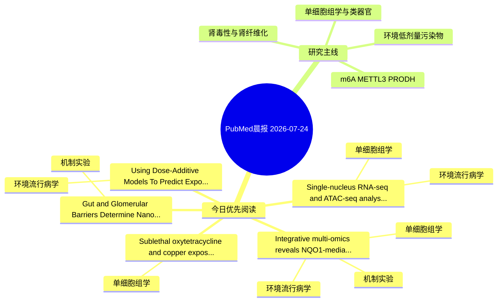

# PubMed 文献晨报｜2026-07-24

- 生成日期：2026-07-24 UTC
- 检索窗口：近 24 小时
- 高质量阈值：规则评分 ≥ 7
- 近 24 小时原始命中数：8

## 今日总体判断

今日筛选出 5 篇优先阅读文献，主要集中在：环境流行病学、单细胞组学、机制实验。

## 今日最值得读的 5 篇文章

### 1. Integrative multi-omics reveals NQO1-mediated airway epithelial injury as a key mechanism of bisphenol A-induced COPD.

- 题目：Integrative multi-omics reveals NQO1-mediated airway epithelial injury as a key mechanism of bisphenol A-induced COPD.
- 期刊：Naunyn-Schmiedeberg's archives of pharmacology
- 年份：2026
- PMID：[42489718](https://pubmed.ncbi.nlm.nih.gov/42489718/)
- DOI：[10.1007/s00210-026-05728-5](https://doi.org/10.1007/s00210-026-05728-5)
- 分类：环境流行病学、机制实验、单细胞组学
- 规则评分：13
- 研究对象：人群/队列或环境暴露人群
- 核心方法：环境流行病学/队列或人群数据；单细胞或空间组学；细胞与动物机制实验
- 主要发现：摘要提示研究重点涉及环境污染物暴露、单细胞或空间组学；结论线索为：Our findings suggest that BPA is a potential risk factor for COPD, and downregulation of NQO1 contributes to the pathogenesis of BPA-induced COPD, potentially through mitochondrial damage in airway epithelial cells.
- 为什么值得读：同时连接环境暴露与机制线索；可帮助寻找细胞类型特异性机制；关键词匹配度较高

### 2. Single-nucleus RNA-seq and ATAC-seq analyses provide molecular insights into cadmium-stress response in alfalfa roots.

- 题目：Single-nucleus RNA-seq and ATAC-seq analyses provide molecular insights into cadmium-stress response in alfalfa roots.
- 期刊：Horticulture research
- 年份：2026
- PMID：[42494487](https://pubmed.ncbi.nlm.nih.gov/42494487/)
- DOI：[10.1093/hr/uhag117](https://doi.org/10.1093/hr/uhag117)
- 分类：环境流行病学、单细胞组学
- 规则评分：10
- 研究对象：题名和摘要未明确，建议阅读全文确认
- 核心方法：单细胞或空间组学
- 主要发现：摘要提示研究重点涉及环境污染物暴露、单细胞或空间组学；结论线索为：Coexpression network analysis revealed 10 cell-type-specific modules, with the calmodulin-like gene MsCML acting as a highly interconnected hub gene, whose overexpression significantly improved Cd tolerance.
- 为什么值得读：可帮助寻找细胞类型特异性机制

### 3. Using Dose-Additive Models To Predict Exposure and Effects of a Military Site Risk-Relevant PFAS Mixture in Mice.

- 题目：Using Dose-Additive Models To Predict Exposure and Effects of a Military Site Risk-Relevant PFAS Mixture in Mice.
- 期刊：ACS environmental Au
- 年份：2026
- PMID：[42491390](https://pubmed.ncbi.nlm.nih.gov/42491390/)
- DOI：[10.1021/acsenvironau.5c00241](https://doi.org/10.1021/acsenvironau.5c00241)
- 分类：环境流行病学
- 规则评分：9
- 研究对象：小鼠或大鼠肾损伤模型
- 核心方法：基于题名/摘要的常规实验或文献分析，需阅读全文确认
- 主要发现：摘要提示研究重点涉及环境污染物暴露；结论线索为：Our results indicate that dose addition methods are successful predictors of PFAS exposure and liver effects and, importantly, provide efficient predictive screening tools for ecological risk assessors evaluating sites' PFAS risks.
- 为什么值得读：与检索主题有交集，可作为背景或线索文献扫读

### 4. Gut and Glomerular Barriers Determine Nanoplastic Fate and Systemic Impact.

- 题目：Gut and Glomerular Barriers Determine Nanoplastic Fate and Systemic Impact.
- 期刊：ACS environmental Au
- 年份：2026
- PMID：[42491343](https://pubmed.ncbi.nlm.nih.gov/42491343/)
- DOI：[10.1021/acsenvironau.6c00069](https://doi.org/10.1021/acsenvironau.6c00069)
- 分类：机制实验
- 规则评分：9
- 研究对象：小鼠或大鼠肾损伤模型
- 核心方法：细胞与动物机制实验
- 主要发现：摘要提示研究重点涉及本方向相关问题；结论线索为：Furthermore, we revealed a microbiota-mediated axis that may prime the kidney for environmentally induced stress in the long term.
- 为什么值得读：与检索主题有交集，可作为背景或线索文献扫读

### 5. Sublethal oxytetracycline and copper exposure alters rRNA gene copy number, expression, and intragenomic polymorphism in ciliates.

- 题目：Sublethal oxytetracycline and copper exposure alters rRNA gene copy number, expression, and intragenomic polymorphism in ciliates.
- 期刊：Current research in microbial sciences
- 年份：2026
- PMID：[42491305](https://pubmed.ncbi.nlm.nih.gov/42491305/)
- DOI：[10.1016/j.crmicr.2026.100643](https://doi.org/10.1016/j.crmicr.2026.100643)
- 分类：单细胞组学
- 规则评分：7
- 研究对象：题名和摘要未明确，建议阅读全文确认
- 核心方法：单细胞或空间组学
- 主要发现：摘要提示研究重点涉及单细胞或空间组学；结论线索为：Re-analysis of field 18S metabarcoding data from CuCl2-polluted marine biofilms revealed dose-dependent increases in the number of ASVs per operational taxonomic unit (OTU, defined at a cutoff of 97% sequence identity) in many protistan groups, suggesting t...
- 为什么值得读：可帮助寻找细胞类型特异性机制

## 分类归档

### 环境流行病学
- [Integrative multi-omics reveals NQO1-mediated airway epithelial injury as a key mechanism of bisphenol A-induced COPD.](https://pubmed.ncbi.nlm.nih.gov/42489718/)（PMID: 42489718）
- [Single-nucleus RNA-seq and ATAC-seq analyses provide molecular insights into cadmium-stress response in alfalfa roots.](https://pubmed.ncbi.nlm.nih.gov/42494487/)（PMID: 42494487）
- [Using Dose-Additive Models To Predict Exposure and Effects of a Military Site Risk-Relevant PFAS Mixture in Mice.](https://pubmed.ncbi.nlm.nih.gov/42491390/)（PMID: 42491390）

### 机制实验
- [Integrative multi-omics reveals NQO1-mediated airway epithelial injury as a key mechanism of bisphenol A-induced COPD.](https://pubmed.ncbi.nlm.nih.gov/42489718/)（PMID: 42489718）
- [Gut and Glomerular Barriers Determine Nanoplastic Fate and Systemic Impact.](https://pubmed.ncbi.nlm.nih.gov/42491343/)（PMID: 42491343）

### 单细胞组学
- [Integrative multi-omics reveals NQO1-mediated airway epithelial injury as a key mechanism of bisphenol A-induced COPD.](https://pubmed.ncbi.nlm.nih.gov/42489718/)（PMID: 42489718）
- [Single-nucleus RNA-seq and ATAC-seq analyses provide molecular insights into cadmium-stress response in alfalfa roots.](https://pubmed.ncbi.nlm.nih.gov/42494487/)（PMID: 42494487）
- [Sublethal oxytetracycline and copper exposure alters rRNA gene copy number, expression, and intragenomic polymorphism in ciliates.](https://pubmed.ncbi.nlm.nih.gov/42491305/)（PMID: 42491305）

### 类器官
- 今日暂无高质量新文献。

### 肾毒性
- 今日暂无高质量新文献。

### m6A-METTL3-PRODH
- 今日暂无高质量新文献。

## 今日阅读优先级

1. Integrative multi-omics reveals NQO1-mediated airway epithelial injury as a key mechanism of bisphenol A-induced COPD.（优先理由：同时连接环境暴露与机制线索；可帮助寻找细胞类型特异性机制；关键词匹配度较高）
2. Single-nucleus RNA-seq and ATAC-seq analyses provide molecular insights into cadmium-stress response in alfalfa roots.（优先理由：可帮助寻找细胞类型特异性机制）
3. Using Dose-Additive Models To Predict Exposure and Effects of a Military Site Risk-Relevant PFAS Mixture in Mice.（优先理由：与检索主题有交集，可作为背景或线索文献扫读）
4. Gut and Glomerular Barriers Determine Nanoplastic Fate and Systemic Impact.（优先理由：与检索主题有交集，可作为背景或线索文献扫读）
5. Sublethal oxytetracycline and copper exposure alters rRNA gene copy number, expression, and intragenomic polymorphism in ciliates.（优先理由：可帮助寻找细胞类型特异性机制）

## Mermaid 思维导图

