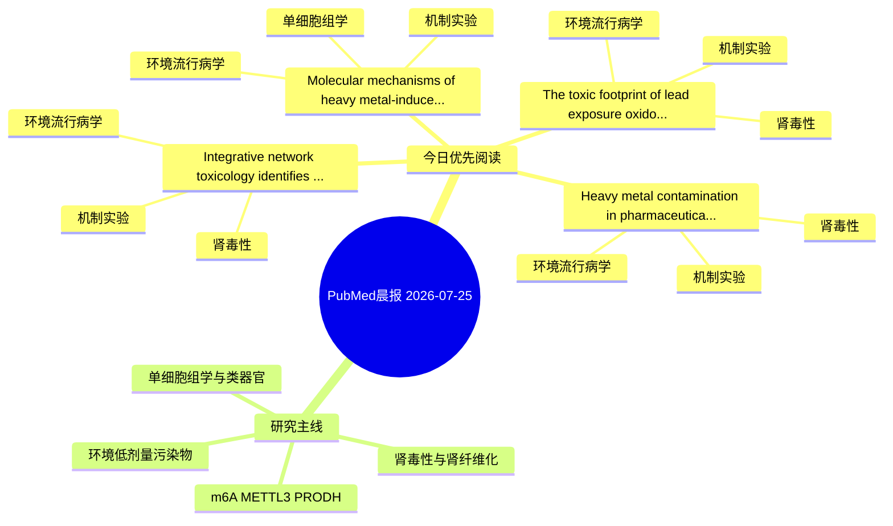

# PubMed 文献晨报｜2026-07-25

- 生成日期：2026-07-25 UTC
- 检索窗口：近 24 小时
- 高质量阈值：规则评分 ≥ 7
- 近 24 小时原始命中数：6

## 今日总体判断

今日筛选出 4 篇优先阅读文献，主要集中在：环境流行病学、机制实验、肾毒性。

## 今日最值得读的 5 篇文章

### 1. Integrative network toxicology identifies SLC5A2 as a key mediator of tetrasodium pyrophosphate-induced renal fibrosis.

- 题目：Integrative network toxicology identifies SLC5A2 as a key mediator of tetrasodium pyrophosphate-induced renal fibrosis.
- 期刊：Food and chemical toxicology : an international journal published for the British Industrial Biological Research Association
- 年份：2026
- PMID：[42497931](https://pubmed.ncbi.nlm.nih.gov/42497931/)
- DOI：[10.1016/j.fct.2026.116294](https://doi.org/10.1016/j.fct.2026.116294)
- 分类：环境流行病学、机制实验、肾毒性
- 规则评分：20
- 研究对象：HK-2 近端肾小管上皮细胞
- 核心方法：细胞与动物机制实验
- 主要发现：摘要提示研究重点涉及环境污染物暴露、肾纤维化；结论线索为：These findings suggest that TSPP may contribute to renal fibrosis by downregulating SLC5A2 and disrupting proximal tubular transport homeostasis, thereby promoting inflammatory and profibrotic responses.
- 为什么值得读：同时连接环境暴露与机制线索；与肾毒性/肾损伤主线直接相关；关键词匹配度较高

### 2. Molecular mechanisms of heavy metal-induced cancer: Insights from animal models and human implications.

- 题目：Molecular mechanisms of heavy metal-induced cancer: Insights from animal models and human implications.
- 期刊：Toxicology and industrial health
- 年份：2026
- PMID：[42498637](https://pubmed.ncbi.nlm.nih.gov/42498637/)
- DOI：[10.1177/07482337261469287](https://doi.org/10.1177/07482337261469287)
- 分类：环境流行病学、机制实验、单细胞组学
- 规则评分：15
- 研究对象：人群/队列或环境暴露人群
- 核心方法：单细胞或空间组学
- 主要发现：摘要提示研究重点涉及环境污染物暴露、单细胞或空间组学；结论线索为：Evaluation of the role of gut microbiome interactions in modulating metal bioavailability and carcinogenic potential, limitations of traditional animal models for mixture risk assessment, and emerging technologies, including single-cell sequencing, CRISPR-b...
- 为什么值得读：同时连接环境暴露与机制线索；可帮助寻找细胞类型特异性机制；关键词匹配度较高

### 3. Heavy metal contamination in pharmaceuticals: A narrative review of prevalence, health risks, and regulatory gaps in Nigeria.

- 题目：Heavy metal contamination in pharmaceuticals: A narrative review of prevalence, health risks, and regulatory gaps in Nigeria.
- 期刊：The International journal of risk & safety in medicine
- 年份：2026
- PMID：[42499143](https://pubmed.ncbi.nlm.nih.gov/42499143/)
- DOI：[10.1177/09246479261471793](https://doi.org/10.1177/09246479261471793)
- 分类：环境流行病学、机制实验、肾毒性
- 规则评分：14
- 研究对象：题名和摘要未明确，建议阅读全文确认
- 核心方法：基于题名/摘要的常规实验或文献分析，需阅读全文确认
- 主要发现：摘要提示研究重点涉及环境污染物暴露、肾毒性/肾损伤；结论线索为：Overall, heavy metal contamination remains a significant medicine safety concern in Nigeria, highlighting the need for stronger regulation, improved analytical capacity, and risk-based surveillance.
- 为什么值得读：同时连接环境暴露与机制线索；与肾毒性/肾损伤主线直接相关；关键词匹配度较高

### 4. The toxic footprint of lead exposure: oxido-inflammatory biomarkers in urban populations of Niger Delta, Nigeria.

- 题目：The toxic footprint of lead exposure: oxido-inflammatory biomarkers in urban populations of Niger Delta, Nigeria.
- 期刊：Biometals : an international journal on the role of metal ions in biology, biochemistry, and medicine
- 年份：2026
- PMID：[42496790](https://pubmed.ncbi.nlm.nih.gov/42496790/)
- DOI：[10.1007/s10534-026-00864-0](https://doi.org/10.1007/s10534-026-00864-0)
- 分类：环境流行病学、机制实验、肾毒性
- 规则评分：12
- 研究对象：题名和摘要未明确，建议阅读全文确认
- 核心方法：基于题名/摘要的常规实验或文献分析，需阅读全文确认
- 主要发现：摘要提示研究重点涉及环境污染物暴露、肾毒性/肾损伤；结论线索为：These results highlight the necessity of more stringent environmental monitoring and focused public health initiatives to lower lead exposure in Nigerian urban populations.
- 为什么值得读：同时连接环境暴露与机制线索；与肾毒性/肾损伤主线直接相关；关键词匹配度较高

## 分类归档

### 环境流行病学
- [Integrative network toxicology identifies SLC5A2 as a key mediator of tetrasodium pyrophosphate-induced renal fibrosis.](https://pubmed.ncbi.nlm.nih.gov/42497931/)（PMID: 42497931）
- [Molecular mechanisms of heavy metal-induced cancer: Insights from animal models and human implications.](https://pubmed.ncbi.nlm.nih.gov/42498637/)（PMID: 42498637）
- [Heavy metal contamination in pharmaceuticals: A narrative review of prevalence, health risks, and regulatory gaps in Nigeria.](https://pubmed.ncbi.nlm.nih.gov/42499143/)（PMID: 42499143）
- [The toxic footprint of lead exposure: oxido-inflammatory biomarkers in urban populations of Niger Delta, Nigeria.](https://pubmed.ncbi.nlm.nih.gov/42496790/)（PMID: 42496790）

### 机制实验
- [Integrative network toxicology identifies SLC5A2 as a key mediator of tetrasodium pyrophosphate-induced renal fibrosis.](https://pubmed.ncbi.nlm.nih.gov/42497931/)（PMID: 42497931）
- [Molecular mechanisms of heavy metal-induced cancer: Insights from animal models and human implications.](https://pubmed.ncbi.nlm.nih.gov/42498637/)（PMID: 42498637）
- [Heavy metal contamination in pharmaceuticals: A narrative review of prevalence, health risks, and regulatory gaps in Nigeria.](https://pubmed.ncbi.nlm.nih.gov/42499143/)（PMID: 42499143）
- [The toxic footprint of lead exposure: oxido-inflammatory biomarkers in urban populations of Niger Delta, Nigeria.](https://pubmed.ncbi.nlm.nih.gov/42496790/)（PMID: 42496790）

### 单细胞组学
- [Molecular mechanisms of heavy metal-induced cancer: Insights from animal models and human implications.](https://pubmed.ncbi.nlm.nih.gov/42498637/)（PMID: 42498637）

### 类器官
- 今日暂无高质量新文献。

### 肾毒性
- [Integrative network toxicology identifies SLC5A2 as a key mediator of tetrasodium pyrophosphate-induced renal fibrosis.](https://pubmed.ncbi.nlm.nih.gov/42497931/)（PMID: 42497931）
- [Heavy metal contamination in pharmaceuticals: A narrative review of prevalence, health risks, and regulatory gaps in Nigeria.](https://pubmed.ncbi.nlm.nih.gov/42499143/)（PMID: 42499143）
- [The toxic footprint of lead exposure: oxido-inflammatory biomarkers in urban populations of Niger Delta, Nigeria.](https://pubmed.ncbi.nlm.nih.gov/42496790/)（PMID: 42496790）

### m6A-METTL3-PRODH
- 今日暂无高质量新文献。

## 今日阅读优先级

1. Integrative network toxicology identifies SLC5A2 as a key mediator of tetrasodium pyrophosphate-induced renal fibrosis.（优先理由：同时连接环境暴露与机制线索；与肾毒性/肾损伤主线直接相关；关键词匹配度较高）
2. Molecular mechanisms of heavy metal-induced cancer: Insights from animal models and human implications.（优先理由：同时连接环境暴露与机制线索；可帮助寻找细胞类型特异性机制；关键词匹配度较高）
3. Heavy metal contamination in pharmaceuticals: A narrative review of prevalence, health risks, and regulatory gaps in Nigeria.（优先理由：同时连接环境暴露与机制线索；与肾毒性/肾损伤主线直接相关；关键词匹配度较高）
4. The toxic footprint of lead exposure: oxido-inflammatory biomarkers in urban populations of Niger Delta, Nigeria.（优先理由：同时连接环境暴露与机制线索；与肾毒性/肾损伤主线直接相关；关键词匹配度较高）

## Mermaid 思维导图

