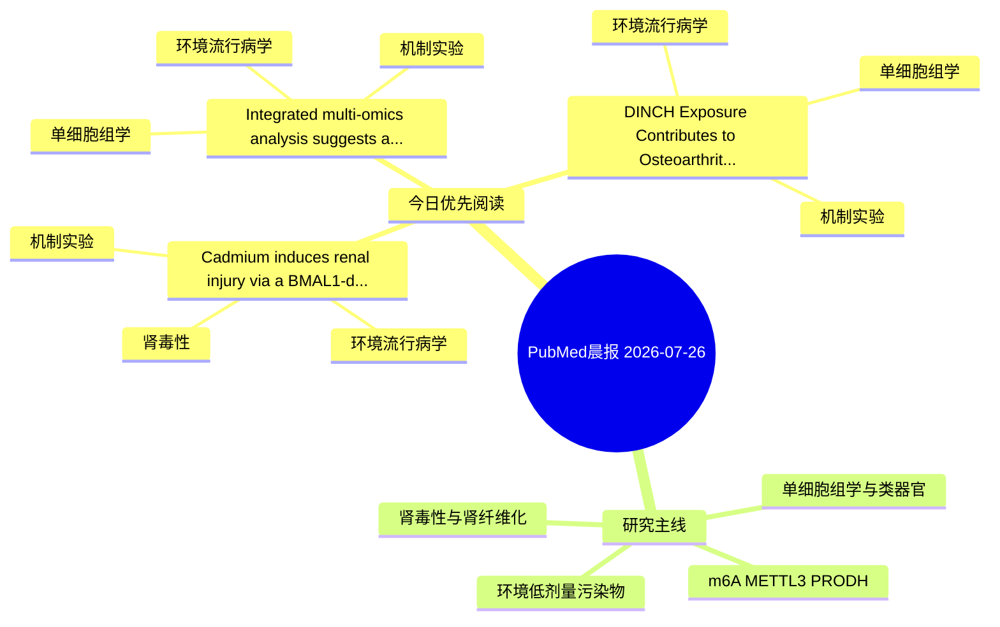

# PubMed 文献晨报｜2026-07-26

- 生成日期：2026-07-26 UTC
- 检索窗口：近 24 小时
- 高质量阈值：规则评分 ≥ 7
- 近 24 小时原始命中数：7

## 今日总体判断

今日筛选出 3 篇优先阅读文献，主要集中在：环境流行病学、机制实验、单细胞组学。

## 今日最值得读的 5 篇文章

### 1. Cadmium induces renal injury via a BMAL1-dependent inflammatory and senescence cascade: Attenuation by Lycium barbarum polysaccharide and melatonin.

- 题目：Cadmium induces renal injury via a BMAL1-dependent inflammatory and senescence cascade: Attenuation by Lycium barbarum polysaccharide and melatonin.
- 期刊：Ecotoxicology and environmental safety
- 年份：2026
- PMID：[42501684](https://pubmed.ncbi.nlm.nih.gov/42501684/)
- DOI：[10.1016/j.ecoenv.2026.120563](https://doi.org/10.1016/j.ecoenv.2026.120563)
- 分类：环境流行病学、机制实验、肾毒性
- 规则评分：17
- 研究对象：小鼠或大鼠肾损伤模型
- 核心方法：基于题名/摘要的常规实验或文献分析，需阅读全文确认
- 主要发现：摘要提示研究重点涉及环境污染物暴露、肾毒性/肾损伤、肾纤维化；结论线索为：Together, these data suggest that BMAL1 is an important modulator of Cd-induced inflammatory and senescence responses in the kidney, and demonstrate that LBP plus MT provides superior mitigation of Cd nephrotoxicity.
- 为什么值得读：同时连接环境暴露与机制线索；与肾毒性/肾损伤主线直接相关；关键词匹配度较高

### 2. Integrated multi-omics analysis suggests a potential mechanism of DEHP-induced monocyte infiltration in MASH via the FOS-CCL3/4 axis.

- 题目：Integrated multi-omics analysis suggests a potential mechanism of DEHP-induced monocyte infiltration in MASH via the FOS-CCL3/4 axis.
- 期刊：Ecotoxicology and environmental safety
- 年份：2026
- PMID：[42501686](https://pubmed.ncbi.nlm.nih.gov/42501686/)
- DOI：[10.1016/j.ecoenv.2026.120551](https://doi.org/10.1016/j.ecoenv.2026.120551)
- 分类：环境流行病学、机制实验、单细胞组学
- 规则评分：14
- 研究对象：人群/队列或环境暴露人群
- 核心方法：环境流行病学/队列或人群数据；单细胞或空间组学；细胞与动物机制实验
- 主要发现：摘要提示研究重点涉及单细胞或空间组学；结论线索为：CONCLUSIONS: This study suggests a potential mechanism by which DEHP exposure may promote monocyte infiltration and exacerbate MASH pathogenesis, potentially by interacting with and inhibiting the core regulatory protein FOS, thereby relieving its suppressi...
- 为什么值得读：同时连接环境暴露与机制线索；可帮助寻找细胞类型特异性机制；关键词匹配度较高

### 3. DINCH Exposure Contributes to Osteoarthritis Pathogenesis via TSPO-Mediated Chondrotoxicity: Evidence from In Silico Prediction to Experimental Validation.

- 题目：DINCH Exposure Contributes to Osteoarthritis Pathogenesis via TSPO-Mediated Chondrotoxicity: Evidence from In Silico Prediction to Experimental Validation.
- 期刊：Chemico-biological interactions
- 年份：2026
- PMID：[42501774](https://pubmed.ncbi.nlm.nih.gov/42501774/)
- DOI：[10.1016/j.cbi.2026.112266](https://doi.org/10.1016/j.cbi.2026.112266)
- 分类：环境流行病学、机制实验、单细胞组学
- 规则评分：10
- 研究对象：人群/队列或环境暴露人群
- 核心方法：单细胞或空间组学；细胞与动物机制实验
- 主要发现：摘要提示研究重点涉及环境污染物暴露、单细胞或空间组学；结论线索为：Single-cell transcriptomic analysis revealed that TSPO is highly expressed in OA chondrocytes and specifically enriched in the hypertrophic chondrocyte subpopulation.
- 为什么值得读：同时连接环境暴露与机制线索；可帮助寻找细胞类型特异性机制

## 分类归档

### 环境流行病学
- [Cadmium induces renal injury via a BMAL1-dependent inflammatory and senescence cascade: Attenuation by Lycium barbarum polysaccharide and melatonin.](https://pubmed.ncbi.nlm.nih.gov/42501684/)（PMID: 42501684）
- [Integrated multi-omics analysis suggests a potential mechanism of DEHP-induced monocyte infiltration in MASH via the FOS-CCL3/4 axis.](https://pubmed.ncbi.nlm.nih.gov/42501686/)（PMID: 42501686）
- [DINCH Exposure Contributes to Osteoarthritis Pathogenesis via TSPO-Mediated Chondrotoxicity: Evidence from In Silico Prediction to Experimental Validation.](https://pubmed.ncbi.nlm.nih.gov/42501774/)（PMID: 42501774）

### 机制实验
- [Cadmium induces renal injury via a BMAL1-dependent inflammatory and senescence cascade: Attenuation by Lycium barbarum polysaccharide and melatonin.](https://pubmed.ncbi.nlm.nih.gov/42501684/)（PMID: 42501684）
- [Integrated multi-omics analysis suggests a potential mechanism of DEHP-induced monocyte infiltration in MASH via the FOS-CCL3/4 axis.](https://pubmed.ncbi.nlm.nih.gov/42501686/)（PMID: 42501686）
- [DINCH Exposure Contributes to Osteoarthritis Pathogenesis via TSPO-Mediated Chondrotoxicity: Evidence from In Silico Prediction to Experimental Validation.](https://pubmed.ncbi.nlm.nih.gov/42501774/)（PMID: 42501774）

### 单细胞组学
- [Integrated multi-omics analysis suggests a potential mechanism of DEHP-induced monocyte infiltration in MASH via the FOS-CCL3/4 axis.](https://pubmed.ncbi.nlm.nih.gov/42501686/)（PMID: 42501686）
- [DINCH Exposure Contributes to Osteoarthritis Pathogenesis via TSPO-Mediated Chondrotoxicity: Evidence from In Silico Prediction to Experimental Validation.](https://pubmed.ncbi.nlm.nih.gov/42501774/)（PMID: 42501774）

### 类器官
- 今日暂无高质量新文献。

### 肾毒性
- [Cadmium induces renal injury via a BMAL1-dependent inflammatory and senescence cascade: Attenuation by Lycium barbarum polysaccharide and melatonin.](https://pubmed.ncbi.nlm.nih.gov/42501684/)（PMID: 42501684）

### m6A-METTL3-PRODH
- 今日暂无高质量新文献。

## 今日阅读优先级

1. Cadmium induces renal injury via a BMAL1-dependent inflammatory and senescence cascade: Attenuation by Lycium barbarum polysaccharide and melatonin.（优先理由：同时连接环境暴露与机制线索；与肾毒性/肾损伤主线直接相关；关键词匹配度较高）
2. Integrated multi-omics analysis suggests a potential mechanism of DEHP-induced monocyte infiltration in MASH via the FOS-CCL3/4 axis.（优先理由：同时连接环境暴露与机制线索；可帮助寻找细胞类型特异性机制；关键词匹配度较高）
3. DINCH Exposure Contributes to Osteoarthritis Pathogenesis via TSPO-Mediated Chondrotoxicity: Evidence from In Silico Prediction to Experimental Validation.（优先理由：同时连接环境暴露与机制线索；可帮助寻找细胞类型特异性机制）

## Mermaid 思维导图

