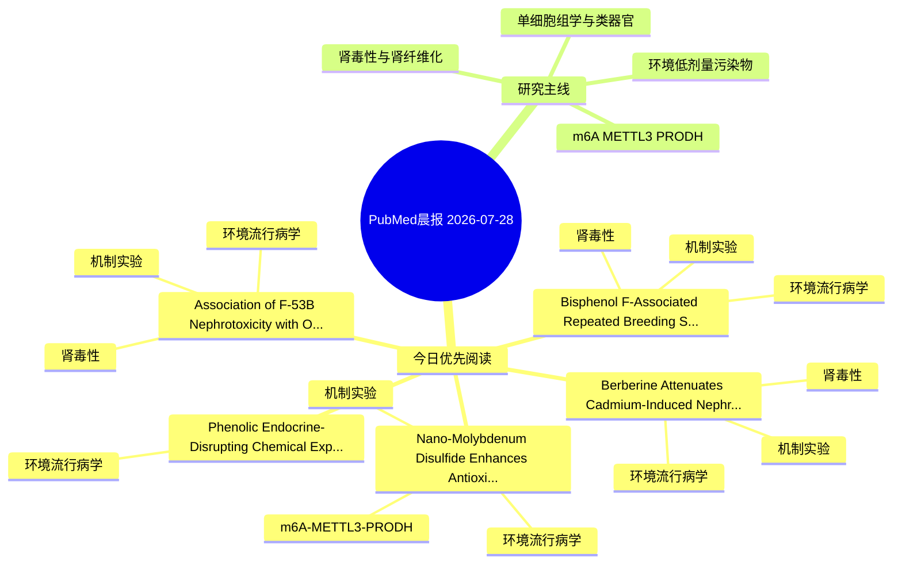

# PubMed 文献晨报｜2026-07-28

- 生成日期：2026-07-28 UTC
- 检索窗口：近 24 小时
- 高质量阈值：规则评分 ≥ 7
- 近 24 小时原始命中数：13

## 今日总体判断

今日筛选出 5 篇优先阅读文献，主要集中在：环境流行病学、机制实验、肾毒性。

## 今日最值得读的 5 篇文章

### 1. Berberine Attenuates Cadmium-Induced Nephrotoxicity by Suppressing LDHA-Mediated Glycolytic Reprogramming and Restoring Mitochondrial TCA Cycle Metabolism.

- 题目：Berberine Attenuates Cadmium-Induced Nephrotoxicity by Suppressing LDHA-Mediated Glycolytic Reprogramming and Restoring Mitochondrial TCA Cycle Metabolism.
- 期刊：Biomolecules
- 年份：2026
- PMID：[42509745](https://pubmed.ncbi.nlm.nih.gov/42509745/)
- DOI：[10.3390/biom16070951](https://doi.org/10.3390/biom16070951)
- 分类：环境流行病学、机制实验、肾毒性
- 规则评分：17
- 研究对象：小鼠或大鼠肾损伤模型
- 核心方法：基于题名/摘要的常规实验或文献分析，需阅读全文确认
- 主要发现：摘要提示研究重点涉及环境污染物暴露、肾毒性/肾损伤；结论线索为：Collectively, these findings indicate that berberine ameliorates Cd-induced renal injury, an effect that correlates with attenuated oxidative stress, modulation of LDHA-associated glycolytic pathways, and restoration of mitochondrial TCA-cycle activity and...
- 为什么值得读：同时连接环境暴露与机制线索；与肾毒性/肾损伤主线直接相关；关键词匹配度较高

### 2. Association of F-53B Nephrotoxicity with Oxidative Stress-Mediated Mitochondrial Dysfunction and Altered Autophagy-Apoptosis Crosstalk.

- 题目：Association of F-53B Nephrotoxicity with Oxidative Stress-Mediated Mitochondrial Dysfunction and Altered Autophagy-Apoptosis Crosstalk.
- 期刊：Biomolecules
- 年份：2026
- PMID：[42509732](https://pubmed.ncbi.nlm.nih.gov/42509732/)
- DOI：[10.3390/biom16070938](https://doi.org/10.3390/biom16070938)
- 分类：环境流行病学、机制实验、肾毒性
- 规则评分：17
- 研究对象：小鼠或大鼠肾损伤模型
- 核心方法：细胞与动物机制实验
- 主要发现：摘要提示研究重点涉及环境污染物暴露、肾毒性/肾损伤；结论线索为：Collectively, our findings demonstrate that F-53B induces nephrotoxicity through a sequential pathological cascade.
- 为什么值得读：同时连接环境暴露与机制线索；与肾毒性/肾损伤主线直接相关；关键词匹配度较高

### 3. Phenolic Endocrine-Disrupting Chemical Exposure and Systemic Biomarker Variability in Patients with Lung Cancer.

- 题目：Phenolic Endocrine-Disrupting Chemical Exposure and Systemic Biomarker Variability in Patients with Lung Cancer.
- 期刊：Medicina (Kaunas, Lithuania)
- 年份：2026
- PMID：[42512951](https://pubmed.ncbi.nlm.nih.gov/42512951/)
- DOI：[10.3390/medicina62071409](https://doi.org/10.3390/medicina62071409)
- 分类：环境流行病学
- 规则评分：16
- 研究对象：人群/队列或环境暴露人群
- 核心方法：环境流行病学/队列或人群数据
- 主要发现：摘要提示研究重点涉及环境污染物暴露；结论线索为：Conclusions: These findings provide novel human biomonitoring evidence linking exposure to phenolic endocrine-disrupting chemicals with systemic metabolic and inflammatory variability in patients with advanced lung cancer.
- 为什么值得读：关键词匹配度较高

### 4. Bisphenol F-Associated Repeated Breeding Syndrome in Cows: Epidemiological Evidence and Protective Effects of Phillyrin Against Granulosa Cell Injury.

- 题目：Bisphenol F-Associated Repeated Breeding Syndrome in Cows: Epidemiological Evidence and Protective Effects of Phillyrin Against Granulosa Cell Injury.
- 期刊：Veterinary sciences
- 年份：2026
- PMID：[42514680](https://pubmed.ncbi.nlm.nih.gov/42514680/)
- DOI：[10.3390/vetsci13070670](https://doi.org/10.3390/vetsci13070670)
- 分类：环境流行病学、机制实验、肾毒性
- 规则评分：13
- 研究对象：患者样本或临床数据
- 核心方法：细胞与动物机制实验
- 主要发现：摘要提示研究重点涉及环境污染物暴露、肾毒性/肾损伤；结论线索为：These findings suggest that BPF exposure might be associated with RBS in cows and phillyrin could be used as a promising natural agent for mitigating BPF-related reproductive toxicity.
- 为什么值得读：同时连接环境暴露与机制线索；与肾毒性/肾损伤主线直接相关；关键词匹配度较高

### 5. Nano-Molybdenum Disulfide Enhances Antioxidant Defense and Aroma Formation in Fragrant Rice Under Cadmium Stress via Modulation of 2-Acetyl-1-Pyrroline Biosynthesis.

- 题目：Nano-Molybdenum Disulfide Enhances Antioxidant Defense and Aroma Formation in Fragrant Rice Under Cadmium Stress via Modulation of 2-Acetyl-1-Pyrroline Biosynthesis.
- 期刊：Antioxidants (Basel, Switzerland)
- 年份：2026
- PMID：[42510548](https://pubmed.ncbi.nlm.nih.gov/42510548/)
- DOI：[10.3390/antiox15070817](https://doi.org/10.3390/antiox15070817)
- 分类：环境流行病学、机制实验、m6A-METTL3-PRODH
- 规则评分：11
- 研究对象：题名和摘要未明确，建议阅读全文确认
- 核心方法：基于题名/摘要的常规实验或文献分析，需阅读全文确认
- 主要发现：摘要提示研究重点涉及环境污染物暴露、m6A-METTL3/PRODH 调控；结论线索为：These findings suggest that MoS2 nanoflakes may serve as a promising nano-enabled strategy to enhance antioxidant defense, improve aroma quality, and mitigate cadmium stress in fragrant rice, potentially through changes associated with the 2-AP biosynthesis...
- 为什么值得读：同时连接环境暴露与机制线索；贴近 m6A-METTL3-PRODH 调控假说

## 分类归档

### 环境流行病学
- [Berberine Attenuates Cadmium-Induced Nephrotoxicity by Suppressing LDHA-Mediated Glycolytic Reprogramming and Restoring Mitochondrial TCA Cycle Metabolism.](https://pubmed.ncbi.nlm.nih.gov/42509745/)（PMID: 42509745）
- [Association of F-53B Nephrotoxicity with Oxidative Stress-Mediated Mitochondrial Dysfunction and Altered Autophagy-Apoptosis Crosstalk.](https://pubmed.ncbi.nlm.nih.gov/42509732/)（PMID: 42509732）
- [Phenolic Endocrine-Disrupting Chemical Exposure and Systemic Biomarker Variability in Patients with Lung Cancer.](https://pubmed.ncbi.nlm.nih.gov/42512951/)（PMID: 42512951）
- [Bisphenol F-Associated Repeated Breeding Syndrome in Cows: Epidemiological Evidence and Protective Effects of Phillyrin Against Granulosa Cell Injury.](https://pubmed.ncbi.nlm.nih.gov/42514680/)（PMID: 42514680）
- [Nano-Molybdenum Disulfide Enhances Antioxidant Defense and Aroma Formation in Fragrant Rice Under Cadmium Stress via Modulation of 2-Acetyl-1-Pyrroline Biosynthesis.](https://pubmed.ncbi.nlm.nih.gov/42510548/)（PMID: 42510548）

### 机制实验
- [Berberine Attenuates Cadmium-Induced Nephrotoxicity by Suppressing LDHA-Mediated Glycolytic Reprogramming and Restoring Mitochondrial TCA Cycle Metabolism.](https://pubmed.ncbi.nlm.nih.gov/42509745/)（PMID: 42509745）
- [Association of F-53B Nephrotoxicity with Oxidative Stress-Mediated Mitochondrial Dysfunction and Altered Autophagy-Apoptosis Crosstalk.](https://pubmed.ncbi.nlm.nih.gov/42509732/)（PMID: 42509732）
- [Bisphenol F-Associated Repeated Breeding Syndrome in Cows: Epidemiological Evidence and Protective Effects of Phillyrin Against Granulosa Cell Injury.](https://pubmed.ncbi.nlm.nih.gov/42514680/)（PMID: 42514680）
- [Nano-Molybdenum Disulfide Enhances Antioxidant Defense and Aroma Formation in Fragrant Rice Under Cadmium Stress via Modulation of 2-Acetyl-1-Pyrroline Biosynthesis.](https://pubmed.ncbi.nlm.nih.gov/42510548/)（PMID: 42510548）

### 单细胞组学
- 今日暂无高质量新文献。

### 类器官
- 今日暂无高质量新文献。

### 肾毒性
- [Berberine Attenuates Cadmium-Induced Nephrotoxicity by Suppressing LDHA-Mediated Glycolytic Reprogramming and Restoring Mitochondrial TCA Cycle Metabolism.](https://pubmed.ncbi.nlm.nih.gov/42509745/)（PMID: 42509745）
- [Association of F-53B Nephrotoxicity with Oxidative Stress-Mediated Mitochondrial Dysfunction and Altered Autophagy-Apoptosis Crosstalk.](https://pubmed.ncbi.nlm.nih.gov/42509732/)（PMID: 42509732）
- [Bisphenol F-Associated Repeated Breeding Syndrome in Cows: Epidemiological Evidence and Protective Effects of Phillyrin Against Granulosa Cell Injury.](https://pubmed.ncbi.nlm.nih.gov/42514680/)（PMID: 42514680）

### m6A-METTL3-PRODH
- [Nano-Molybdenum Disulfide Enhances Antioxidant Defense and Aroma Formation in Fragrant Rice Under Cadmium Stress via Modulation of 2-Acetyl-1-Pyrroline Biosynthesis.](https://pubmed.ncbi.nlm.nih.gov/42510548/)（PMID: 42510548）

## 今日阅读优先级

1. Berberine Attenuates Cadmium-Induced Nephrotoxicity by Suppressing LDHA-Mediated Glycolytic Reprogramming and Restoring Mitochondrial TCA Cycle Metabolism.（优先理由：同时连接环境暴露与机制线索；与肾毒性/肾损伤主线直接相关；关键词匹配度较高）
2. Association of F-53B Nephrotoxicity with Oxidative Stress-Mediated Mitochondrial Dysfunction and Altered Autophagy-Apoptosis Crosstalk.（优先理由：同时连接环境暴露与机制线索；与肾毒性/肾损伤主线直接相关；关键词匹配度较高）
3. Phenolic Endocrine-Disrupting Chemical Exposure and Systemic Biomarker Variability in Patients with Lung Cancer.（优先理由：关键词匹配度较高）
4. Bisphenol F-Associated Repeated Breeding Syndrome in Cows: Epidemiological Evidence and Protective Effects of Phillyrin Against Granulosa Cell Injury.（优先理由：同时连接环境暴露与机制线索；与肾毒性/肾损伤主线直接相关；关键词匹配度较高）
5. Nano-Molybdenum Disulfide Enhances Antioxidant Defense and Aroma Formation in Fragrant Rice Under Cadmium Stress via Modulation of 2-Acetyl-1-Pyrroline Biosynthesis.（优先理由：同时连接环境暴露与机制线索；贴近 m6A-METTL3-PRODH 调控假说）

## Mermaid 思维导图

