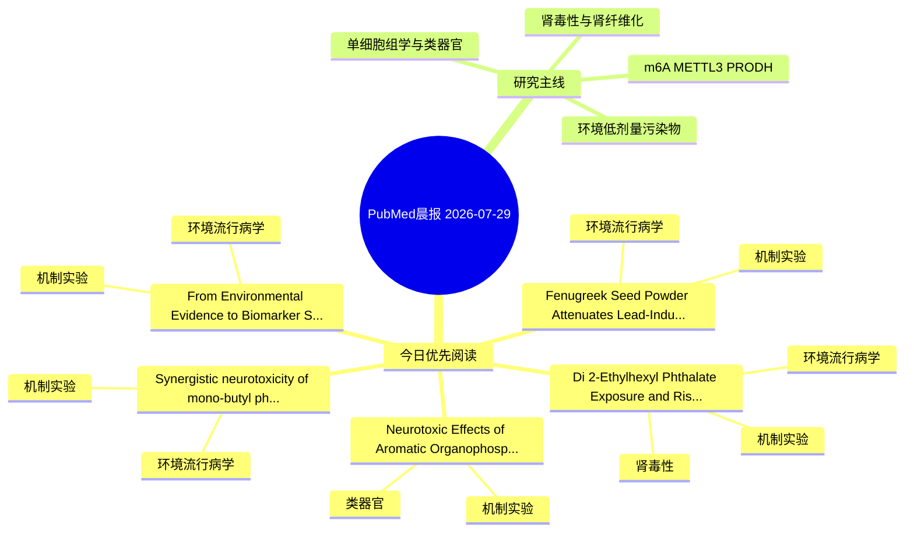

# PubMed 文献晨报｜2026-07-29

- 生成日期：2026-07-29 UTC
- 检索窗口：近 7 天
- 高质量阈值：规则评分 ≥ 7
- 近 24 小时原始命中数：13

## 今日总体判断

今日筛选出 5 篇优先阅读文献，主要集中在：机制实验、环境流行病学、肾毒性。
由于近 24 小时内没有达到高质量阈值的未推荐文献，本次已自动扩大检索范围。

## 今日最值得读的 5 篇文章

### 1. Di(2-Ethylhexyl) Phthalate Exposure and Risk of Diabetic Kidney Disease: Epidemiological Association and Mechanistic Insights.

- 题目：Di(2-Ethylhexyl) Phthalate Exposure and Risk of Diabetic Kidney Disease: Epidemiological Association and Mechanistic Insights.
- 期刊：Diabetes/metabolism research and reviews
- 年份：2026
- PMID：[42517613](https://pubmed.ncbi.nlm.nih.gov/42517613/)
- DOI：[10.1002/dmrr.70209](https://doi.org/10.1002/dmrr.70209)
- 分类：环境流行病学、机制实验、肾毒性
- 规则评分：17
- 研究对象：HK-2 近端肾小管上皮细胞
- 核心方法：环境流行病学/队列或人群数据；细胞与动物机制实验
- 主要发现：摘要提示研究重点涉及本方向相关问题；结论线索为：CONCLUSION: DEHP is an important environmental risk factor for DKD.
- 为什么值得读：同时连接环境暴露与机制线索；与肾毒性/肾损伤主线直接相关；关键词匹配度较高

### 2. Neurotoxic Effects of Aromatic Organophosphate Flame Retardants Revealed by Lipidomic Analysis in Human Brain Organoids.

- 题目：Neurotoxic Effects of Aromatic Organophosphate Flame Retardants Revealed by Lipidomic Analysis in Human Brain Organoids.
- 期刊：Toxics
- 年份：2026
- PMID：[42515120](https://pubmed.ncbi.nlm.nih.gov/42515120/)
- DOI：[10.3390/toxics14070555](https://doi.org/10.3390/toxics14070555)
- 分类：机制实验、类器官
- 规则评分：11
- 研究对象：人群/队列或环境暴露人群
- 核心方法：类器官/干细胞模型
- 主要发现：摘要提示研究重点涉及类器官模型；结论线索为：Overall, these findings indicate that aromatic OPFRs induce cytotoxicity, oxidative stress, and alteration of cholinergic function, and are associated with lipid dysregulation linked to neurotoxicity in brain organoids.
- 为什么值得读：对建立更接近人体的模型有参考价值

### 3. From Environmental Evidence to Biomarker Selection: A Structured Decision-Support Process for Human Biomonitoring Studies in Contaminated Sites.

- 题目：From Environmental Evidence to Biomarker Selection: A Structured Decision-Support Process for Human Biomonitoring Studies in Contaminated Sites.
- 期刊：Toxics
- 年份：2026
- PMID：[42515181](https://pubmed.ncbi.nlm.nih.gov/42515181/)
- DOI：[10.3390/toxics14070616](https://doi.org/10.3390/toxics14070616)
- 分类：环境流行病学、机制实验
- 规则评分：10
- 研究对象：人群/队列或环境暴露人群
- 核心方法：环境流行病学/队列或人群数据
- 主要发现：摘要提示研究重点涉及环境污染物暴露；结论线索为：Applicability is illustrated through an ongoing HBM study in Livorno and Piombino (Tuscany).
- 为什么值得读：同时连接环境暴露与机制线索

### 4. Synergistic neurotoxicity of mono-butyl phthalate and bisphenol A at environmentally relevant concentrations: Multi-Omics evidence for ferroptosis via glutathione metabolism disruption in neural stem cells and brain organoids.

- 题目：Synergistic neurotoxicity of mono-butyl phthalate and bisphenol A at environmentally relevant concentrations: Multi-Omics evidence for ferroptosis via glutathione metabolism disruption in neural stem cells and brain organoids.
- 期刊：Chemico-biological interactions
- 年份：2026
- PMID：[42508794](https://pubmed.ncbi.nlm.nih.gov/42508794/)
- DOI：[10.1016/j.cbi.2026.112271](https://doi.org/10.1016/j.cbi.2026.112271)
- 分类：环境流行病学、机制实验
- 规则评分：9
- 研究对象：人群/队列或环境暴露人群
- 核心方法：环境流行病学/队列或人群数据
- 主要发现：摘要提示研究重点涉及本方向相关问题；结论线索为：Integrated multi-omics analysis revealed ferroptosis may serve as the primary mode of synergistic cell death.
- 为什么值得读：同时连接环境暴露与机制线索

### 5. Fenugreek Seed Powder Attenuates Lead-Induced Hepatic Injury and Renal Dysfunction in Male Mice Co-Exposed to Escalating Lead Doses.

- 题目：Fenugreek Seed Powder Attenuates Lead-Induced Hepatic Injury and Renal Dysfunction in Male Mice Co-Exposed to Escalating Lead Doses.
- 期刊：Current issues in molecular biology
- 年份：2026
- PMID：[42510891](https://pubmed.ncbi.nlm.nih.gov/42510891/)
- DOI：[10.3390/cimb48070650](https://doi.org/10.3390/cimb48070650)
- 分类：环境流行病学、机制实验
- 规则评分：9
- 研究对象：小鼠或大鼠肾损伤模型
- 核心方法：基于题名/摘要的常规实验或文献分析，需阅读全文确认
- 主要发现：摘要提示研究重点涉及环境污染物暴露；结论线索为：These preclinical findings support further investigation of fenugreek as a candidate dietary adjunct against environmental Pb exposure, contingent on protein-level validation, pharmacokinetic characterization, benchmarking against a standard chelator, and b...
- 为什么值得读：同时连接环境暴露与机制线索

## 分类归档

### 环境流行病学
- [Di(2-Ethylhexyl) Phthalate Exposure and Risk of Diabetic Kidney Disease: Epidemiological Association and Mechanistic Insights.](https://pubmed.ncbi.nlm.nih.gov/42517613/)（PMID: 42517613）
- [From Environmental Evidence to Biomarker Selection: A Structured Decision-Support Process for Human Biomonitoring Studies in Contaminated Sites.](https://pubmed.ncbi.nlm.nih.gov/42515181/)（PMID: 42515181）
- [Synergistic neurotoxicity of mono-butyl phthalate and bisphenol A at environmentally relevant concentrations: Multi-Omics evidence for ferroptosis via glutathione metabolism disruption in neural stem cells and brain organoids.](https://pubmed.ncbi.nlm.nih.gov/42508794/)（PMID: 42508794）
- [Fenugreek Seed Powder Attenuates Lead-Induced Hepatic Injury and Renal Dysfunction in Male Mice Co-Exposed to Escalating Lead Doses.](https://pubmed.ncbi.nlm.nih.gov/42510891/)（PMID: 42510891）

### 机制实验
- [Di(2-Ethylhexyl) Phthalate Exposure and Risk of Diabetic Kidney Disease: Epidemiological Association and Mechanistic Insights.](https://pubmed.ncbi.nlm.nih.gov/42517613/)（PMID: 42517613）
- [Neurotoxic Effects of Aromatic Organophosphate Flame Retardants Revealed by Lipidomic Analysis in Human Brain Organoids.](https://pubmed.ncbi.nlm.nih.gov/42515120/)（PMID: 42515120）
- [From Environmental Evidence to Biomarker Selection: A Structured Decision-Support Process for Human Biomonitoring Studies in Contaminated Sites.](https://pubmed.ncbi.nlm.nih.gov/42515181/)（PMID: 42515181）
- [Synergistic neurotoxicity of mono-butyl phthalate and bisphenol A at environmentally relevant concentrations: Multi-Omics evidence for ferroptosis via glutathione metabolism disruption in neural stem cells and brain organoids.](https://pubmed.ncbi.nlm.nih.gov/42508794/)（PMID: 42508794）
- [Fenugreek Seed Powder Attenuates Lead-Induced Hepatic Injury and Renal Dysfunction in Male Mice Co-Exposed to Escalating Lead Doses.](https://pubmed.ncbi.nlm.nih.gov/42510891/)（PMID: 42510891）

### 单细胞组学
- 今日暂无高质量新文献。

### 类器官
- [Neurotoxic Effects of Aromatic Organophosphate Flame Retardants Revealed by Lipidomic Analysis in Human Brain Organoids.](https://pubmed.ncbi.nlm.nih.gov/42515120/)（PMID: 42515120）

### 肾毒性
- [Di(2-Ethylhexyl) Phthalate Exposure and Risk of Diabetic Kidney Disease: Epidemiological Association and Mechanistic Insights.](https://pubmed.ncbi.nlm.nih.gov/42517613/)（PMID: 42517613）

### m6A-METTL3-PRODH
- 今日暂无高质量新文献。

## 今日阅读优先级

1. Di(2-Ethylhexyl) Phthalate Exposure and Risk of Diabetic Kidney Disease: Epidemiological Association and Mechanistic Insights.（优先理由：同时连接环境暴露与机制线索；与肾毒性/肾损伤主线直接相关；关键词匹配度较高）
2. Neurotoxic Effects of Aromatic Organophosphate Flame Retardants Revealed by Lipidomic Analysis in Human Brain Organoids.（优先理由：对建立更接近人体的模型有参考价值）
3. From Environmental Evidence to Biomarker Selection: A Structured Decision-Support Process for Human Biomonitoring Studies in Contaminated Sites.（优先理由：同时连接环境暴露与机制线索）
4. Synergistic neurotoxicity of mono-butyl phthalate and bisphenol A at environmentally relevant concentrations: Multi-Omics evidence for ferroptosis via glutathione metabolism disruption in neural stem cells and brain organoids.（优先理由：同时连接环境暴露与机制线索）
5. Fenugreek Seed Powder Attenuates Lead-Induced Hepatic Injury and Renal Dysfunction in Male Mice Co-Exposed to Escalating Lead Doses.（优先理由：同时连接环境暴露与机制线索）

## Mermaid 思维导图

