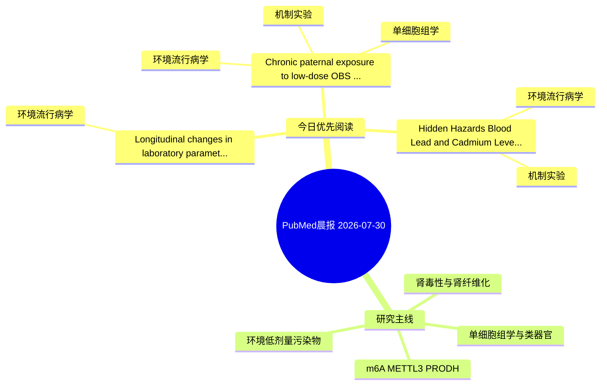

# PubMed 文献晨报｜2026-07-30

- 生成日期：2026-07-30 UTC
- 检索窗口：近 24 小时
- 高质量阈值：规则评分 ≥ 7
- 近 24 小时原始命中数：3

## 今日总体判断

今日筛选出 3 篇优先阅读文献，主要集中在：环境流行病学、机制实验、单细胞组学。

## 今日最值得读的 5 篇文章

### 1. Chronic paternal exposure to low-dose OBS reprograms progeny's intestinal cholesterol metabolism and increases IBD susceptibility.

- 题目：Chronic paternal exposure to low-dose OBS reprograms progeny's intestinal cholesterol metabolism and increases IBD susceptibility.
- 期刊：Environmental pollution (Barking, Essex : 1987)
- 年份：2026
- PMID：[42526577](https://pubmed.ncbi.nlm.nih.gov/42526577/)
- DOI：[10.1016/j.envpol.2026.128846](https://doi.org/10.1016/j.envpol.2026.128846)
- 分类：环境流行病学、机制实验、单细胞组学
- 规则评分：14
- 研究对象：患者样本或临床数据
- 核心方法：单细胞或空间组学
- 主要发现：摘要提示研究重点涉及环境污染物暴露、单细胞或空间组学；结论线索为：Collectively, our study provides insight into the intergenerational toxicity of emerging PFAS, which also facilitates the identification of potential targets for the early warning and therapeutic intervention of IBD.
- 为什么值得读：同时连接环境暴露与机制线索；可帮助寻找细胞类型特异性机制；关键词匹配度较高

### 2. Longitudinal changes in laboratory parameters and QTc during isavuconazole therapy in Japanese patients with hematologic malignancies.

- 题目：Longitudinal changes in laboratory parameters and QTc during isavuconazole therapy in Japanese patients with hematologic malignancies.
- 期刊：PloS one
- 年份：2026
- PMID：[42525627](https://pubmed.ncbi.nlm.nih.gov/42525627/)
- DOI：[10.1371/journal.pone.0354816](https://doi.org/10.1371/journal.pone.0354816)
- 分类：环境流行病学
- 规则评分：9
- 研究对象：题名和摘要未明确，建议阅读全文确认
- 核心方法：基于题名/摘要的常规实验或文献分析，需阅读全文确认
- 主要发现：摘要提示研究重点涉及环境污染物暴露；结论线索为：CONCLUSIONS: ISCZ showed a favorable safety profile in Japanese patients with hematologic malignancies and may be a safe option during QT-prolonging therapies.
- 为什么值得读：与检索主题有交集，可作为背景或线索文献扫读

### 3. Hidden Hazards: Blood Lead and Cadmium Levels Associated with Biochemical and Hematological Markers.

- 题目：Hidden Hazards: Blood Lead and Cadmium Levels Associated with Biochemical and Hematological Markers.
- 期刊：Advanced pharmaceutical bulletin
- 年份：2026
- PMID：[42524077](https://pubmed.ncbi.nlm.nih.gov/42524077/)
- DOI：[10.34172/apb.025.46563](https://doi.org/10.34172/apb.025.46563)
- 分类：环境流行病学、机制实验
- 规则评分：9
- 研究对象：题名和摘要未明确，建议阅读全文确认
- 核心方法：基于题名/摘要的常规实验或文献分析，需阅读全文确认
- 主要发现：摘要提示研究重点涉及环境污染物暴露；结论线索为：CONCLUSION: Occupational exposure to lead and cadmium suggests adverse hepatic, renal, hormonal, and oxidative stress changes among fuel station workers.
- 为什么值得读：同时连接环境暴露与机制线索

## 分类归档

### 环境流行病学
- [Chronic paternal exposure to low-dose OBS reprograms progeny's intestinal cholesterol metabolism and increases IBD susceptibility.](https://pubmed.ncbi.nlm.nih.gov/42526577/)（PMID: 42526577）
- [Longitudinal changes in laboratory parameters and QTc during isavuconazole therapy in Japanese patients with hematologic malignancies.](https://pubmed.ncbi.nlm.nih.gov/42525627/)（PMID: 42525627）
- [Hidden Hazards: Blood Lead and Cadmium Levels Associated with Biochemical and Hematological Markers.](https://pubmed.ncbi.nlm.nih.gov/42524077/)（PMID: 42524077）

### 机制实验
- [Chronic paternal exposure to low-dose OBS reprograms progeny's intestinal cholesterol metabolism and increases IBD susceptibility.](https://pubmed.ncbi.nlm.nih.gov/42526577/)（PMID: 42526577）
- [Hidden Hazards: Blood Lead and Cadmium Levels Associated with Biochemical and Hematological Markers.](https://pubmed.ncbi.nlm.nih.gov/42524077/)（PMID: 42524077）

### 单细胞组学
- [Chronic paternal exposure to low-dose OBS reprograms progeny's intestinal cholesterol metabolism and increases IBD susceptibility.](https://pubmed.ncbi.nlm.nih.gov/42526577/)（PMID: 42526577）

### 类器官
- 今日暂无高质量新文献。

### 肾毒性
- 今日暂无高质量新文献。

### m6A-METTL3-PRODH
- 今日暂无高质量新文献。

## 今日阅读优先级

1. Chronic paternal exposure to low-dose OBS reprograms progeny's intestinal cholesterol metabolism and increases IBD susceptibility.（优先理由：同时连接环境暴露与机制线索；可帮助寻找细胞类型特异性机制；关键词匹配度较高）
2. Longitudinal changes in laboratory parameters and QTc during isavuconazole therapy in Japanese patients with hematologic malignancies.（优先理由：与检索主题有交集，可作为背景或线索文献扫读）
3. Hidden Hazards: Blood Lead and Cadmium Levels Associated with Biochemical and Hematological Markers.（优先理由：同时连接环境暴露与机制线索）

## Mermaid 思维导图

