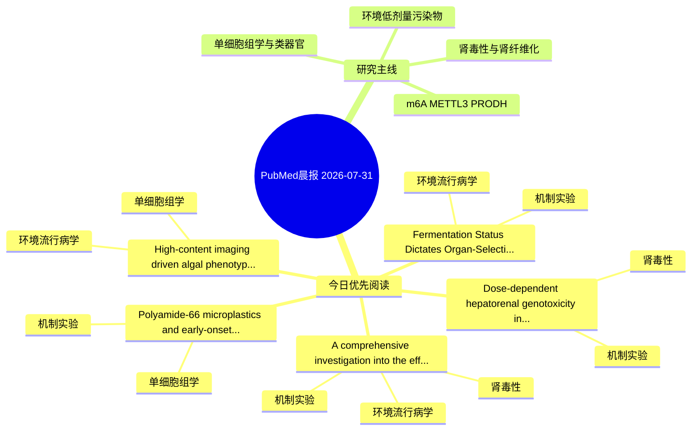

# PubMed 文献晨报｜2026-07-31

- 生成日期：2026-07-31 UTC
- 检索窗口：近 24 小时
- 高质量阈值：规则评分 ≥ 7
- 近 24 小时原始命中数：7

## 今日总体判断

今日筛选出 5 篇优先阅读文献，主要集中在：机制实验、环境流行病学、肾毒性。

## 今日最值得读的 5 篇文章

### 1. Dose-dependent hepatorenal genotoxicity induced by polyethylene microplastics: Evidence from comet assay and apoptotic pathway activation.

- 题目：Dose-dependent hepatorenal genotoxicity induced by polyethylene microplastics: Evidence from comet assay and apoptotic pathway activation.
- 期刊：Tissue & cell
- 年份：2026
- PMID：[42531719](https://pubmed.ncbi.nlm.nih.gov/42531719/)
- DOI：[10.1016/j.tice.2026.103816](https://doi.org/10.1016/j.tice.2026.103816)
- 分类：机制实验、肾毒性
- 规则评分：14
- 研究对象：小鼠或大鼠肾损伤模型
- 核心方法：基于题名/摘要的常规实验或文献分析，需阅读全文确认
- 主要发现：摘要提示研究重点涉及肾毒性/肾损伤；结论线索为：Although partial recovery occurs after exposure cessation, the findings highlight the cumulative and potentially irreversible toxic effects of PE-MPs.
- 为什么值得读：与肾毒性/肾损伤主线直接相关；关键词匹配度较高

### 2. A comprehensive investigation into the effect of bisphenol A on the expression of drug-metabolizing enzymes: Consequences for endogenous metabolites and xenobiotic pharmacokinetics.

- 题目：A comprehensive investigation into the effect of bisphenol A on the expression of drug-metabolizing enzymes: Consequences for endogenous metabolites and xenobiotic pharmacokinetics.
- 期刊：Drug metabolism and disposition: the biological fate of chemicals
- 年份：2026
- PMID：[42531744](https://pubmed.ncbi.nlm.nih.gov/42531744/)
- DOI：[10.1016/j.dmd.2026.100361](https://doi.org/10.1016/j.dmd.2026.100361)
- 分类：环境流行病学、机制实验、肾毒性
- 规则评分：11
- 研究对象：小鼠或大鼠肾损伤模型
- 核心方法：细胞与动物机制实验
- 主要发现：摘要提示研究重点涉及肾毒性/肾损伤；结论线索为：Further, the pharmacokinetics of substrate xenobiotic modulated by these enzymes is also altered.
- 为什么值得读：同时连接环境暴露与机制线索；与肾毒性/肾损伤主线直接相关

### 3. Polyamide-66 microplastics and early-onset ischemic stroke: a systems toxicology, multi-omics, and molecular dynamics simulation analysis.

- 题目：Polyamide-66 microplastics and early-onset ischemic stroke: a systems toxicology, multi-omics, and molecular dynamics simulation analysis.
- 期刊：Molecular diversity
- 年份：2026
- PMID：[42530798](https://pubmed.ncbi.nlm.nih.gov/42530798/)
- DOI：[10.1007/s11030-026-11672-6](https://doi.org/10.1007/s11030-026-11672-6)
- 分类：机制实验、单细胞组学
- 规则评分：10
- 研究对象：人群/队列或环境暴露人群
- 核心方法：单细胞或空间组学；细胞与动物机制实验
- 主要发现：摘要提示研究重点涉及单细胞或空间组学；结论线索为：Microplastics have recently been identified as a novel stroke risk factor, and among polymers detected in human arterial thrombi from ischemic stroke, polyamide-66 (PA66) microplastics show the highest detection frequency, with microplastic burden positivel...
- 为什么值得读：可帮助寻找细胞类型特异性机制

### 4. High-content imaging driven algal phenotypes enable precise multilevel discrimination of heavy metal stress.

- 题目：High-content imaging driven algal phenotypes enable precise multilevel discrimination of heavy metal stress.
- 期刊：Journal of hazardous materials
- 年份：2026
- PMID：[42531928](https://pubmed.ncbi.nlm.nih.gov/42531928/)
- DOI：[10.1016/j.jhazmat.2026.143114](https://doi.org/10.1016/j.jhazmat.2026.143114)
- 分类：环境流行病学、单细胞组学
- 规则评分：10
- 研究对象：题名和摘要未明确，建议阅读全文确认
- 核心方法：单细胞或空间组学
- 主要发现：摘要提示研究重点涉及环境污染物暴露、单细胞或空间组学；结论线索为：The multidimensional phenotypic features detected significant sublethal alterations at markedly lower exposure levels than those detected by conventional optical density measurements, and Mantel tests revealed consistent phenotypic response patterns across...
- 为什么值得读：可帮助寻找细胞类型特异性机制

### 5. Fermentation Status Dictates Organ-Selective Protection of a Millet-Based Dairy Beverage Against Sub-Chronic Lead Toxicity in Rats.

- 题目：Fermentation Status Dictates Organ-Selective Protection of a Millet-Based Dairy Beverage Against Sub-Chronic Lead Toxicity in Rats.
- 期刊：Biological trace element research
- 年份：2026
- PMID：[42533197](https://pubmed.ncbi.nlm.nih.gov/42533197/)
- DOI：[10.1007/s12011-026-05253-9](https://doi.org/10.1007/s12011-026-05253-9)
- 分类：环境流行病学、机制实验
- 规则评分：9
- 研究对象：小鼠或大鼠肾损伤模型
- 核心方法：基于题名/摘要的常规实验或文献分析，需阅读全文确认
- 主要发现：摘要提示研究重点涉及环境污染物暴露；结论线索为：These findings support the concept that food processing can be leveraged to design targeted nutritional interventions against heavy metal toxicity.
- 为什么值得读：同时连接环境暴露与机制线索

## 分类归档

### 环境流行病学
- [A comprehensive investigation into the effect of bisphenol A on the expression of drug-metabolizing enzymes: Consequences for endogenous metabolites and xenobiotic pharmacokinetics.](https://pubmed.ncbi.nlm.nih.gov/42531744/)（PMID: 42531744）
- [High-content imaging driven algal phenotypes enable precise multilevel discrimination of heavy metal stress.](https://pubmed.ncbi.nlm.nih.gov/42531928/)（PMID: 42531928）
- [Fermentation Status Dictates Organ-Selective Protection of a Millet-Based Dairy Beverage Against Sub-Chronic Lead Toxicity in Rats.](https://pubmed.ncbi.nlm.nih.gov/42533197/)（PMID: 42533197）

### 机制实验
- [Dose-dependent hepatorenal genotoxicity induced by polyethylene microplastics: Evidence from comet assay and apoptotic pathway activation.](https://pubmed.ncbi.nlm.nih.gov/42531719/)（PMID: 42531719）
- [A comprehensive investigation into the effect of bisphenol A on the expression of drug-metabolizing enzymes: Consequences for endogenous metabolites and xenobiotic pharmacokinetics.](https://pubmed.ncbi.nlm.nih.gov/42531744/)（PMID: 42531744）
- [Polyamide-66 microplastics and early-onset ischemic stroke: a systems toxicology, multi-omics, and molecular dynamics simulation analysis.](https://pubmed.ncbi.nlm.nih.gov/42530798/)（PMID: 42530798）
- [Fermentation Status Dictates Organ-Selective Protection of a Millet-Based Dairy Beverage Against Sub-Chronic Lead Toxicity in Rats.](https://pubmed.ncbi.nlm.nih.gov/42533197/)（PMID: 42533197）

### 单细胞组学
- [Polyamide-66 microplastics and early-onset ischemic stroke: a systems toxicology, multi-omics, and molecular dynamics simulation analysis.](https://pubmed.ncbi.nlm.nih.gov/42530798/)（PMID: 42530798）
- [High-content imaging driven algal phenotypes enable precise multilevel discrimination of heavy metal stress.](https://pubmed.ncbi.nlm.nih.gov/42531928/)（PMID: 42531928）

### 类器官
- 今日暂无高质量新文献。

### 肾毒性
- [Dose-dependent hepatorenal genotoxicity induced by polyethylene microplastics: Evidence from comet assay and apoptotic pathway activation.](https://pubmed.ncbi.nlm.nih.gov/42531719/)（PMID: 42531719）
- [A comprehensive investigation into the effect of bisphenol A on the expression of drug-metabolizing enzymes: Consequences for endogenous metabolites and xenobiotic pharmacokinetics.](https://pubmed.ncbi.nlm.nih.gov/42531744/)（PMID: 42531744）

### m6A-METTL3-PRODH
- 今日暂无高质量新文献。

## 今日阅读优先级

1. Dose-dependent hepatorenal genotoxicity induced by polyethylene microplastics: Evidence from comet assay and apoptotic pathway activation.（优先理由：与肾毒性/肾损伤主线直接相关；关键词匹配度较高）
2. A comprehensive investigation into the effect of bisphenol A on the expression of drug-metabolizing enzymes: Consequences for endogenous metabolites and xenobiotic pharmacokinetics.（优先理由：同时连接环境暴露与机制线索；与肾毒性/肾损伤主线直接相关）
3. Polyamide-66 microplastics and early-onset ischemic stroke: a systems toxicology, multi-omics, and molecular dynamics simulation analysis.（优先理由：可帮助寻找细胞类型特异性机制）
4. High-content imaging driven algal phenotypes enable precise multilevel discrimination of heavy metal stress.（优先理由：可帮助寻找细胞类型特异性机制）
5. Fermentation Status Dictates Organ-Selective Protection of a Millet-Based Dairy Beverage Against Sub-Chronic Lead Toxicity in Rats.（优先理由：同时连接环境暴露与机制线索）

## Mermaid 思维导图

