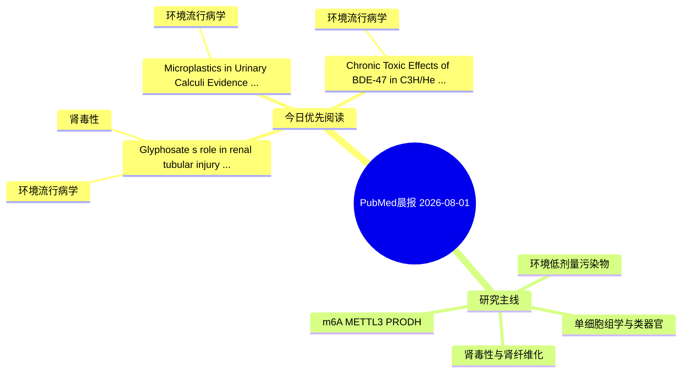

# PubMed 文献晨报｜2026-08-01

- 生成日期：2026-08-01 UTC
- 检索窗口：近 24 小时
- 高质量阈值：规则评分 ≥ 7
- 近 24 小时原始命中数：8

## 今日总体判断

今日筛选出 3 篇优先阅读文献，主要集中在：环境流行病学、肾毒性。

## 今日最值得读的 5 篇文章

### 1. Glyphosate's role in renal tubular injury at low exposure levels: evidence from a patient cohort.

- 题目：Glyphosate's role in renal tubular injury at low exposure levels: evidence from a patient cohort.
- 期刊：Renal failure
- 年份：2026
- PMID：[42535947](https://pubmed.ncbi.nlm.nih.gov/42535947/)
- DOI：[10.1080/0886022X.2026.2707684](https://doi.org/10.1080/0886022X.2026.2707684)
- 分类：环境流行病学、肾毒性
- 规则评分：14
- 研究对象：人群/队列或环境暴露人群
- 核心方法：环境流行病学/队列或人群数据
- 主要发现：摘要提示研究重点涉及环境污染物暴露；结论线索为：These findings support the potential nephrotoxic effects of low-dose glyphosate exposure in a clinical cohort and add to the limited epidemiological evidence linking environmental exposure to renal pathological injury.
- 为什么值得读：与肾毒性/肾损伤主线直接相关；关键词匹配度较高

### 2. Microplastics in Urinary Calculi: Evidence from Human Urinary Stones.

- 题目：Microplastics in Urinary Calculi: Evidence from Human Urinary Stones.
- 期刊：The Journal of urology
- 年份：2026
- PMID：[42537208](https://pubmed.ncbi.nlm.nih.gov/42537208/)
- DOI：[10.1097/JU.0000000000005237](https://doi.org/10.1097/JU.0000000000005237)
- 分类：环境流行病学
- 规则评分：13
- 研究对象：人群/队列或环境暴露人群
- 核心方法：基于题名/摘要的常规实验或文献分析，需阅读全文确认
- 主要发现：摘要提示研究重点涉及环境污染物暴露；结论线索为：CONCLUSIONS: This study provides the first evidence of microplastics within human urolithiasis.
- 为什么值得读：关键词匹配度较高

### 3. Chronic Toxic Effects of BDE-47 in C3H/He Mice Following Oral Exposure.

- 题目：Chronic Toxic Effects of BDE-47 in C3H/He Mice Following Oral Exposure.
- 期刊：Food and chemical toxicology : an international journal published for the British Industrial Biological Research Association
- 年份：2026
- PMID：[42532297](https://pubmed.ncbi.nlm.nih.gov/42532297/)
- DOI：[10.1016/j.fct.2026.116306](https://doi.org/10.1016/j.fct.2026.116306)
- 分类：环境流行病学
- 规则评分：9
- 研究对象：人群/队列或环境暴露人群
- 核心方法：基于题名/摘要的常规实验或文献分析，需阅读全文确认
- 主要发现：摘要提示研究重点涉及环境污染物暴露；结论线索为：Collectively, this study has confirmed that BDE-47 has significant chronic toxicity to mammals, providing a new basis for subsequent toxicological research and safety risk evaluation.
- 为什么值得读：与检索主题有交集，可作为背景或线索文献扫读

## 分类归档

### 环境流行病学
- [Glyphosate's role in renal tubular injury at low exposure levels: evidence from a patient cohort.](https://pubmed.ncbi.nlm.nih.gov/42535947/)（PMID: 42535947）
- [Microplastics in Urinary Calculi: Evidence from Human Urinary Stones.](https://pubmed.ncbi.nlm.nih.gov/42537208/)（PMID: 42537208）
- [Chronic Toxic Effects of BDE-47 in C3H/He Mice Following Oral Exposure.](https://pubmed.ncbi.nlm.nih.gov/42532297/)（PMID: 42532297）

### 机制实验
- 今日暂无高质量新文献。

### 单细胞组学
- 今日暂无高质量新文献。

### 类器官
- 今日暂无高质量新文献。

### 肾毒性
- [Glyphosate's role in renal tubular injury at low exposure levels: evidence from a patient cohort.](https://pubmed.ncbi.nlm.nih.gov/42535947/)（PMID: 42535947）

### m6A-METTL3-PRODH
- 今日暂无高质量新文献。

## 今日阅读优先级

1. Glyphosate's role in renal tubular injury at low exposure levels: evidence from a patient cohort.（优先理由：与肾毒性/肾损伤主线直接相关；关键词匹配度较高）
2. Microplastics in Urinary Calculi: Evidence from Human Urinary Stones.（优先理由：关键词匹配度较高）
3. Chronic Toxic Effects of BDE-47 in C3H/He Mice Following Oral Exposure.（优先理由：与检索主题有交集，可作为背景或线索文献扫读）

## Mermaid 思维导图

