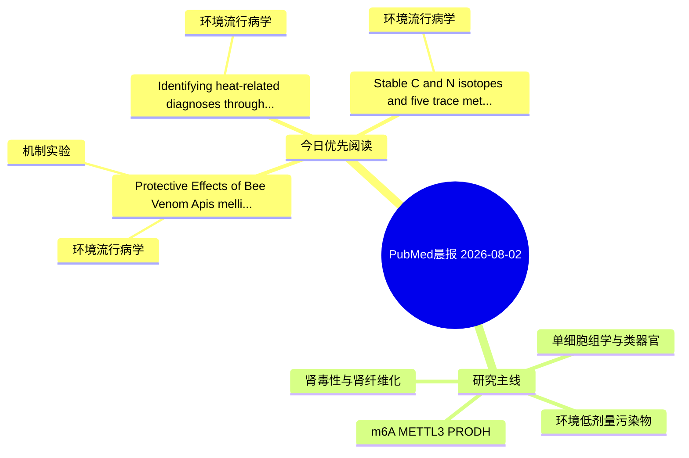

# PubMed 文献晨报｜2026-08-02

- 生成日期：2026-08-02 UTC
- 检索窗口：近 24 小时
- 高质量阈值：规则评分 ≥ 7
- 近 24 小时原始命中数：4

## 今日总体判断

今日筛选出 3 篇优先阅读文献，主要集中在：环境流行病学、机制实验。

## 今日最值得读的 5 篇文章

### 1. Protective Effects of Bee Venom (Apis mellifera) Against Cadmium-Induced Hepatorenal Toxicity, Oxidative Stress, and Anxiety-Like Behavior in Rats.

- 题目：Protective Effects of Bee Venom (Apis mellifera) Against Cadmium-Induced Hepatorenal Toxicity, Oxidative Stress, and Anxiety-Like Behavior in Rats.
- 期刊：Environmental toxicology
- 年份：2026
- PMID：[42541405](https://pubmed.ncbi.nlm.nih.gov/42541405/)
- DOI：[10.1002/tox.70153](https://doi.org/10.1002/tox.70153)
- 分类：环境流行病学、机制实验
- 规则评分：12
- 研究对象：小鼠或大鼠肾损伤模型
- 核心方法：细胞与动物机制实验
- 主要发现：摘要提示研究重点涉及环境污染物暴露；结论线索为：Collectively, these findings highlight the potential of BV to protect against Cd-induced hepatorenal and neurobehavioral toxicity, likely through modulation of oxidative stress pathways, thereby underscoring its promise as a natural therapeutic candidate fo...
- 为什么值得读：同时连接环境暴露与机制线索；关键词匹配度较高

### 2. Identifying heat-related diagnoses through linked electronic health record and environmental data: a heat-wide association study conducted in Chicago.

- 题目：Identifying heat-related diagnoses through linked electronic health record and environmental data: a heat-wide association study conducted in Chicago.
- 期刊：International journal of population data science
- 年份：2026
- PMID：[42540965](https://pubmed.ncbi.nlm.nih.gov/42540965/)
- DOI：[10.23889/ijpds.v11i5.3706](https://doi.org/10.23889/ijpds.v11i5.3706)
- 分类：环境流行病学
- 规则评分：10
- 研究对象：人群/队列或环境暴露人群
- 核心方法：环境流行病学/队列或人群数据
- 主要发现：摘要提示研究重点涉及环境污染物暴露；结论线索为：Findings refine the definition of heat-related health outcomes and inform targeted public-health and clinical responses to future extreme heat events.
- 为什么值得读：与检索主题有交集，可作为背景或线索文献扫读

### 3. Stable C and N isotopes and five trace metal concentrations in the tissues of four odontocetes around Taiwan, Northwestern Pacific Ocean.

- 题目：Stable C and N isotopes and five trace metal concentrations in the tissues of four odontocetes around Taiwan, Northwestern Pacific Ocean.
- 期刊：Ecotoxicology and environmental safety
- 年份：2026
- PMID：[42542433](https://pubmed.ncbi.nlm.nih.gov/42542433/)
- DOI：[10.1016/j.ecoenv.2026.120422](https://doi.org/10.1016/j.ecoenv.2026.120422)
- 分类：环境流行病学
- 规则评分：9
- 研究对象：题名和摘要未明确，建议阅读全文确认
- 核心方法：基于题名/摘要的常规实验或文献分析，需阅读全文确认
- 主要发现：摘要提示研究重点涉及环境污染物暴露；结论线索为：Furthermore, the high mean Cd concentrations detected in the muscle and kidney tissues of Tt and Sb indicate a rising trend in Cd pollution in the north-western Pacific Ocean over the past two to three decades.
- 为什么值得读：与检索主题有交集，可作为背景或线索文献扫读

## 分类归档

### 环境流行病学
- [Protective Effects of Bee Venom (Apis mellifera) Against Cadmium-Induced Hepatorenal Toxicity, Oxidative Stress, and Anxiety-Like Behavior in Rats.](https://pubmed.ncbi.nlm.nih.gov/42541405/)（PMID: 42541405）
- [Identifying heat-related diagnoses through linked electronic health record and environmental data: a heat-wide association study conducted in Chicago.](https://pubmed.ncbi.nlm.nih.gov/42540965/)（PMID: 42540965）
- [Stable C and N isotopes and five trace metal concentrations in the tissues of four odontocetes around Taiwan, Northwestern Pacific Ocean.](https://pubmed.ncbi.nlm.nih.gov/42542433/)（PMID: 42542433）

### 机制实验
- [Protective Effects of Bee Venom (Apis mellifera) Against Cadmium-Induced Hepatorenal Toxicity, Oxidative Stress, and Anxiety-Like Behavior in Rats.](https://pubmed.ncbi.nlm.nih.gov/42541405/)（PMID: 42541405）

### 单细胞组学
- 今日暂无高质量新文献。

### 类器官
- 今日暂无高质量新文献。

### 肾毒性
- 今日暂无高质量新文献。

### m6A-METTL3-PRODH
- 今日暂无高质量新文献。

## 今日阅读优先级

1. Protective Effects of Bee Venom (Apis mellifera) Against Cadmium-Induced Hepatorenal Toxicity, Oxidative Stress, and Anxiety-Like Behavior in Rats.（优先理由：同时连接环境暴露与机制线索；关键词匹配度较高）
2. Identifying heat-related diagnoses through linked electronic health record and environmental data: a heat-wide association study conducted in Chicago.（优先理由：与检索主题有交集，可作为背景或线索文献扫读）
3. Stable C and N isotopes and five trace metal concentrations in the tissues of four odontocetes around Taiwan, Northwestern Pacific Ocean.（优先理由：与检索主题有交集，可作为背景或线索文献扫读）

## Mermaid 思维导图

