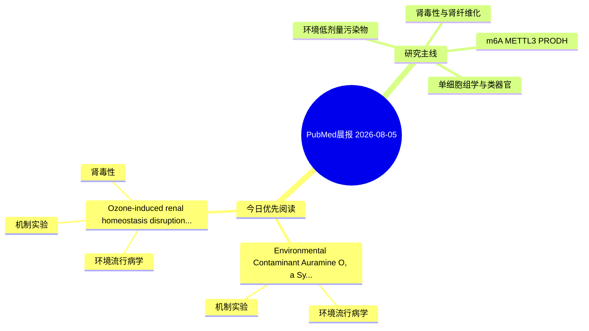

# PubMed 文献晨报｜2026-08-05

- 生成日期：2026-08-05 UTC
- 检索窗口：近 24 小时
- 高质量阈值：规则评分 ≥ 7
- 近 24 小时原始命中数：2

## 今日总体判断

今日筛选出 2 篇优先阅读文献，主要集中在：环境流行病学、机制实验、肾毒性。

## 今日最值得读的 5 篇文章

### 1. Environmental Contaminant Auramine O, a Synthetic Dye Exposure Induces Multiorgan Toxicity via Inflammatory and Apoptotic Pathways in Sprague-Dawley Rats.

- 题目：Environmental Contaminant Auramine O, a Synthetic Dye Exposure Induces Multiorgan Toxicity via Inflammatory and Apoptotic Pathways in Sprague-Dawley Rats.
- 期刊：Journal of applied toxicology : JAT
- 年份：2026
- PMID：[42551918](https://pubmed.ncbi.nlm.nih.gov/42551918/)
- DOI：[10.1002/jat.70379](https://doi.org/10.1002/jat.70379)
- 分类：环境流行病学、机制实验
- 规则评分：12
- 研究对象：小鼠或大鼠肾损伤模型
- 核心方法：基于题名/摘要的常规实验或文献分析，需阅读全文确认
- 主要发现：摘要提示研究重点涉及本方向相关问题；结论线索为：Histopathological analysis of tissue samples revealed considerable damage to the liver (hepatic injury), kidney (tubular degeneration), heart (myocardial injury), and brain (neuronal degeneration).
- 为什么值得读：同时连接环境暴露与机制线索；关键词匹配度较高

### 2. Ozone-induced renal homeostasis disruption in diabetic mice: The role of Th17/Treg imbalance and drug intervention.

- 题目：Ozone-induced renal homeostasis disruption in diabetic mice: The role of Th17/Treg imbalance and drug intervention.
- 期刊：Journal of hazardous materials
- 年份：2026
- PMID：[42551371](https://pubmed.ncbi.nlm.nih.gov/42551371/)
- DOI：[10.1016/j.jhazmat.2026.143029](https://doi.org/10.1016/j.jhazmat.2026.143029)
- 分类：环境流行病学、机制实验、肾毒性
- 规则评分：12
- 研究对象：小鼠或大鼠肾损伤模型
- 核心方法：基于题名/摘要的常规实验或文献分析，需阅读全文确认
- 主要发现：摘要提示研究重点涉及环境污染物暴露、肾毒性/肾损伤；结论线索为：This study provided valuable insights into the nephrotoxic effects associated with ozone exposure, and offered a reference for the development of intervention strategies targeting pollutant-driven metabolic kidney disease and the formulation of environmenta...
- 为什么值得读：同时连接环境暴露与机制线索；与肾毒性/肾损伤主线直接相关；关键词匹配度较高

## 分类归档

### 环境流行病学
- [Environmental Contaminant Auramine O, a Synthetic Dye Exposure Induces Multiorgan Toxicity via Inflammatory and Apoptotic Pathways in Sprague-Dawley Rats.](https://pubmed.ncbi.nlm.nih.gov/42551918/)（PMID: 42551918）
- [Ozone-induced renal homeostasis disruption in diabetic mice: The role of Th17/Treg imbalance and drug intervention.](https://pubmed.ncbi.nlm.nih.gov/42551371/)（PMID: 42551371）

### 机制实验
- [Environmental Contaminant Auramine O, a Synthetic Dye Exposure Induces Multiorgan Toxicity via Inflammatory and Apoptotic Pathways in Sprague-Dawley Rats.](https://pubmed.ncbi.nlm.nih.gov/42551918/)（PMID: 42551918）
- [Ozone-induced renal homeostasis disruption in diabetic mice: The role of Th17/Treg imbalance and drug intervention.](https://pubmed.ncbi.nlm.nih.gov/42551371/)（PMID: 42551371）

### 单细胞组学
- 今日暂无高质量新文献。

### 类器官
- 今日暂无高质量新文献。

### 肾毒性
- [Ozone-induced renal homeostasis disruption in diabetic mice: The role of Th17/Treg imbalance and drug intervention.](https://pubmed.ncbi.nlm.nih.gov/42551371/)（PMID: 42551371）

### m6A-METTL3-PRODH
- 今日暂无高质量新文献。

## 今日阅读优先级

1. Environmental Contaminant Auramine O, a Synthetic Dye Exposure Induces Multiorgan Toxicity via Inflammatory and Apoptotic Pathways in Sprague-Dawley Rats.（优先理由：同时连接环境暴露与机制线索；关键词匹配度较高）
2. Ozone-induced renal homeostasis disruption in diabetic mice: The role of Th17/Treg imbalance and drug intervention.（优先理由：同时连接环境暴露与机制线索；与肾毒性/肾损伤主线直接相关；关键词匹配度较高）

## Mermaid 思维导图

