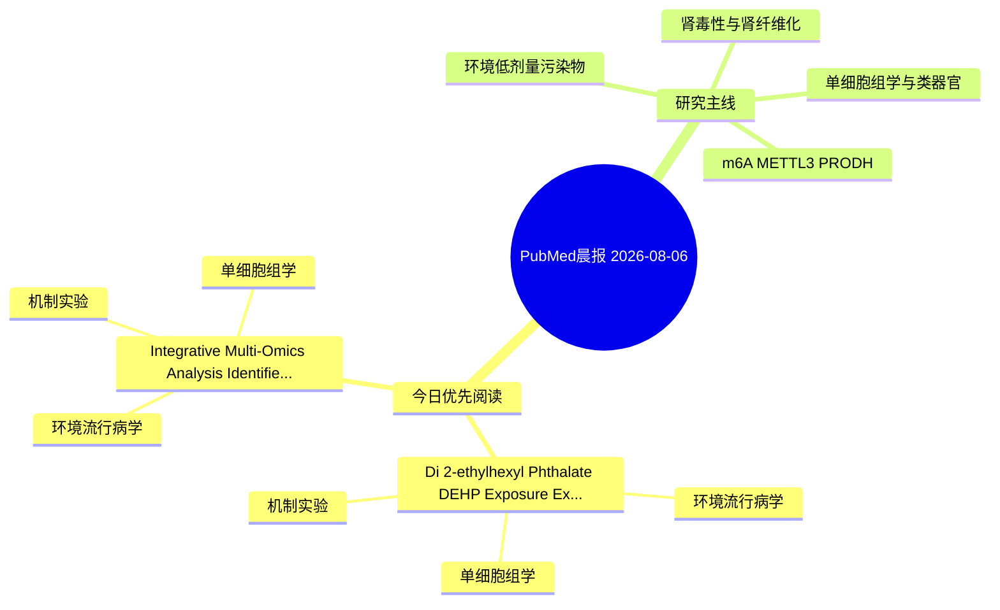

# PubMed 文献晨报｜2026-08-06

- 生成日期：2026-08-06 UTC
- 检索窗口：近 24 小时
- 高质量阈值：规则评分 ≥ 7
- 近 24 小时原始命中数：4

## 今日总体判断

今日筛选出 2 篇优先阅读文献，主要集中在：环境流行病学、机制实验、单细胞组学。

## 今日最值得读的 5 篇文章

### 1. Di(2-ethylhexyl) Phthalate (DEHP) Exposure Exacerbates Subarachnoid Hemorrhage by Inducing Astrocyte-Mediated Inflammation and Oxidative Stress through the ADORA1/PI3K-Akt/MAPK Axis.

- 题目：Di(2-ethylhexyl) Phthalate (DEHP) Exposure Exacerbates Subarachnoid Hemorrhage by Inducing Astrocyte-Mediated Inflammation and Oxidative Stress through the ADORA1/PI3K-Akt/MAPK Axis.
- 期刊：Journal of agricultural and food chemistry
- 年份：2026
- PMID：[42554815](https://pubmed.ncbi.nlm.nih.gov/42554815/)
- DOI：[10.1021/acs.jafc.6c05550](https://doi.org/10.1021/acs.jafc.6c05550)
- 分类：环境流行病学、机制实验、单细胞组学
- 规则评分：17
- 研究对象：小鼠或大鼠肾损伤模型
- 核心方法：单细胞或空间组学；细胞与动物机制实验
- 主要发现：摘要提示研究重点涉及环境污染物暴露、单细胞或空间组学；结论线索为：These findings reveal that DEHP aggravates SAH neurotoxicity via ADORA1-mediated astrocyte inflammation and oxidative stress through the PI3K-Akt/MAPK axis, providing new insights into environmental pollutant neurotoxicity.
- 为什么值得读：同时连接环境暴露与机制线索；可帮助寻找细胞类型特异性机制；关键词匹配度较高

### 2. Integrative Multi-Omics Analysis Identifies Key Molecular Targets Linking Bisphenol A Exposure to Gestational Diabetes Mellitus.

- 题目：Integrative Multi-Omics Analysis Identifies Key Molecular Targets Linking Bisphenol A Exposure to Gestational Diabetes Mellitus.
- 期刊：Reproductive sciences (Thousand Oaks, Calif.)
- 年份：2026
- PMID：[42552472](https://pubmed.ncbi.nlm.nih.gov/42552472/)
- DOI：[10.1007/s43032-026-02170-z](https://doi.org/10.1007/s43032-026-02170-z)
- 分类：环境流行病学、机制实验、单细胞组学
- 规则评分：10
- 研究对象：题名和摘要未明确，建议阅读全文确认
- 核心方法：单细胞或空间组学；细胞与动物机制实验
- 主要发现：摘要提示研究重点涉及单细胞或空间组学；结论线索为：Immune analysis revealed significant correlations between hub genes and the infiltration levels of immune cells.
- 为什么值得读：同时连接环境暴露与机制线索；可帮助寻找细胞类型特异性机制

## 分类归档

### 环境流行病学
- [Di(2-ethylhexyl) Phthalate (DEHP) Exposure Exacerbates Subarachnoid Hemorrhage by Inducing Astrocyte-Mediated Inflammation and Oxidative Stress through the ADORA1/PI3K-Akt/MAPK Axis.](https://pubmed.ncbi.nlm.nih.gov/42554815/)（PMID: 42554815）
- [Integrative Multi-Omics Analysis Identifies Key Molecular Targets Linking Bisphenol A Exposure to Gestational Diabetes Mellitus.](https://pubmed.ncbi.nlm.nih.gov/42552472/)（PMID: 42552472）

### 机制实验
- [Di(2-ethylhexyl) Phthalate (DEHP) Exposure Exacerbates Subarachnoid Hemorrhage by Inducing Astrocyte-Mediated Inflammation and Oxidative Stress through the ADORA1/PI3K-Akt/MAPK Axis.](https://pubmed.ncbi.nlm.nih.gov/42554815/)（PMID: 42554815）
- [Integrative Multi-Omics Analysis Identifies Key Molecular Targets Linking Bisphenol A Exposure to Gestational Diabetes Mellitus.](https://pubmed.ncbi.nlm.nih.gov/42552472/)（PMID: 42552472）

### 单细胞组学
- [Di(2-ethylhexyl) Phthalate (DEHP) Exposure Exacerbates Subarachnoid Hemorrhage by Inducing Astrocyte-Mediated Inflammation and Oxidative Stress through the ADORA1/PI3K-Akt/MAPK Axis.](https://pubmed.ncbi.nlm.nih.gov/42554815/)（PMID: 42554815）
- [Integrative Multi-Omics Analysis Identifies Key Molecular Targets Linking Bisphenol A Exposure to Gestational Diabetes Mellitus.](https://pubmed.ncbi.nlm.nih.gov/42552472/)（PMID: 42552472）

### 类器官
- 今日暂无高质量新文献。

### 肾毒性
- 今日暂无高质量新文献。

### m6A-METTL3-PRODH
- 今日暂无高质量新文献。

## 今日阅读优先级

1. Di(2-ethylhexyl) Phthalate (DEHP) Exposure Exacerbates Subarachnoid Hemorrhage by Inducing Astrocyte-Mediated Inflammation and Oxidative Stress through the ADORA1/PI3K-Akt/MAPK Axis.（优先理由：同时连接环境暴露与机制线索；可帮助寻找细胞类型特异性机制；关键词匹配度较高）
2. Integrative Multi-Omics Analysis Identifies Key Molecular Targets Linking Bisphenol A Exposure to Gestational Diabetes Mellitus.（优先理由：同时连接环境暴露与机制线索；可帮助寻找细胞类型特异性机制）

## Mermaid 思维导图

