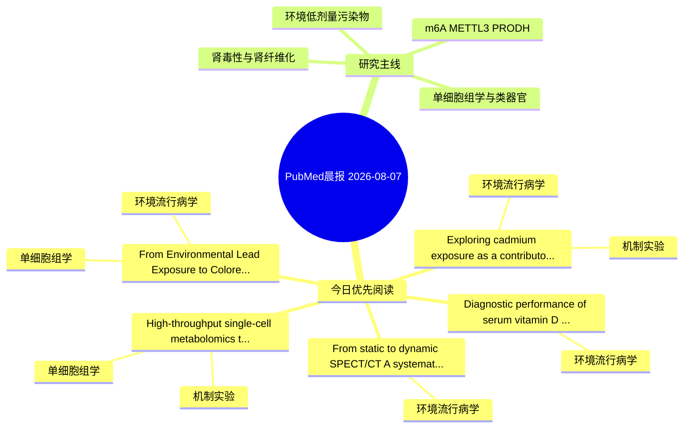

# PubMed 文献晨报｜2026-08-07

- 生成日期：2026-08-07 UTC
- 检索窗口：近 24 小时
- 高质量阈值：规则评分 ≥ 7
- 近 24 小时原始命中数：5

## 今日总体判断

今日筛选出 5 篇优先阅读文献，主要集中在：环境流行病学、机制实验、单细胞组学。

## 今日最值得读的 5 篇文章

### 1. Diagnostic performance of serum vitamin D metabolites and 14 inorganic elements in early prediction of kidney neoplasm.

- 题目：Diagnostic performance of serum vitamin D metabolites and 14 inorganic elements in early prediction of kidney neoplasm.
- 期刊：Frontiers in oncology
- 年份：2026
- PMID：[42558352](https://pubmed.ncbi.nlm.nih.gov/42558352/)
- DOI：[10.3389/fonc.2026.1884903](https://doi.org/10.3389/fonc.2026.1884903)
- 分类：环境流行病学
- 规则评分：15
- 研究对象：肾小管/肾脏细胞与组织
- 核心方法：基于题名/摘要的常规实验或文献分析，需阅读全文确认
- 主要发现：摘要提示研究重点涉及环境污染物暴露；结论线索为：CONCLUSION: KN patients exhibit altered VitD metabolites and trace element profiles, with low Zn and Se potentially promoting malignancy.
- 为什么值得读：关键词匹配度较高

### 2. Exploring cadmium exposure as a contributor to male infertility: insights from the relationship between environmental pollutants and the male reproductive system.

- 题目：Exploring cadmium exposure as a contributor to male infertility: insights from the relationship between environmental pollutants and the male reproductive system.
- 期刊：Frontiers in endocrinology
- 年份：2026
- PMID：[42558478](https://pubmed.ncbi.nlm.nih.gov/42558478/)
- DOI：[10.3389/fendo.2026.1819705](https://doi.org/10.3389/fendo.2026.1819705)
- 分类：环境流行病学、机制实验
- 规则评分：12
- 研究对象：人群/队列或环境暴露人群
- 核心方法：细胞与动物机制实验
- 主要发现：摘要提示研究重点涉及环境污染物暴露；结论线索为：The results suggest that cadmium may cause damage to the male reproductive system, potentially adversely affecting semen quality.
- 为什么值得读：同时连接环境暴露与机制线索；关键词匹配度较高

### 3. From Environmental Lead Exposure to Colorectal Cancer: Integrated Transcriptomic and Genetic Analyses Identify HMOX1 as a Prioritized Candidate.

- 题目：From Environmental Lead Exposure to Colorectal Cancer: Integrated Transcriptomic and Genetic Analyses Identify HMOX1 as a Prioritized Candidate.
- 期刊：Biological trace element research
- 年份：2026
- PMID：[42560444](https://pubmed.ncbi.nlm.nih.gov/42560444/)
- DOI：[10.1007/s12011-026-05277-1](https://doi.org/10.1007/s12011-026-05277-1)
- 分类：环境流行病学、单细胞组学
- 规则评分：10
- 研究对象：人群/队列或环境暴露人群
- 核心方法：环境流行病学/队列或人群数据；单细胞或空间组学
- 主要发现：摘要提示研究重点涉及环境污染物暴露、单细胞或空间组学；结论线索为：Collectively, these results suggest that the crude epidemiologic association between blood lead and CRC prevalence is sensitive to covariate adjustment and generate testable hypotheses implicating HMOX1 for future experimental validation.
- 为什么值得读：可帮助寻找细胞类型特异性机制

### 4. From static to dynamic SPECT/CT: A systematic review of clinical applications and perspectives.

- 题目：From static to dynamic SPECT/CT: A systematic review of clinical applications and perspectives.
- 期刊：Seminars in nuclear medicine
- 年份：2026
- PMID：[42562661](https://pubmed.ncbi.nlm.nih.gov/42562661/)
- DOI：[10.1053/j.semnuclmed.2026.07.011](https://doi.org/10.1053/j.semnuclmed.2026.07.011)
- 分类：环境流行病学
- 规则评分：8
- 研究对象：患者样本或临床数据
- 核心方法：基于题名/摘要的常规实验或文献分析，需阅读全文确认
- 主要发现：摘要提示研究重点涉及环境污染物暴露；结论线索为：CONCLUSIONS: Dynamic SPECT/CT represents a major evolution toward quantitative nuclear imaging, bridging the gap between traditional static SPECT and PET kinetics.
- 为什么值得读：与检索主题有交集，可作为背景或线索文献扫读

### 5. High-throughput single-cell metabolomics to reveal the hepatotoxicity of 77PDQ exposure in mice.

- 题目：High-throughput single-cell metabolomics to reveal the hepatotoxicity of 77PDQ exposure in mice.
- 期刊：Talanta
- 年份：2026
- PMID：[42556040](https://pubmed.ncbi.nlm.nih.gov/42556040/)
- DOI：[10.1016/j.talanta.2026.130393](https://doi.org/10.1016/j.talanta.2026.130393)
- 分类：机制实验、单细胞组学
- 规则评分：7
- 研究对象：小鼠或大鼠肾损伤模型
- 核心方法：单细胞或空间组学；细胞与动物机制实验
- 主要发现：摘要提示研究重点涉及单细胞或空间组学；结论线索为：Analysis of primary mouse liver cells revealed 181 significantly altered metabolites (|Log2FC|>1, p < 0.05) following 77PDQ exposure.
- 为什么值得读：可帮助寻找细胞类型特异性机制

## 分类归档

### 环境流行病学
- [Diagnostic performance of serum vitamin D metabolites and 14 inorganic elements in early prediction of kidney neoplasm.](https://pubmed.ncbi.nlm.nih.gov/42558352/)（PMID: 42558352）
- [Exploring cadmium exposure as a contributor to male infertility: insights from the relationship between environmental pollutants and the male reproductive system.](https://pubmed.ncbi.nlm.nih.gov/42558478/)（PMID: 42558478）
- [From Environmental Lead Exposure to Colorectal Cancer: Integrated Transcriptomic and Genetic Analyses Identify HMOX1 as a Prioritized Candidate.](https://pubmed.ncbi.nlm.nih.gov/42560444/)（PMID: 42560444）
- [From static to dynamic SPECT/CT: A systematic review of clinical applications and perspectives.](https://pubmed.ncbi.nlm.nih.gov/42562661/)（PMID: 42562661）

### 机制实验
- [Exploring cadmium exposure as a contributor to male infertility: insights from the relationship between environmental pollutants and the male reproductive system.](https://pubmed.ncbi.nlm.nih.gov/42558478/)（PMID: 42558478）
- [High-throughput single-cell metabolomics to reveal the hepatotoxicity of 77PDQ exposure in mice.](https://pubmed.ncbi.nlm.nih.gov/42556040/)（PMID: 42556040）

### 单细胞组学
- [From Environmental Lead Exposure to Colorectal Cancer: Integrated Transcriptomic and Genetic Analyses Identify HMOX1 as a Prioritized Candidate.](https://pubmed.ncbi.nlm.nih.gov/42560444/)（PMID: 42560444）
- [High-throughput single-cell metabolomics to reveal the hepatotoxicity of 77PDQ exposure in mice.](https://pubmed.ncbi.nlm.nih.gov/42556040/)（PMID: 42556040）

### 类器官
- 今日暂无高质量新文献。

### 肾毒性
- 今日暂无高质量新文献。

### m6A-METTL3-PRODH
- 今日暂无高质量新文献。

## 今日阅读优先级

1. Diagnostic performance of serum vitamin D metabolites and 14 inorganic elements in early prediction of kidney neoplasm.（优先理由：关键词匹配度较高）
2. Exploring cadmium exposure as a contributor to male infertility: insights from the relationship between environmental pollutants and the male reproductive system.（优先理由：同时连接环境暴露与机制线索；关键词匹配度较高）
3. From Environmental Lead Exposure to Colorectal Cancer: Integrated Transcriptomic and Genetic Analyses Identify HMOX1 as a Prioritized Candidate.（优先理由：可帮助寻找细胞类型特异性机制）
4. From static to dynamic SPECT/CT: A systematic review of clinical applications and perspectives.（优先理由：与检索主题有交集，可作为背景或线索文献扫读）
5. High-throughput single-cell metabolomics to reveal the hepatotoxicity of 77PDQ exposure in mice.（优先理由：可帮助寻找细胞类型特异性机制）

## Mermaid 思维导图

