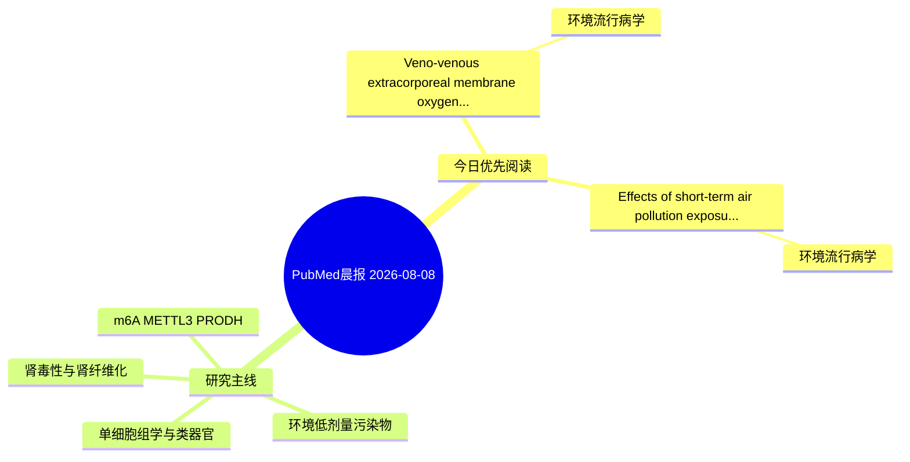

# PubMed 文献晨报｜2026-08-08

- 生成日期：2026-08-08 UTC
- 检索窗口：近 24 小时
- 高质量阈值：规则评分 ≥ 7
- 近 24 小时原始命中数：3

## 今日总体判断

今日筛选出 2 篇优先阅读文献，主要集中在：环境流行病学。

## 今日最值得读的 5 篇文章

### 1. Veno-venous extracorporeal membrane oxygenation support for severe leptospirosis complicated by pulmonary hemorrhage and refractory acute respiratory distress syndrome: A case report and literature review.

- 题目：Veno-venous extracorporeal membrane oxygenation support for severe leptospirosis complicated by pulmonary hemorrhage and refractory acute respiratory distress syndrome: A case report and literature review.
- 期刊：Medicine
- 年份：2026
- PMID：[42566621](https://pubmed.ncbi.nlm.nih.gov/42566621/)
- DOI：[10.1097/MD.0000000000050167](https://doi.org/10.1097/MD.0000000000050167)
- 分类：环境流行病学
- 规则评分：9
- 研究对象：患者样本或临床数据
- 核心方法：基于题名/摘要的常规实验或文献分析，需阅读全文确认
- 主要发现：摘要提示研究重点涉及环境污染物暴露；结论线索为：Individualized anticoagulation strategies and continued application of lung-protective measures, including prone positioning when feasible, are critical to optimizing outcomes.
- 为什么值得读：与检索主题有交集，可作为背景或线索文献扫读

### 2. Effects of short-term air pollution exposure on respiratory infection-related healthcare burden in kidney transplant recipients.

- 题目：Effects of short-term air pollution exposure on respiratory infection-related healthcare burden in kidney transplant recipients.
- 期刊：Zhong nan da xue xue bao. Yi xue ban = Journal of Central South University. Medical sciences
- 年份：2026
- PMID：[42565574](https://pubmed.ncbi.nlm.nih.gov/42565574/)
- DOI：[10.11817/j.issn.1672-7347.2026.260089](https://doi.org/10.11817/j.issn.1672-7347.2026.260089)
- 分类：环境流行病学
- 规则评分：9
- 研究对象：人群/队列或环境暴露人群
- 核心方法：环境流行病学/队列或人群数据
- 主要发现：摘要提示研究重点涉及环境污染物暴露；结论线索为：CONCLUSIONS: Short-term exposure to higher levels of PM2.5, PM10, and SO2 significantly increases the clinical and economic burden of RTIs in kidney transplant recipients.
- 为什么值得读：与检索主题有交集，可作为背景或线索文献扫读

## 分类归档

### 环境流行病学
- [Veno-venous extracorporeal membrane oxygenation support for severe leptospirosis complicated by pulmonary hemorrhage and refractory acute respiratory distress syndrome: A case report and literature review.](https://pubmed.ncbi.nlm.nih.gov/42566621/)（PMID: 42566621）
- [Effects of short-term air pollution exposure on respiratory infection-related healthcare burden in kidney transplant recipients.](https://pubmed.ncbi.nlm.nih.gov/42565574/)（PMID: 42565574）

### 机制实验
- 今日暂无高质量新文献。

### 单细胞组学
- 今日暂无高质量新文献。

### 类器官
- 今日暂无高质量新文献。

### 肾毒性
- 今日暂无高质量新文献。

### m6A-METTL3-PRODH
- 今日暂无高质量新文献。

## 今日阅读优先级

1. Veno-venous extracorporeal membrane oxygenation support for severe leptospirosis complicated by pulmonary hemorrhage and refractory acute respiratory distress syndrome: A case report and literature review.（优先理由：与检索主题有交集，可作为背景或线索文献扫读）
2. Effects of short-term air pollution exposure on respiratory infection-related healthcare burden in kidney transplant recipients.（优先理由：与检索主题有交集，可作为背景或线索文献扫读）

## Mermaid 思维导图

