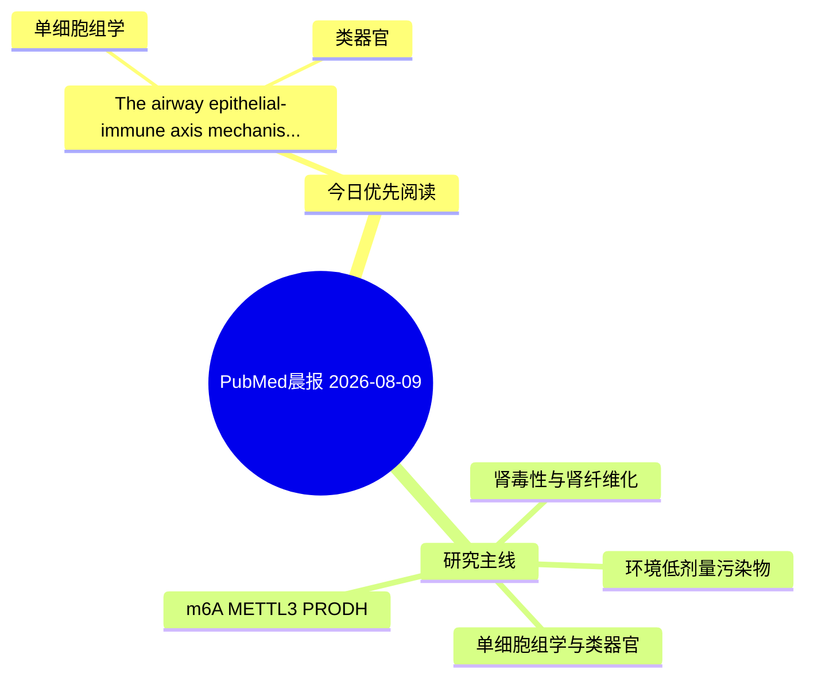

# PubMed 文献晨报｜2026-08-09

- 生成日期：2026-08-09 UTC
- 检索窗口：近 24 小时
- 高质量阈值：规则评分 ≥ 7
- 近 24 小时原始命中数：1

## 今日总体判断

今日筛选出 1 篇优先阅读文献，主要集中在：单细胞组学、类器官。

## 今日最值得读的 5 篇文章

### 1. The airway epithelial-immune axis: mechanisms and therapeutic implications.

- 题目：The airway epithelial-immune axis: mechanisms and therapeutic implications.
- 期刊：Frontiers in immunology
- 年份：2026
- PMID：[42568577](https://pubmed.ncbi.nlm.nih.gov/42568577/)
- DOI：[10.3389/fimmu.2026.1891760](https://doi.org/10.3389/fimmu.2026.1891760)
- 分类：单细胞组学、类器官
- 规则评分：10
- 研究对象：肾脏类器官或 iPSC 模型
- 核心方法：单细胞或空间组学；类器官/干细胞模型
- 主要发现：摘要提示研究重点涉及单细胞或空间组学、类器官模型；结论线索为：Furthermore, we highlight how emerging technologies-such as single-cell RNA sequencing, spatial transcriptomics, organoid models, and multi-omics integration-are decoding cellular heterogeneity and spatial niches, ultimately paving the way for precision med...
- 为什么值得读：可帮助寻找细胞类型特异性机制；对建立更接近人体的模型有参考价值

## 分类归档

### 环境流行病学
- 今日暂无高质量新文献。

### 机制实验
- 今日暂无高质量新文献。

### 单细胞组学
- [The airway epithelial-immune axis: mechanisms and therapeutic implications.](https://pubmed.ncbi.nlm.nih.gov/42568577/)（PMID: 42568577）

### 类器官
- [The airway epithelial-immune axis: mechanisms and therapeutic implications.](https://pubmed.ncbi.nlm.nih.gov/42568577/)（PMID: 42568577）

### 肾毒性
- 今日暂无高质量新文献。

### m6A-METTL3-PRODH
- 今日暂无高质量新文献。

## 今日阅读优先级

1. The airway epithelial-immune axis: mechanisms and therapeutic implications.（优先理由：可帮助寻找细胞类型特异性机制；对建立更接近人体的模型有参考价值）

## Mermaid 思维导图

