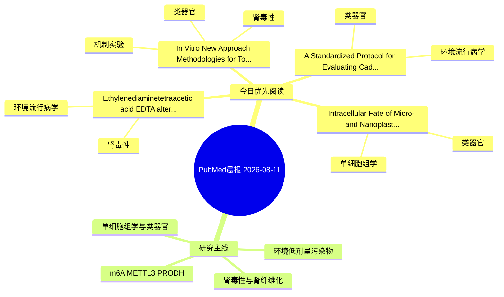

# PubMed 文献晨报｜2026-08-11

- 生成日期：2026-08-11 UTC
- 检索窗口：近 24 小时
- 高质量阈值：规则评分 ≥ 7
- 近 24 小时原始命中数：4

## 今日总体判断

今日筛选出 4 篇优先阅读文献，主要集中在：类器官、环境流行病学、肾毒性。

## 今日最值得读的 5 篇文章

### 1. Ethylenediaminetetraacetic acid (EDTA) alters phytochemicals of cooked Vicia faba beans and impairs liver and kidney functions in CD-1 mice.

- 题目：Ethylenediaminetetraacetic acid (EDTA) alters phytochemicals of cooked Vicia faba beans and impairs liver and kidney functions in CD-1 mice.
- 期刊：Scientific reports
- 年份：2026
- PMID：[42575918](https://pubmed.ncbi.nlm.nih.gov/42575918/)
- DOI：[10.1038/s41598-026-61448-z](https://doi.org/10.1038/s41598-026-61448-z)
- 分类：环境流行病学、肾毒性
- 规则评分：12
- 研究对象：小鼠或大鼠肾损伤模型
- 核心方法：基于题名/摘要的常规实验或文献分析，需阅读全文确认
- 主要发现：摘要提示研究重点涉及肾毒性/肾损伤；结论线索为：The results revealed that the addition of EDTA during cooking process led to marked alterations in the phytochemical compositions of V.
- 为什么值得读：与肾毒性/肾损伤主线直接相关；关键词匹配度较高

### 2. In Vitro New Approach Methodologies for Toxicity Assessment of Emerging Food Contaminants in Indonesia: A Proposed Strategy for BPOM Regulatory Integration.

- 题目：In Vitro New Approach Methodologies for Toxicity Assessment of Emerging Food Contaminants in Indonesia: A Proposed Strategy for BPOM Regulatory Integration.
- 期刊：Journal of applied toxicology : JAT
- 年份：2026
- PMID：[42575853](https://pubmed.ncbi.nlm.nih.gov/42575853/)
- DOI：[10.1002/jat.70394](https://doi.org/10.1002/jat.70394)
- 分类：机制实验、类器官、肾毒性
- 规则评分：11
- 研究对象：人群/队列或环境暴露人群
- 核心方法：类器官/干细胞模型；细胞与动物机制实验
- 主要发现：摘要提示研究重点涉及肾毒性/肾损伤、类器官模型；结论线索为：A novel evidence-based NAM validation roadmap tailored to the Southeast Asian regulatory context is proposed.
- 为什么值得读：与肾毒性/肾损伤主线直接相关；对建立更接近人体的模型有参考价值

### 3. Intracellular Fate of Micro- and Nanoplastics in Human Placenta: Organelle-Specific Toxicity and Mechanistic Convergence.

- 题目：Intracellular Fate of Micro- and Nanoplastics in Human Placenta: Organelle-Specific Toxicity and Mechanistic Convergence.
- 期刊：Environmental toxicology and pharmacology
- 年份：2026
- PMID：[42575350](https://pubmed.ncbi.nlm.nih.gov/42575350/)
- DOI：[10.1016/j.etap.2026.105129](https://doi.org/10.1016/j.etap.2026.105129)
- 分类：单细胞组学、类器官
- 规则评分：10
- 研究对象：人群/队列或环境暴露人群
- 核心方法：单细胞或空间组学；类器官/干细胞模型
- 主要发现：摘要提示研究重点涉及单细胞或空间组学、类器官模型；结论线索为：Priority directions include scRNA-seq-based cPCDR validation, trophoblast organoid models, and prospective placental biobanking.
- 为什么值得读：可帮助寻找细胞类型特异性机制；对建立更接近人体的模型有参考价值

### 4. A Standardized Protocol for Evaluating Cadmium Toxicity in Human Colorectal Organoids via Luciferase-Based Viability Assay.

- 题目：A Standardized Protocol for Evaluating Cadmium Toxicity in Human Colorectal Organoids via Luciferase-Based Viability Assay.
- 期刊：Journal of visualized experiments : JoVE
- 年份：2026
- PMID：[42574534](https://pubmed.ncbi.nlm.nih.gov/42574534/)
- DOI：[10.3791/70531](https://doi.org/10.3791/70531)
- 分类：环境流行病学、类器官
- 规则评分：10
- 研究对象：人群/队列或环境暴露人群
- 核心方法：类器官/干细胞模型
- 主要发现：摘要提示研究重点涉及环境污染物暴露、类器官模型；结论线索为：This study provides methodological guidance and practical insights for utilizing human COs in environmental heavy-metal toxicology studies.
- 为什么值得读：对建立更接近人体的模型有参考价值

## 分类归档

### 环境流行病学
- [Ethylenediaminetetraacetic acid (EDTA) alters phytochemicals of cooked Vicia faba beans and impairs liver and kidney functions in CD-1 mice.](https://pubmed.ncbi.nlm.nih.gov/42575918/)（PMID: 42575918）
- [A Standardized Protocol for Evaluating Cadmium Toxicity in Human Colorectal Organoids via Luciferase-Based Viability Assay.](https://pubmed.ncbi.nlm.nih.gov/42574534/)（PMID: 42574534）

### 机制实验
- [In Vitro New Approach Methodologies for Toxicity Assessment of Emerging Food Contaminants in Indonesia: A Proposed Strategy for BPOM Regulatory Integration.](https://pubmed.ncbi.nlm.nih.gov/42575853/)（PMID: 42575853）

### 单细胞组学
- [Intracellular Fate of Micro- and Nanoplastics in Human Placenta: Organelle-Specific Toxicity and Mechanistic Convergence.](https://pubmed.ncbi.nlm.nih.gov/42575350/)（PMID: 42575350）

### 类器官
- [In Vitro New Approach Methodologies for Toxicity Assessment of Emerging Food Contaminants in Indonesia: A Proposed Strategy for BPOM Regulatory Integration.](https://pubmed.ncbi.nlm.nih.gov/42575853/)（PMID: 42575853）
- [Intracellular Fate of Micro- and Nanoplastics in Human Placenta: Organelle-Specific Toxicity and Mechanistic Convergence.](https://pubmed.ncbi.nlm.nih.gov/42575350/)（PMID: 42575350）
- [A Standardized Protocol for Evaluating Cadmium Toxicity in Human Colorectal Organoids via Luciferase-Based Viability Assay.](https://pubmed.ncbi.nlm.nih.gov/42574534/)（PMID: 42574534）

### 肾毒性
- [Ethylenediaminetetraacetic acid (EDTA) alters phytochemicals of cooked Vicia faba beans and impairs liver and kidney functions in CD-1 mice.](https://pubmed.ncbi.nlm.nih.gov/42575918/)（PMID: 42575918）
- [In Vitro New Approach Methodologies for Toxicity Assessment of Emerging Food Contaminants in Indonesia: A Proposed Strategy for BPOM Regulatory Integration.](https://pubmed.ncbi.nlm.nih.gov/42575853/)（PMID: 42575853）

### m6A-METTL3-PRODH
- 今日暂无高质量新文献。

## 今日阅读优先级

1. Ethylenediaminetetraacetic acid (EDTA) alters phytochemicals of cooked Vicia faba beans and impairs liver and kidney functions in CD-1 mice.（优先理由：与肾毒性/肾损伤主线直接相关；关键词匹配度较高）
2. In Vitro New Approach Methodologies for Toxicity Assessment of Emerging Food Contaminants in Indonesia: A Proposed Strategy for BPOM Regulatory Integration.（优先理由：与肾毒性/肾损伤主线直接相关；对建立更接近人体的模型有参考价值）
3. Intracellular Fate of Micro- and Nanoplastics in Human Placenta: Organelle-Specific Toxicity and Mechanistic Convergence.（优先理由：可帮助寻找细胞类型特异性机制；对建立更接近人体的模型有参考价值）
4. A Standardized Protocol for Evaluating Cadmium Toxicity in Human Colorectal Organoids via Luciferase-Based Viability Assay.（优先理由：对建立更接近人体的模型有参考价值）

## Mermaid 思维导图

