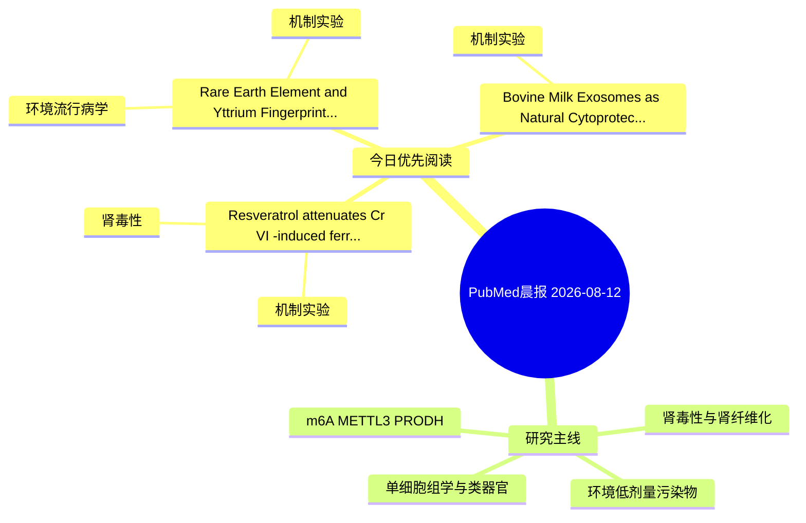

# PubMed 文献晨报｜2026-08-12

- 生成日期：2026-08-12 UTC
- 检索窗口：近 24 小时
- 高质量阈值：规则评分 ≥ 7
- 近 24 小时原始命中数：6

## 今日总体判断

今日筛选出 3 篇优先阅读文献，主要集中在：机制实验、肾毒性、环境流行病学。

## 今日最值得读的 5 篇文章

### 1. Resveratrol attenuates Cr(VI)-induced ferroptosis through SIRT3 activation in nephrocytes and in vivo.

- 题目：Resveratrol attenuates Cr(VI)-induced ferroptosis through SIRT3 activation in nephrocytes and in vivo.
- 期刊：Ecotoxicology and environmental safety
- 年份：2026
- PMID：[42580257](https://pubmed.ncbi.nlm.nih.gov/42580257/)
- DOI：[10.1016/j.ecoenv.2026.120646](https://doi.org/10.1016/j.ecoenv.2026.120646)
- 分类：机制实验、肾毒性
- 规则评分：17
- 研究对象：题名和摘要未明确，建议阅读全文确认
- 核心方法：细胞与动物机制实验
- 主要发现：摘要提示研究重点涉及环境污染物暴露、肾毒性/肾损伤；结论线索为：Our results reveal a novel SIRT3-mediated pathway through which resveratrol counteracts Cr(VI)-induced renal ferroptosis, highlighting its potential as a therapeutic agent against heavy metal-induced kidney damage.
- 为什么值得读：与肾毒性/肾损伤主线直接相关；关键词匹配度较高

### 2. Rare Earth Element and Yttrium Fingerprints in Human Kidney Stones: Tracing Environmental Exposure and Pathological Mineralization Pathway.

- 题目：Rare Earth Element and Yttrium Fingerprints in Human Kidney Stones: Tracing Environmental Exposure and Pathological Mineralization Pathway.
- 期刊：Biological trace element research
- 年份：2026
- PMID：[42579053](https://pubmed.ncbi.nlm.nih.gov/42579053/)
- DOI：[10.1007/s12011-026-05278-0](https://doi.org/10.1007/s12011-026-05278-0)
- 分类：环境流行病学、机制实验
- 规则评分：10
- 研究对象：人群/队列或环境暴露人群
- 核心方法：基于题名/摘要的常规实验或文献分析，需阅读全文确认
- 主要发现：摘要提示研究重点涉及环境污染物暴露；结论线索为：These results indicate that REE + Y are sensitive to biomineralization processes in kidney stones and may serve as potential tracers for apatite incorporation in calcium-bearing stones.
- 为什么值得读：同时连接环境暴露与机制线索

### 3. Bovine Milk Exosomes as Natural Cytoprotective Nanoplatforms Against Lead-Induced Toxicity.

- 题目：Bovine Milk Exosomes as Natural Cytoprotective Nanoplatforms Against Lead-Induced Toxicity.
- 期刊：Biologics : targets & therapy
- 年份：2026
- PMID：[42577763](https://pubmed.ncbi.nlm.nih.gov/42577763/)
- DOI：[10.2147/BTT.S571251](https://doi.org/10.2147/BTT.S571251)
- 分类：机制实验
- 规则评分：9
- 研究对象：人群/队列或环境暴露人群
- 核心方法：基于题名/摘要的常规实验或文献分析，需阅读全文确认
- 主要发现：摘要提示研究重点涉及环境污染物暴露；结论线索为：CONCLUSION: This study highlights the endogenous potential of BMEs as therapeutic and biotechnological agents against chemical toxicity.
- 为什么值得读：与检索主题有交集，可作为背景或线索文献扫读

## 分类归档

### 环境流行病学
- [Rare Earth Element and Yttrium Fingerprints in Human Kidney Stones: Tracing Environmental Exposure and Pathological Mineralization Pathway.](https://pubmed.ncbi.nlm.nih.gov/42579053/)（PMID: 42579053）

### 机制实验
- [Resveratrol attenuates Cr(VI)-induced ferroptosis through SIRT3 activation in nephrocytes and in vivo.](https://pubmed.ncbi.nlm.nih.gov/42580257/)（PMID: 42580257）
- [Rare Earth Element and Yttrium Fingerprints in Human Kidney Stones: Tracing Environmental Exposure and Pathological Mineralization Pathway.](https://pubmed.ncbi.nlm.nih.gov/42579053/)（PMID: 42579053）
- [Bovine Milk Exosomes as Natural Cytoprotective Nanoplatforms Against Lead-Induced Toxicity.](https://pubmed.ncbi.nlm.nih.gov/42577763/)（PMID: 42577763）

### 单细胞组学
- 今日暂无高质量新文献。

### 类器官
- 今日暂无高质量新文献。

### 肾毒性
- [Resveratrol attenuates Cr(VI)-induced ferroptosis through SIRT3 activation in nephrocytes and in vivo.](https://pubmed.ncbi.nlm.nih.gov/42580257/)（PMID: 42580257）

### m6A-METTL3-PRODH
- 今日暂无高质量新文献。

## 今日阅读优先级

1. Resveratrol attenuates Cr(VI)-induced ferroptosis through SIRT3 activation in nephrocytes and in vivo.（优先理由：与肾毒性/肾损伤主线直接相关；关键词匹配度较高）
2. Rare Earth Element and Yttrium Fingerprints in Human Kidney Stones: Tracing Environmental Exposure and Pathological Mineralization Pathway.（优先理由：同时连接环境暴露与机制线索）
3. Bovine Milk Exosomes as Natural Cytoprotective Nanoplatforms Against Lead-Induced Toxicity.（优先理由：与检索主题有交集，可作为背景或线索文献扫读）

## Mermaid 思维导图

