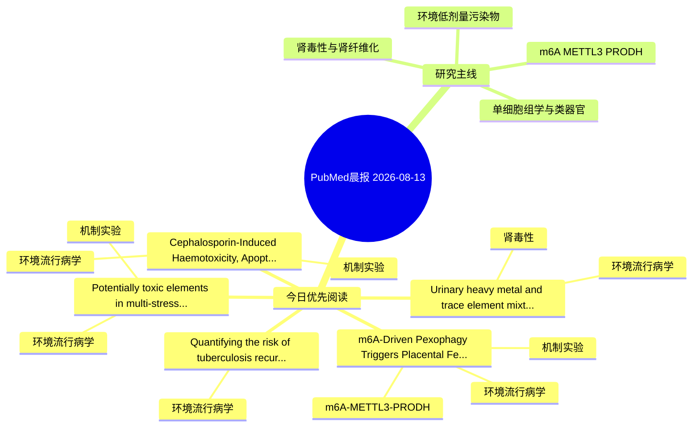

# PubMed 文献晨报｜2026-08-13

- 生成日期：2026-08-13 UTC
- 检索窗口：近 24 小时
- 高质量阈值：规则评分 ≥ 7
- 近 24 小时原始命中数：7

## 今日总体判断

今日筛选出 5 篇优先阅读文献，主要集中在：环境流行病学、机制实验、肾毒性。

## 今日最值得读的 5 篇文章

### 1. Urinary heavy metal and trace element mixtures in chronic kidney disease: associations and implications for potential reverse causality.

- 题目：Urinary heavy metal and trace element mixtures in chronic kidney disease: associations and implications for potential reverse causality.
- 期刊：Frontiers in toxicology
- 年份：2026
- PMID：[42583340](https://pubmed.ncbi.nlm.nih.gov/42583340/)
- DOI：[10.3389/ftox.2026.1892052](https://doi.org/10.3389/ftox.2026.1892052)
- 分类：环境流行病学、肾毒性
- 规则评分：12
- 研究对象：题名和摘要未明确，建议阅读全文确认
- 核心方法：基于题名/摘要的常规实验或文献分析，需阅读全文确认
- 主要发现：摘要提示研究重点涉及环境污染物暴露、肾毒性/肾损伤；结论线索为：Our findings suggest that urinary elements in CKD reflect not only exposure but also disease-related alterations in renal excretory function.
- 为什么值得读：与肾毒性/肾损伤主线直接相关；关键词匹配度较高

### 2. m6A-Driven Pexophagy Triggers Placental Ferroptosis to Impair Fetal Growth Upon Environmental Stress.

- 题目：m6A-Driven Pexophagy Triggers Placental Ferroptosis to Impair Fetal Growth Upon Environmental Stress.
- 期刊：Advanced science (Weinheim, Baden-Wurttemberg, Germany)
- 年份：2026
- PMID：[42584958](https://pubmed.ncbi.nlm.nih.gov/42584958/)
- DOI：[10.1002/advs.77068](https://doi.org/10.1002/advs.77068)
- 分类：环境流行病学、机制实验、m6A-METTL3-PRODH
- 规则评分：11
- 研究对象：人群/队列或环境暴露人群
- 核心方法：环境流行病学/队列或人群数据；m6A RNA修饰检测；细胞与动物机制实验
- 主要发现：摘要提示研究重点涉及环境污染物暴露、m6A-METTL3/PRODH 调控；结论线索为：Overall, our findings uncover a novel m6A-PEX2-PEX5 axis driving pexophagy-dependent placental ferroptosis, offering placental pexophagy as a therapeutic target for FGR and fetal-origin adult diseases.
- 为什么值得读：同时连接环境暴露与机制线索；贴近 m6A-METTL3-PRODH 调控假说

### 3. Potentially toxic elements in multi-stressor marine environments: bioaccumulation, ecosystem impacts, and human health implications.

- 题目：Potentially toxic elements in multi-stressor marine environments: bioaccumulation, ecosystem impacts, and human health implications.
- 期刊：Environmental geochemistry and health
- 年份：2026
- PMID：[42581170](https://pubmed.ncbi.nlm.nih.gov/42581170/)
- DOI：[10.1007/s10653-026-03420-4](https://doi.org/10.1007/s10653-026-03420-4)
- 分类：环境流行病学、机制实验
- 规则评分：11
- 研究对象：人群/队列或环境暴露人群
- 核心方法：环境流行病学/队列或人群数据
- 主要发现：摘要提示研究重点涉及环境污染物暴露；结论线索为：These findings suggest that current regulatory thresholds, which overlook interactive effects and additive toxicities, systematically underestimate cumulative threats in a changing ocean, necessitating urgent adoption of integrated, climate-aware frameworks...
- 为什么值得读：同时连接环境暴露与机制线索

### 4. Cephalosporin-Induced Haemotoxicity, Apoptosis, DNA Damage in Clarias gariepinus: Ameliorative Role of Chlorella vulgaris.

- 题目：Cephalosporin-Induced Haemotoxicity, Apoptosis, DNA Damage in Clarias gariepinus: Ameliorative Role of Chlorella vulgaris.
- 期刊：Environmental toxicology
- 年份：2026
- PMID：[42581408](https://pubmed.ncbi.nlm.nih.gov/42581408/)
- DOI：[10.1002/tox.70176](https://doi.org/10.1002/tox.70176)
- 分类：环境流行病学、机制实验
- 规则评分：9
- 研究对象：题名和摘要未明确，建议阅读全文确认
- 核心方法：基于题名/摘要的常规实验或文献分析，需阅读全文确认
- 主要发现：摘要提示研究重点涉及环境污染物暴露；结论线索为：Collectively, these findings demonstrate that cephalosporin residues can induce multi-system toxicity in C.
- 为什么值得读：同时连接环境暴露与机制线索

### 5. Quantifying the risk of tuberculosis recurrence in Asia: A systematic review of hazard estimates.

- 题目：Quantifying the risk of tuberculosis recurrence in Asia: A systematic review of hazard estimates.
- 期刊：The Medical journal of Malaysia
- 年份：2026
- PMID：[42584453](https://pubmed.ncbi.nlm.nih.gov/42584453/)
- DOI：未提供
- 分类：环境流行病学
- 规则评分：8
- 研究对象：人群/队列或环境暴露人群
- 核心方法：环境流行病学/队列或人群数据
- 主要发现：摘要提示研究重点涉及环境污染物暴露；结论线索为：CONCLUSION: Multiple determinants drive TB recurrence; thus, improving post-treatment surveillance as well as integrating clinical, behavioural and environmental interventions are important to reduce the incidence and mortality of TB recurrence cases.
- 为什么值得读：与检索主题有交集，可作为背景或线索文献扫读

## 分类归档

### 环境流行病学
- [Urinary heavy metal and trace element mixtures in chronic kidney disease: associations and implications for potential reverse causality.](https://pubmed.ncbi.nlm.nih.gov/42583340/)（PMID: 42583340）
- [m6A-Driven Pexophagy Triggers Placental Ferroptosis to Impair Fetal Growth Upon Environmental Stress.](https://pubmed.ncbi.nlm.nih.gov/42584958/)（PMID: 42584958）
- [Potentially toxic elements in multi-stressor marine environments: bioaccumulation, ecosystem impacts, and human health implications.](https://pubmed.ncbi.nlm.nih.gov/42581170/)（PMID: 42581170）
- [Cephalosporin-Induced Haemotoxicity, Apoptosis, DNA Damage in Clarias gariepinus: Ameliorative Role of Chlorella vulgaris.](https://pubmed.ncbi.nlm.nih.gov/42581408/)（PMID: 42581408）
- [Quantifying the risk of tuberculosis recurrence in Asia: A systematic review of hazard estimates.](https://pubmed.ncbi.nlm.nih.gov/42584453/)（PMID: 42584453）

### 机制实验
- [m6A-Driven Pexophagy Triggers Placental Ferroptosis to Impair Fetal Growth Upon Environmental Stress.](https://pubmed.ncbi.nlm.nih.gov/42584958/)（PMID: 42584958）
- [Potentially toxic elements in multi-stressor marine environments: bioaccumulation, ecosystem impacts, and human health implications.](https://pubmed.ncbi.nlm.nih.gov/42581170/)（PMID: 42581170）
- [Cephalosporin-Induced Haemotoxicity, Apoptosis, DNA Damage in Clarias gariepinus: Ameliorative Role of Chlorella vulgaris.](https://pubmed.ncbi.nlm.nih.gov/42581408/)（PMID: 42581408）

### 单细胞组学
- 今日暂无高质量新文献。

### 类器官
- 今日暂无高质量新文献。

### 肾毒性
- [Urinary heavy metal and trace element mixtures in chronic kidney disease: associations and implications for potential reverse causality.](https://pubmed.ncbi.nlm.nih.gov/42583340/)（PMID: 42583340）

### m6A-METTL3-PRODH
- [m6A-Driven Pexophagy Triggers Placental Ferroptosis to Impair Fetal Growth Upon Environmental Stress.](https://pubmed.ncbi.nlm.nih.gov/42584958/)（PMID: 42584958）

## 今日阅读优先级

1. Urinary heavy metal and trace element mixtures in chronic kidney disease: associations and implications for potential reverse causality.（优先理由：与肾毒性/肾损伤主线直接相关；关键词匹配度较高）
2. m6A-Driven Pexophagy Triggers Placental Ferroptosis to Impair Fetal Growth Upon Environmental Stress.（优先理由：同时连接环境暴露与机制线索；贴近 m6A-METTL3-PRODH 调控假说）
3. Potentially toxic elements in multi-stressor marine environments: bioaccumulation, ecosystem impacts, and human health implications.（优先理由：同时连接环境暴露与机制线索）
4. Cephalosporin-Induced Haemotoxicity, Apoptosis, DNA Damage in Clarias gariepinus: Ameliorative Role of Chlorella vulgaris.（优先理由：同时连接环境暴露与机制线索）
5. Quantifying the risk of tuberculosis recurrence in Asia: A systematic review of hazard estimates.（优先理由：与检索主题有交集，可作为背景或线索文献扫读）

## Mermaid 思维导图

