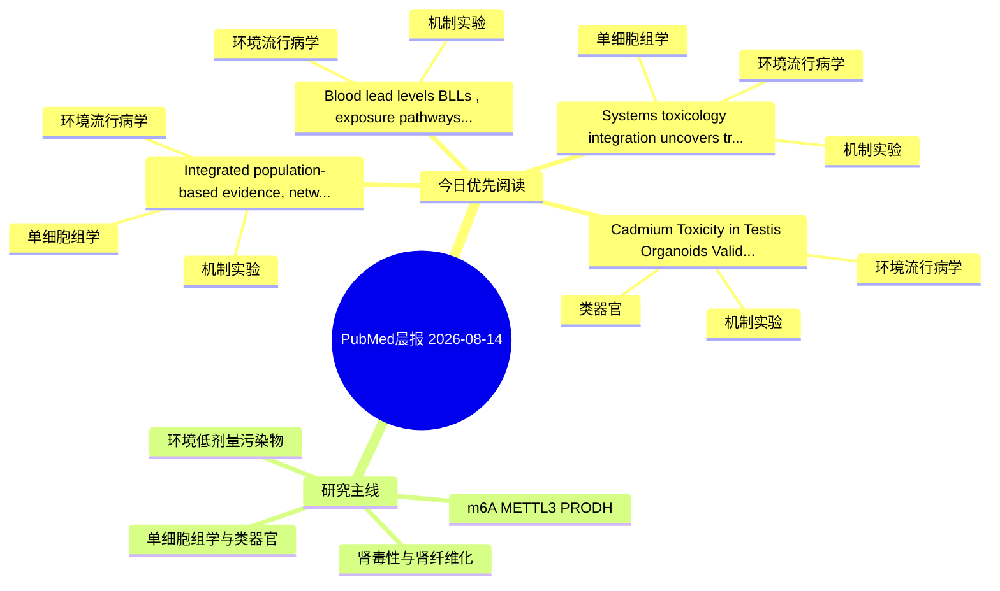

# PubMed 文献晨报｜2026-08-14

- 生成日期：2026-08-14 UTC
- 检索窗口：近 24 小时
- 高质量阈值：规则评分 ≥ 7
- 近 24 小时原始命中数：5

## 今日总体判断

今日筛选出 4 篇优先阅读文献，主要集中在：环境流行病学、机制实验、单细胞组学。

## 今日最值得读的 5 篇文章

### 1. Integrated population-based evidence, network toxicology, single-cell profiling, and in vitro studies elucidate mechanisms connecting PAHs to stroke.

- 题目：Integrated population-based evidence, network toxicology, single-cell profiling, and in vitro studies elucidate mechanisms connecting PAHs to stroke.
- 期刊：Ecotoxicology and environmental safety
- 年份：2026
- PMID：[42594829](https://pubmed.ncbi.nlm.nih.gov/42594829/)
- DOI：[10.1016/j.ecoenv.2026.120654](https://doi.org/10.1016/j.ecoenv.2026.120654)
- 分类：环境流行病学、机制实验、单细胞组学
- 规则评分：15
- 研究对象：人群/队列或环境暴露人群
- 核心方法：环境流行病学/队列或人群数据；单细胞或空间组学；细胞与动物机制实验
- 主要发现：摘要提示研究重点涉及环境污染物暴露、肾纤维化、单细胞或空间组学；结论线索为：Together, these findings suggest that 2-NAP may represent an important contributor linking PAH exposure to stroke and that LAMP2-associated pathways may participate in PAH-related cerebrovascular injury.
- 为什么值得读：同时连接环境暴露与机制线索；可帮助寻找细胞类型特异性机制；关键词匹配度较高

### 2. Systems toxicology integration uncovers trophoblast apoptosis as a pivotal mechanism underlying PFAS-related recurrent miscarriage.

- 题目：Systems toxicology integration uncovers trophoblast apoptosis as a pivotal mechanism underlying PFAS-related recurrent miscarriage.
- 期刊：Frontiers in cell and developmental biology
- 年份：2026
- PMID：[42591639](https://pubmed.ncbi.nlm.nih.gov/42591639/)
- DOI：[10.3389/fcell.2026.1889539](https://doi.org/10.3389/fcell.2026.1889539)
- 分类：环境流行病学、机制实验、单细胞组学、类器官
- 规则评分：14
- 研究对象：人群/队列或环境暴露人群
- 核心方法：单细胞或空间组学；类器官/干细胞模型；细胞与动物机制实验
- 主要发现：摘要提示研究重点涉及环境污染物暴露、单细胞或空间组学、类器官模型；结论线索为：Also, this study is limited by its in vitro nature, the use of a single SV40-immortalized trophoblast cell line, and the absence of primary human trophoblast or organoid validation.
- 为什么值得读：同时连接环境暴露与机制线索；可帮助寻找细胞类型特异性机制；对建立更接近人体的模型有参考价值

### 3. Cadmium Toxicity in Testis Organoids: Validation of an In Vitro Model for Testicular Toxicology.

- 题目：Cadmium Toxicity in Testis Organoids: Validation of an In Vitro Model for Testicular Toxicology.
- 期刊：Toxicologic pathology
- 年份：2026
- PMID：[42590896](https://pubmed.ncbi.nlm.nih.gov/42590896/)
- DOI：[10.1177/01926233261465410](https://doi.org/10.1177/01926233261465410)
- 分类：环境流行病学、机制实验、类器官
- 规则评分：13
- 研究对象：肾脏类器官或 iPSC 模型
- 核心方法：类器官/干细胞模型；细胞与动物机制实验
- 主要发现：摘要提示研究重点涉及环境污染物暴露、类器官模型；结论线索为：Collectively, these findings demonstrate dose-dependent toxicological responses and support the use of this testis organoid system as a relevant in vitro model for reproductive toxicology and environmental toxicant evaluation.
- 为什么值得读：同时连接环境暴露与机制线索；对建立更接近人体的模型有参考价值；关键词匹配度较高

### 4. Blood lead levels (BLLs), exposure pathways and health impacts in South Asia: a comprehensive review.

- 题目：Blood lead levels (BLLs), exposure pathways and health impacts in South Asia: a comprehensive review.
- 期刊：Critical reviews in toxicology
- 年份：2026
- PMID：[42593355](https://pubmed.ncbi.nlm.nih.gov/42593355/)
- DOI：[10.1080/10408444.2026.2692126](https://doi.org/10.1080/10408444.2026.2692126)
- 分类：环境流行病学、机制实验
- 规则评分：11
- 研究对象：人群/队列或环境暴露人群
- 核心方法：环境流行病学/队列或人群数据
- 主要发现：摘要提示研究重点涉及环境污染物暴露；结论线索为：This review highlights the critical need for enhanced food safety regulations, reinforced environmental monitoring and targeted public health interventions in order to mitigate lead exposure and its related health impacts especially in vulnerable populations.
- 为什么值得读：同时连接环境暴露与机制线索

## 分类归档

### 环境流行病学
- [Integrated population-based evidence, network toxicology, single-cell profiling, and in vitro studies elucidate mechanisms connecting PAHs to stroke.](https://pubmed.ncbi.nlm.nih.gov/42594829/)（PMID: 42594829）
- [Systems toxicology integration uncovers trophoblast apoptosis as a pivotal mechanism underlying PFAS-related recurrent miscarriage.](https://pubmed.ncbi.nlm.nih.gov/42591639/)（PMID: 42591639）
- [Cadmium Toxicity in Testis Organoids: Validation of an In Vitro Model for Testicular Toxicology.](https://pubmed.ncbi.nlm.nih.gov/42590896/)（PMID: 42590896）
- [Blood lead levels (BLLs), exposure pathways and health impacts in South Asia: a comprehensive review.](https://pubmed.ncbi.nlm.nih.gov/42593355/)（PMID: 42593355）

### 机制实验
- [Integrated population-based evidence, network toxicology, single-cell profiling, and in vitro studies elucidate mechanisms connecting PAHs to stroke.](https://pubmed.ncbi.nlm.nih.gov/42594829/)（PMID: 42594829）
- [Systems toxicology integration uncovers trophoblast apoptosis as a pivotal mechanism underlying PFAS-related recurrent miscarriage.](https://pubmed.ncbi.nlm.nih.gov/42591639/)（PMID: 42591639）
- [Cadmium Toxicity in Testis Organoids: Validation of an In Vitro Model for Testicular Toxicology.](https://pubmed.ncbi.nlm.nih.gov/42590896/)（PMID: 42590896）
- [Blood lead levels (BLLs), exposure pathways and health impacts in South Asia: a comprehensive review.](https://pubmed.ncbi.nlm.nih.gov/42593355/)（PMID: 42593355）

### 单细胞组学
- [Integrated population-based evidence, network toxicology, single-cell profiling, and in vitro studies elucidate mechanisms connecting PAHs to stroke.](https://pubmed.ncbi.nlm.nih.gov/42594829/)（PMID: 42594829）
- [Systems toxicology integration uncovers trophoblast apoptosis as a pivotal mechanism underlying PFAS-related recurrent miscarriage.](https://pubmed.ncbi.nlm.nih.gov/42591639/)（PMID: 42591639）

### 类器官
- [Systems toxicology integration uncovers trophoblast apoptosis as a pivotal mechanism underlying PFAS-related recurrent miscarriage.](https://pubmed.ncbi.nlm.nih.gov/42591639/)（PMID: 42591639）
- [Cadmium Toxicity in Testis Organoids: Validation of an In Vitro Model for Testicular Toxicology.](https://pubmed.ncbi.nlm.nih.gov/42590896/)（PMID: 42590896）

### 肾毒性
- 今日暂无高质量新文献。

### m6A-METTL3-PRODH
- 今日暂无高质量新文献。

## 今日阅读优先级

1. Integrated population-based evidence, network toxicology, single-cell profiling, and in vitro studies elucidate mechanisms connecting PAHs to stroke.（优先理由：同时连接环境暴露与机制线索；可帮助寻找细胞类型特异性机制；关键词匹配度较高）
2. Systems toxicology integration uncovers trophoblast apoptosis as a pivotal mechanism underlying PFAS-related recurrent miscarriage.（优先理由：同时连接环境暴露与机制线索；可帮助寻找细胞类型特异性机制；对建立更接近人体的模型有参考价值）
3. Cadmium Toxicity in Testis Organoids: Validation of an In Vitro Model for Testicular Toxicology.（优先理由：同时连接环境暴露与机制线索；对建立更接近人体的模型有参考价值；关键词匹配度较高）
4. Blood lead levels (BLLs), exposure pathways and health impacts in South Asia: a comprehensive review.（优先理由：同时连接环境暴露与机制线索）

## Mermaid 思维导图

