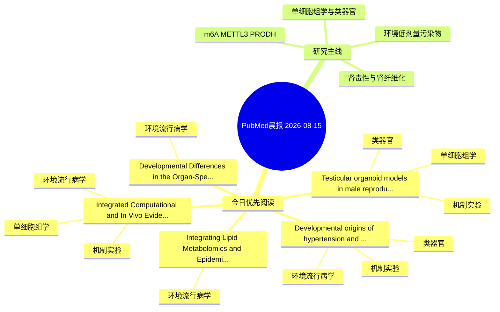

# PubMed 文献晨报｜2026-08-15

- 生成日期：2026-08-15 UTC
- 检索窗口：近 24 小时
- 高质量阈值：规则评分 ≥ 7
- 近 24 小时原始命中数：5

## 今日总体判断

今日筛选出 5 篇优先阅读文献，主要集中在：环境流行病学、机制实验、单细胞组学。

## 今日最值得读的 5 篇文章

### 1. Testicular organoid models in male reproductive toxicology: advances, applications, and future perspectives.

- 题目：Testicular organoid models in male reproductive toxicology: advances, applications, and future perspectives.
- 期刊：Frontiers in physiology
- 年份：2026
- PMID：[42597451](https://pubmed.ncbi.nlm.nih.gov/42597451/)
- DOI：[10.3389/fphys.2026.1874148](https://doi.org/10.3389/fphys.2026.1874148)
- 分类：机制实验、单细胞组学、类器官
- 规则评分：15
- 研究对象：人群/队列或环境暴露人群
- 核心方法：单细胞或空间组学；类器官/干细胞模型；细胞与动物机制实验
- 主要发现：摘要提示研究重点涉及单细胞或空间组学、类器官模型；结论线索为：Future priorities center on protocol standardization, automated high-throughput adaptation, multi-organ-on-chip integration, and formal regulatory validation to enable transformative applications in drug safety evaluation, environmental risk management, and...
- 为什么值得读：可帮助寻找细胞类型特异性机制；对建立更接近人体的模型有参考价值；关键词匹配度较高

### 2. Developmental Differences in the Organ-Specific Distribution of Cu, Zn, Cd, and Pb in Free-Ranging Wild Boar (Sus scrofa).

- 题目：Developmental Differences in the Organ-Specific Distribution of Cu, Zn, Cd, and Pb in Free-Ranging Wild Boar (Sus scrofa).
- 期刊：Archives of environmental contamination and toxicology
- 年份：2026
- PMID：[42599319](https://pubmed.ncbi.nlm.nih.gov/42599319/)
- DOI：[10.1007/s00244-026-01210-8](https://doi.org/10.1007/s00244-026-01210-8)
- 分类：环境流行病学
- 规则评分：12
- 研究对象：题名和摘要未明确，建议阅读全文确认
- 核心方法：基于题名/摘要的常规实验或文献分析，需阅读全文确认
- 主要发现：摘要提示研究重点涉及环境污染物暴露；结论线索为：Together, these results suggest that multi-organ distribution patterns provide useful insight into developmental metal partitioning beyond absolute concentration data and highlight the importance of incorporating developmental context into ecotoxicological...
- 为什么值得读：关键词匹配度较高

### 3. Developmental origins of hypertension and renal injury: epigenetic memory in renal stem and progenitor cells.

- 题目：Developmental origins of hypertension and renal injury: epigenetic memory in renal stem and progenitor cells.
- 期刊：Hypertension research : official journal of the Japanese Society of Hypertension
- 年份：2026
- PMID：[42595880](https://pubmed.ncbi.nlm.nih.gov/42595880/)
- DOI：[10.1038/s41440-026-02774-7](https://doi.org/10.1038/s41440-026-02774-7)
- 分类：环境流行病学、机制实验、类器官、肾毒性
- 规则评分：12
- 研究对象：肾脏类器官或 iPSC 模型
- 核心方法：类器官/干细胞模型
- 主要发现：摘要提示研究重点涉及环境污染物暴露、肾毒性/肾损伤；结论线索为：Maternal nutrition and supplementation, early surveillance, and lifestyle intervention represent potentially modifiable windows across the life course.
- 为什么值得读：同时连接环境暴露与机制线索；与肾毒性/肾损伤主线直接相关；对建立更接近人体的模型有参考价值

### 4. Integrated Computational and In Vivo Evidence Prioritizes MYH6 as a Candidate Node in PFOS-Associated HCM-like Cardiac Remodeling.

- 题目：Integrated Computational and In Vivo Evidence Prioritizes MYH6 as a Candidate Node in PFOS-Associated HCM-like Cardiac Remodeling.
- 期刊：Environmental pollution (Barking, Essex : 1987)
- 年份：2026
- PMID：[42600829](https://pubmed.ncbi.nlm.nih.gov/42600829/)
- DOI：[10.1016/j.envpol.2026.128925](https://doi.org/10.1016/j.envpol.2026.128925)
- 分类：环境流行病学、机制实验、单细胞组学
- 规则评分：10
- 研究对象：人群/队列或环境暴露人群
- 核心方法：单细胞或空间组学；细胞与动物机制实验
- 主要发现：摘要提示研究重点涉及环境污染物暴露、肾纤维化、单细胞或空间组学；结论线索为：Batch docking revealed 11 of 26 PFAS with scores at least as favorable as PFOS, indicating compound-level variation in modeled MYH6 compatibility.
- 为什么值得读：同时连接环境暴露与机制线索；可帮助寻找细胞类型特异性机制

### 5. Integrating Lipid Metabolomics and Epidemiology: A Mediation Analysis of Blood Lipids between Per- and Polyfluoroalkyl Substances (PFAS) and Renal Impairment.

- 题目：Integrating Lipid Metabolomics and Epidemiology: A Mediation Analysis of Blood Lipids between Per- and Polyfluoroalkyl Substances (PFAS) and Renal Impairment.
- 期刊：Environmental pollution (Barking, Essex : 1987)
- 年份：2026
- PMID：[42600826](https://pubmed.ncbi.nlm.nih.gov/42600826/)
- DOI：[10.1016/j.envpol.2026.128967](https://doi.org/10.1016/j.envpol.2026.128967)
- 分类：环境流行病学
- 规则评分：9
- 研究对象：人群/队列或环境暴露人群
- 核心方法：环境流行病学/队列或人群数据
- 主要发现：摘要提示研究重点涉及环境污染物暴露；结论线索为：Collectively, these findings suggest that mixed PFAS exposure, particularly to PFOA and PFHpA, may induce impaired renal function, with increased blood lipids playing an important mediating role.
- 为什么值得读：与检索主题有交集，可作为背景或线索文献扫读

## 分类归档

### 环境流行病学
- [Developmental Differences in the Organ-Specific Distribution of Cu, Zn, Cd, and Pb in Free-Ranging Wild Boar (Sus scrofa).](https://pubmed.ncbi.nlm.nih.gov/42599319/)（PMID: 42599319）
- [Developmental origins of hypertension and renal injury: epigenetic memory in renal stem and progenitor cells.](https://pubmed.ncbi.nlm.nih.gov/42595880/)（PMID: 42595880）
- [Integrated Computational and In Vivo Evidence Prioritizes MYH6 as a Candidate Node in PFOS-Associated HCM-like Cardiac Remodeling.](https://pubmed.ncbi.nlm.nih.gov/42600829/)（PMID: 42600829）
- [Integrating Lipid Metabolomics and Epidemiology: A Mediation Analysis of Blood Lipids between Per- and Polyfluoroalkyl Substances (PFAS) and Renal Impairment.](https://pubmed.ncbi.nlm.nih.gov/42600826/)（PMID: 42600826）

### 机制实验
- [Testicular organoid models in male reproductive toxicology: advances, applications, and future perspectives.](https://pubmed.ncbi.nlm.nih.gov/42597451/)（PMID: 42597451）
- [Developmental origins of hypertension and renal injury: epigenetic memory in renal stem and progenitor cells.](https://pubmed.ncbi.nlm.nih.gov/42595880/)（PMID: 42595880）
- [Integrated Computational and In Vivo Evidence Prioritizes MYH6 as a Candidate Node in PFOS-Associated HCM-like Cardiac Remodeling.](https://pubmed.ncbi.nlm.nih.gov/42600829/)（PMID: 42600829）

### 单细胞组学
- [Testicular organoid models in male reproductive toxicology: advances, applications, and future perspectives.](https://pubmed.ncbi.nlm.nih.gov/42597451/)（PMID: 42597451）
- [Integrated Computational and In Vivo Evidence Prioritizes MYH6 as a Candidate Node in PFOS-Associated HCM-like Cardiac Remodeling.](https://pubmed.ncbi.nlm.nih.gov/42600829/)（PMID: 42600829）

### 类器官
- [Testicular organoid models in male reproductive toxicology: advances, applications, and future perspectives.](https://pubmed.ncbi.nlm.nih.gov/42597451/)（PMID: 42597451）
- [Developmental origins of hypertension and renal injury: epigenetic memory in renal stem and progenitor cells.](https://pubmed.ncbi.nlm.nih.gov/42595880/)（PMID: 42595880）

### 肾毒性
- [Developmental origins of hypertension and renal injury: epigenetic memory in renal stem and progenitor cells.](https://pubmed.ncbi.nlm.nih.gov/42595880/)（PMID: 42595880）

### m6A-METTL3-PRODH
- 今日暂无高质量新文献。

## 今日阅读优先级

1. Testicular organoid models in male reproductive toxicology: advances, applications, and future perspectives.（优先理由：可帮助寻找细胞类型特异性机制；对建立更接近人体的模型有参考价值；关键词匹配度较高）
2. Developmental Differences in the Organ-Specific Distribution of Cu, Zn, Cd, and Pb in Free-Ranging Wild Boar (Sus scrofa).（优先理由：关键词匹配度较高）
3. Developmental origins of hypertension and renal injury: epigenetic memory in renal stem and progenitor cells.（优先理由：同时连接环境暴露与机制线索；与肾毒性/肾损伤主线直接相关；对建立更接近人体的模型有参考价值）
4. Integrated Computational and In Vivo Evidence Prioritizes MYH6 as a Candidate Node in PFOS-Associated HCM-like Cardiac Remodeling.（优先理由：同时连接环境暴露与机制线索；可帮助寻找细胞类型特异性机制）
5. Integrating Lipid Metabolomics and Epidemiology: A Mediation Analysis of Blood Lipids between Per- and Polyfluoroalkyl Substances (PFAS) and Renal Impairment.（优先理由：与检索主题有交集，可作为背景或线索文献扫读）

## Mermaid 思维导图

