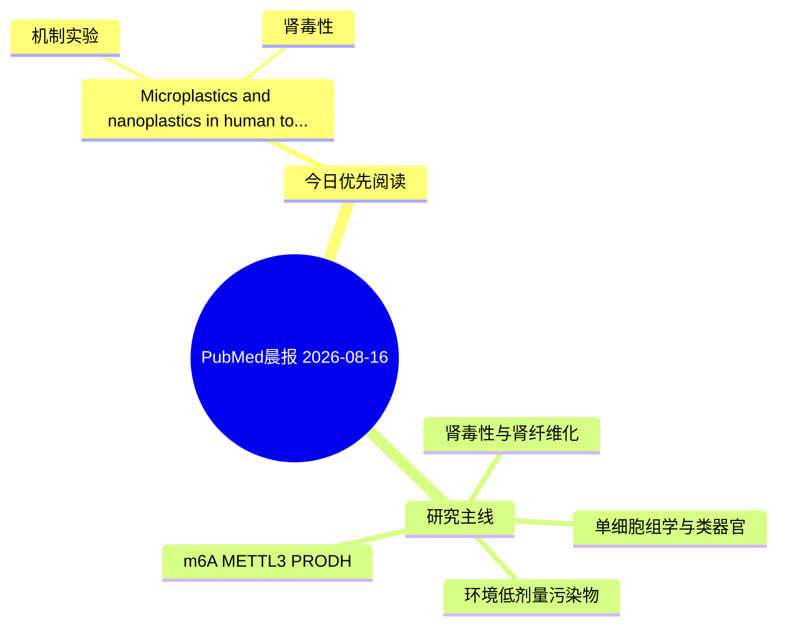

# PubMed 文献晨报｜2026-08-16

- 生成日期：2026-08-16 UTC
- 检索窗口：近 7 天
- 高质量阈值：规则评分 ≥ 7
- 近 24 小时原始命中数：0

## 今日总体判断

今日筛选出 1 篇优先阅读文献，主要集中在：机制实验、肾毒性。
由于近 24 小时内没有检索到候选文献，本次已自动扩大检索范围。

## 今日最值得读的 5 篇文章

### 1. Microplastics and nanoplastics in human toxicity: ROS-mediated mechanisms, cellular damage and systemic effects.

- 题目：Microplastics and nanoplastics in human toxicity: ROS-mediated mechanisms, cellular damage and systemic effects.
- 期刊：Molecular biology reports
- 年份：2026
- PMID：[42584724](https://pubmed.ncbi.nlm.nih.gov/42584724/)
- DOI：[10.1007/s11033-026-12575-3](https://doi.org/10.1007/s11033-026-12575-3)
- 分类：机制实验、肾毒性
- 规则评分：7
- 研究对象：人群/队列或环境暴露人群
- 核心方法：基于题名/摘要的常规实验或文献分析，需阅读全文确认
- 主要发现：摘要提示研究重点涉及肾毒性/肾损伤、肾纤维化；结论线索为：This review consolidates current understanding of the sources, cellular uptake, ROS-mediated mechanisms, and multi-organ toxicological effects of MPs and NPs.
- 为什么值得读：与肾毒性/肾损伤主线直接相关

## 分类归档

### 环境流行病学
- 今日暂无高质量新文献。

### 机制实验
- [Microplastics and nanoplastics in human toxicity: ROS-mediated mechanisms, cellular damage and systemic effects.](https://pubmed.ncbi.nlm.nih.gov/42584724/)（PMID: 42584724）

### 单细胞组学
- 今日暂无高质量新文献。

### 类器官
- 今日暂无高质量新文献。

### 肾毒性
- [Microplastics and nanoplastics in human toxicity: ROS-mediated mechanisms, cellular damage and systemic effects.](https://pubmed.ncbi.nlm.nih.gov/42584724/)（PMID: 42584724）

### m6A-METTL3-PRODH
- 今日暂无高质量新文献。

## 今日阅读优先级

1. Microplastics and nanoplastics in human toxicity: ROS-mediated mechanisms, cellular damage and systemic effects.（优先理由：与肾毒性/肾损伤主线直接相关）

## Mermaid 思维导图

