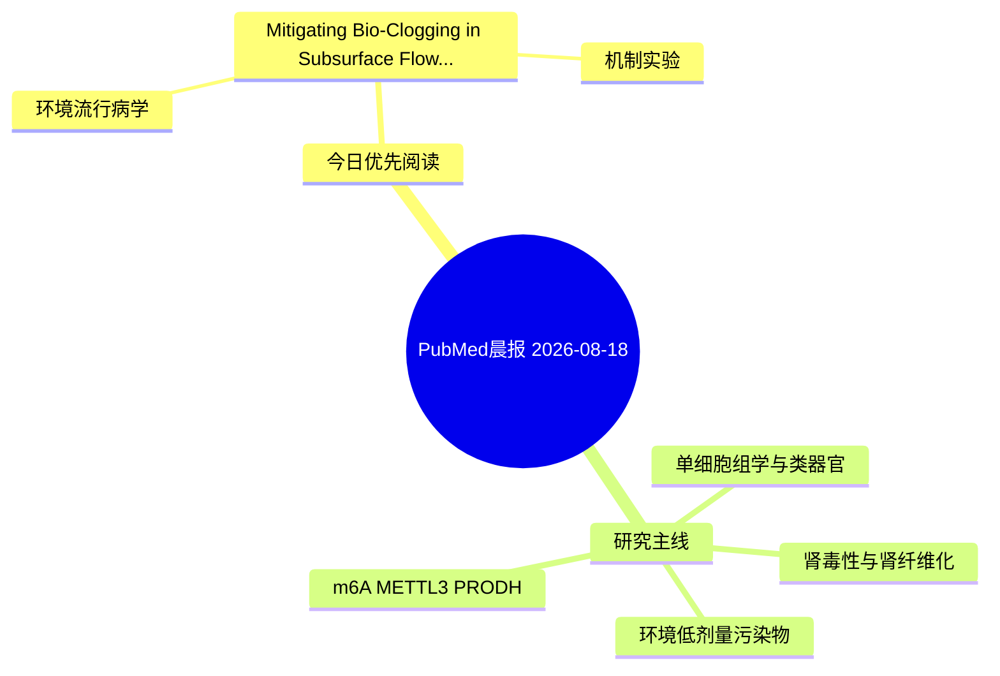

# PubMed 文献晨报｜2026-08-18

- 生成日期：2026-08-18 UTC
- 检索窗口：近 24 小时
- 高质量阈值：规则评分 ≥ 7
- 近 24 小时原始命中数：2

## 今日总体判断

今日筛选出 1 篇优先阅读文献，主要集中在：环境流行病学、机制实验。

## 今日最值得读的 5 篇文章

### 1. Mitigating Bio-Clogging in Subsurface Flow Constructed Wetlands via Quorum Quenching: Performance Evaluation and Mechanistic Insights.

- 题目：Mitigating Bio-Clogging in Subsurface Flow Constructed Wetlands via Quorum Quenching: Performance Evaluation and Mechanistic Insights.
- 期刊：Environmental research
- 年份：2026
- PMID：[42607984](https://pubmed.ncbi.nlm.nih.gov/42607984/)
- DOI：[10.1016/j.envres.2026.125504](https://doi.org/10.1016/j.envres.2026.125504)
- 分类：环境流行病学、机制实验
- 规则评分：9
- 研究对象：题名和摘要未明确，建议阅读全文确认
- 核心方法：基于题名/摘要的常规实验或文献分析，需阅读全文确认
- 主要发现：摘要提示研究重点涉及环境污染物暴露；结论线索为：Overall, this study revealed that the QQ-based approach could shift bio-clogging control from passive mitigation to proactive, source-oriented ecological regulation, providing new insights into maintaining the hydraulic function and long-term operational st...
- 为什么值得读：同时连接环境暴露与机制线索

## 分类归档

### 环境流行病学
- [Mitigating Bio-Clogging in Subsurface Flow Constructed Wetlands via Quorum Quenching: Performance Evaluation and Mechanistic Insights.](https://pubmed.ncbi.nlm.nih.gov/42607984/)（PMID: 42607984）

### 机制实验
- [Mitigating Bio-Clogging in Subsurface Flow Constructed Wetlands via Quorum Quenching: Performance Evaluation and Mechanistic Insights.](https://pubmed.ncbi.nlm.nih.gov/42607984/)（PMID: 42607984）

### 单细胞组学
- 今日暂无高质量新文献。

### 类器官
- 今日暂无高质量新文献。

### 肾毒性
- 今日暂无高质量新文献。

### m6A-METTL3-PRODH
- 今日暂无高质量新文献。

## 今日阅读优先级

1. Mitigating Bio-Clogging in Subsurface Flow Constructed Wetlands via Quorum Quenching: Performance Evaluation and Mechanistic Insights.（优先理由：同时连接环境暴露与机制线索）

## Mermaid 思维导图

