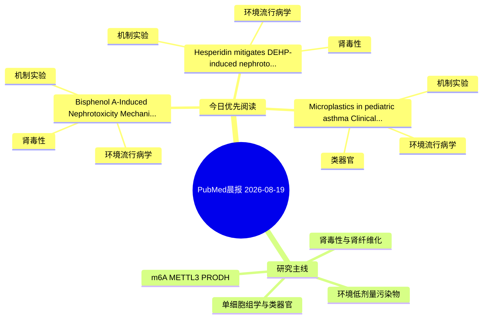

# PubMed 文献晨报｜2026-08-19

- 生成日期：2026-08-19 UTC
- 检索窗口：近 24 小时
- 高质量阈值：规则评分 ≥ 7
- 近 24 小时原始命中数：3

## 今日总体判断

今日筛选出 3 篇优先阅读文献，主要集中在：环境流行病学、机制实验、肾毒性。

## 今日最值得读的 5 篇文章

### 1. Bisphenol A-Induced Nephrotoxicity: Mechanistic Insights Into Oxidative Stress, Inflammation, and Cellular Dysfunction.

- 题目：Bisphenol A-Induced Nephrotoxicity: Mechanistic Insights Into Oxidative Stress, Inflammation, and Cellular Dysfunction.
- 期刊：Environmental toxicology
- 年份：2026
- PMID：[42610645](https://pubmed.ncbi.nlm.nih.gov/42610645/)
- DOI：[10.1002/tox.70190](https://doi.org/10.1002/tox.70190)
- 分类：环境流行病学、机制实验、肾毒性
- 规则评分：19
- 研究对象：人群/队列或环境暴露人群
- 核心方法：细胞与动物机制实验
- 主要发现：摘要提示研究重点涉及肾毒性/肾损伤；结论线索为：In vitro studies further demonstrate reduced renal cell viability and enhanced apoptosis mediated by the activation of PI3K/AKT, Bcl2/Bax-caspase, and AMPK/mTOR signaling pathways.
- 为什么值得读：同时连接环境暴露与机制线索；与肾毒性/肾损伤主线直接相关；关键词匹配度较高

### 2. Hesperidin mitigates DEHP-induced nephrotoxicity through anti-oxidant, anti-apoptotic, and anti-inflammatory pathway modulation: Evidence from Nrf2/HO-1/Keap-1, Bax/Bcl-2/caspase-3, and TLR4/NF-κB axis activation.

- 题目：Hesperidin mitigates DEHP-induced nephrotoxicity through anti-oxidant, anti-apoptotic, and anti-inflammatory pathway modulation: Evidence from Nrf2/HO-1/Keap-1, Bax/Bcl-2/caspase-3, and TLR4/NF-κB axis activation.
- 期刊：Iranian journal of basic medical sciences
- 年份：2026
- PMID：[42610118](https://pubmed.ncbi.nlm.nih.gov/42610118/)
- DOI：[10.22038/ijbms.2026.89049.19222](https://doi.org/10.22038/ijbms.2026.89049.19222)
- 分类：环境流行病学、机制实验、肾毒性
- 规则评分：17
- 研究对象：小鼠或大鼠肾损伤模型
- 核心方法：基于题名/摘要的常规实验或文献分析，需阅读全文确认
- 主要发现：摘要提示研究重点涉及肾毒性/肾损伤；结论线索为：CONCLUSION: HSP demonstrates dose-dependent renoprotective effects against DEHP-induced nephrotoxicity in rats.
- 为什么值得读：同时连接环境暴露与机制线索；与肾毒性/肾损伤主线直接相关；关键词匹配度较高

### 3. Microplastics in pediatric asthma: Clinical associations with disease severity.

- 题目：Microplastics in pediatric asthma: Clinical associations with disease severity.
- 期刊：Ecotoxicology and environmental safety
- 年份：2026
- PMID：[42612384](https://pubmed.ncbi.nlm.nih.gov/42612384/)
- DOI：[10.1016/j.ecoenv.2026.120676](https://doi.org/10.1016/j.ecoenv.2026.120676)
- 分类：环境流行病学、机制实验、类器官
- 规则评分：7
- 研究对象：人群/队列或环境暴露人群
- 核心方法：环境流行病学/队列或人群数据；类器官/干细胞模型
- 主要发现：摘要提示研究重点涉及类器官模型；结论线索为：CONCLUSIONS: Respiratory MPs burden is universal in this pediatric asthma cohort and associates with poor disease control.
- 为什么值得读：同时连接环境暴露与机制线索；对建立更接近人体的模型有参考价值

## 分类归档

### 环境流行病学
- [Bisphenol A-Induced Nephrotoxicity: Mechanistic Insights Into Oxidative Stress, Inflammation, and Cellular Dysfunction.](https://pubmed.ncbi.nlm.nih.gov/42610645/)（PMID: 42610645）
- [Hesperidin mitigates DEHP-induced nephrotoxicity through anti-oxidant, anti-apoptotic, and anti-inflammatory pathway modulation: Evidence from Nrf2/HO-1/Keap-1, Bax/Bcl-2/caspase-3, and TLR4/NF-κB axis activation.](https://pubmed.ncbi.nlm.nih.gov/42610118/)（PMID: 42610118）
- [Microplastics in pediatric asthma: Clinical associations with disease severity.](https://pubmed.ncbi.nlm.nih.gov/42612384/)（PMID: 42612384）

### 机制实验
- [Bisphenol A-Induced Nephrotoxicity: Mechanistic Insights Into Oxidative Stress, Inflammation, and Cellular Dysfunction.](https://pubmed.ncbi.nlm.nih.gov/42610645/)（PMID: 42610645）
- [Hesperidin mitigates DEHP-induced nephrotoxicity through anti-oxidant, anti-apoptotic, and anti-inflammatory pathway modulation: Evidence from Nrf2/HO-1/Keap-1, Bax/Bcl-2/caspase-3, and TLR4/NF-κB axis activation.](https://pubmed.ncbi.nlm.nih.gov/42610118/)（PMID: 42610118）
- [Microplastics in pediatric asthma: Clinical associations with disease severity.](https://pubmed.ncbi.nlm.nih.gov/42612384/)（PMID: 42612384）

### 单细胞组学
- 今日暂无高质量新文献。

### 类器官
- [Microplastics in pediatric asthma: Clinical associations with disease severity.](https://pubmed.ncbi.nlm.nih.gov/42612384/)（PMID: 42612384）

### 肾毒性
- [Bisphenol A-Induced Nephrotoxicity: Mechanistic Insights Into Oxidative Stress, Inflammation, and Cellular Dysfunction.](https://pubmed.ncbi.nlm.nih.gov/42610645/)（PMID: 42610645）
- [Hesperidin mitigates DEHP-induced nephrotoxicity through anti-oxidant, anti-apoptotic, and anti-inflammatory pathway modulation: Evidence from Nrf2/HO-1/Keap-1, Bax/Bcl-2/caspase-3, and TLR4/NF-κB axis activation.](https://pubmed.ncbi.nlm.nih.gov/42610118/)（PMID: 42610118）

### m6A-METTL3-PRODH
- 今日暂无高质量新文献。

## 今日阅读优先级

1. Bisphenol A-Induced Nephrotoxicity: Mechanistic Insights Into Oxidative Stress, Inflammation, and Cellular Dysfunction.（优先理由：同时连接环境暴露与机制线索；与肾毒性/肾损伤主线直接相关；关键词匹配度较高）
2. Hesperidin mitigates DEHP-induced nephrotoxicity through anti-oxidant, anti-apoptotic, and anti-inflammatory pathway modulation: Evidence from Nrf2/HO-1/Keap-1, Bax/Bcl-2/caspase-3, and TLR4/NF-κB axis activation.（优先理由：同时连接环境暴露与机制线索；与肾毒性/肾损伤主线直接相关；关键词匹配度较高）
3. Microplastics in pediatric asthma: Clinical associations with disease severity.（优先理由：同时连接环境暴露与机制线索；对建立更接近人体的模型有参考价值）

## Mermaid 思维导图

