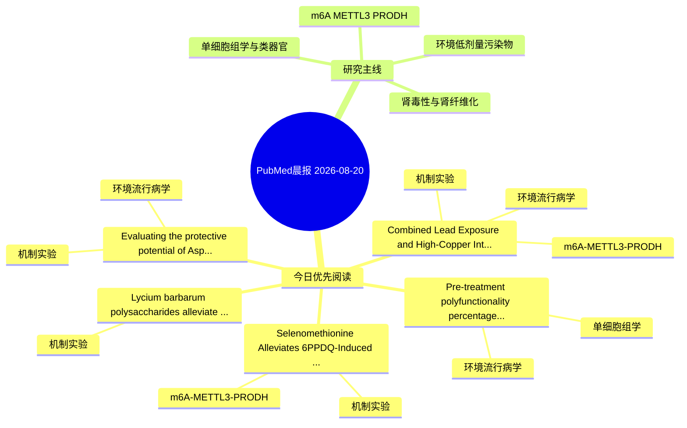

# PubMed 文献晨报｜2026-08-20

- 生成日期：2026-08-20 UTC
- 检索窗口：近 24 小时
- 高质量阈值：规则评分 ≥ 7
- 近 24 小时原始命中数：7

## 今日总体判断

今日筛选出 5 篇优先阅读文献，主要集中在：机制实验、环境流行病学、m6A-METTL3-PRODH。

## 今日最值得读的 5 篇文章

### 1. Combined Lead Exposure and High-Copper Intake Exacerbates Synaptic Loss via METTL3-Mediated m6A Methylation in Mice.

- 题目：Combined Lead Exposure and High-Copper Intake Exacerbates Synaptic Loss via METTL3-Mediated m6A Methylation in Mice.
- 期刊：Toxicology letters
- 年份：2026
- PMID：[42617961](https://pubmed.ncbi.nlm.nih.gov/42617961/)
- DOI：[10.1016/j.toxlet.2026.113177](https://doi.org/10.1016/j.toxlet.2026.113177)
- 分类：环境流行病学、机制实验、m6A-METTL3-PRODH
- 规则评分：16
- 研究对象：小鼠或大鼠肾损伤模型
- 核心方法：m6A RNA修饰检测；细胞与动物机制实验
- 主要发现：摘要提示研究重点涉及环境污染物暴露、m6A-METTL3/PRODH 调控；结论线索为：This study first identifies that high Cu intake synergistically exacerbates Pb neurotoxicity by activating the METTL3-driven m6A epitranscriptomic pathway, offering a potential target for intervening in cognitive impairment related to combined heavy metal e...
- 为什么值得读：同时连接环境暴露与机制线索；贴近 m6A-METTL3-PRODH 调控假说；关键词匹配度较高

### 2. Selenomethionine Alleviates 6PPDQ-Induced Liver Inflammation by Targeting ROS/METTL3/YTHDC1/ATF3 Axis.

- 题目：Selenomethionine Alleviates 6PPDQ-Induced Liver Inflammation by Targeting ROS/METTL3/YTHDC1/ATF3 Axis.
- 期刊：Journal of agricultural and food chemistry
- 年份：2026
- PMID：[42616453](https://pubmed.ncbi.nlm.nih.gov/42616453/)
- DOI：[10.1021/acs.jafc.6c04149](https://doi.org/10.1021/acs.jafc.6c04149)
- 分类：机制实验、m6A-METTL3-PRODH
- 规则评分：16
- 研究对象：小鼠或大鼠肾损伤模型
- 核心方法：m6A RNA修饰检测
- 主要发现：摘要提示研究重点涉及环境污染物暴露、m6A-METTL3/PRODH 调控；结论线索为：These findings provide novel mechanistic insights into 6PPDQ hepatotoxicity and highlight the protective role of selenium against environmentally induced liver damage.
- 为什么值得读：贴近 m6A-METTL3-PRODH 调控假说；关键词匹配度较高

### 3. Evaluating the protective potential of Aspilia africana against phenanthrene-induced cardiorenal injury: biochemical and computational approaches.

- 题目：Evaluating the protective potential of Aspilia africana against phenanthrene-induced cardiorenal injury: biochemical and computational approaches.
- 期刊：In silico pharmacology
- 年份：2026
- PMID：[42614422](https://pubmed.ncbi.nlm.nih.gov/42614422/)
- DOI：[10.1007/s40203-026-00721-5](https://doi.org/10.1007/s40203-026-00721-5)
- 分类：环境流行病学、机制实验
- 规则评分：13
- 研究对象：小鼠或大鼠肾损伤模型
- 核心方法：细胞与动物机制实验
- 主要发现：摘要提示研究重点涉及环境污染物暴露；结论线索为：Molecular docking revealed favourable binding affinities of bioactive phytochemicals with SGLT1 and GLP-1R, while ADMET profiling indicated acceptable drug-likeness and low predicted toxicity for most compounds.
- 为什么值得读：同时连接环境暴露与机制线索；关键词匹配度较高

### 4. Lycium barbarum polysaccharides alleviate PVC microplastic-induced ferroptosis and fibrosis in duck kidneys by attenuating NCOA4-mediated ferritinophagy: an in vivo study.

- 题目：Lycium barbarum polysaccharides alleviate PVC microplastic-induced ferroptosis and fibrosis in duck kidneys by attenuating NCOA4-mediated ferritinophagy: an in vivo study.
- 期刊：Poultry science
- 年份：2026
- PMID：[42617263](https://pubmed.ncbi.nlm.nih.gov/42617263/)
- DOI：[10.1016/j.psj.2026.107479](https://doi.org/10.1016/j.psj.2026.107479)
- 分类：机制实验
- 规则评分：12
- 研究对象：题名和摘要未明确，建议阅读全文确认
- 核心方法：细胞与动物机制实验
- 主要发现：摘要提示研究重点涉及肾纤维化；结论线索为：In conclusion, LBP alleviates PVC-MPs-induced renal ferroptosis and fibrosis by attenuating NCOA4-mediated ferritinophagy.
- 为什么值得读：关键词匹配度较高

### 5. Pre-treatment polyfunctionality percentage (PFA) of CD8+ T cells is associated with development of immune-related adverse events (irAEs) in patients receiving immune checkpoint inhibitors (ICIs).

- 题目：Pre-treatment polyfunctionality percentage (PFA) of CD8+ T cells is associated with development of immune-related adverse events (irAEs) in patients receiving immune checkpoint inhibitors (ICIs).
- 期刊：Neoplasia (New York, N.Y.)
- 年份：2026
- PMID：[42617555](https://pubmed.ncbi.nlm.nih.gov/42617555/)
- DOI：[10.1016/j.neo.2026.101353](https://doi.org/10.1016/j.neo.2026.101353)
- 分类：环境流行病学、单细胞组学
- 规则评分：10
- 研究对象：患者样本或临床数据
- 核心方法：单细胞或空间组学
- 主要发现：摘要提示研究重点涉及环境污染物暴露、单细胞或空间组学；结论线索为：CONCLUSIONS: In this pilot study, pre-ICI CD8+ T cell PFA was associated with development of irAEs.
- 为什么值得读：可帮助寻找细胞类型特异性机制

## 分类归档

### 环境流行病学
- [Combined Lead Exposure and High-Copper Intake Exacerbates Synaptic Loss via METTL3-Mediated m6A Methylation in Mice.](https://pubmed.ncbi.nlm.nih.gov/42617961/)（PMID: 42617961）
- [Evaluating the protective potential of Aspilia africana against phenanthrene-induced cardiorenal injury: biochemical and computational approaches.](https://pubmed.ncbi.nlm.nih.gov/42614422/)（PMID: 42614422）
- [Pre-treatment polyfunctionality percentage (PFA) of CD8+ T cells is associated with development of immune-related adverse events (irAEs) in patients receiving immune checkpoint inhibitors (ICIs).](https://pubmed.ncbi.nlm.nih.gov/42617555/)（PMID: 42617555）

### 机制实验
- [Combined Lead Exposure and High-Copper Intake Exacerbates Synaptic Loss via METTL3-Mediated m6A Methylation in Mice.](https://pubmed.ncbi.nlm.nih.gov/42617961/)（PMID: 42617961）
- [Selenomethionine Alleviates 6PPDQ-Induced Liver Inflammation by Targeting ROS/METTL3/YTHDC1/ATF3 Axis.](https://pubmed.ncbi.nlm.nih.gov/42616453/)（PMID: 42616453）
- [Evaluating the protective potential of Aspilia africana against phenanthrene-induced cardiorenal injury: biochemical and computational approaches.](https://pubmed.ncbi.nlm.nih.gov/42614422/)（PMID: 42614422）
- [Lycium barbarum polysaccharides alleviate PVC microplastic-induced ferroptosis and fibrosis in duck kidneys by attenuating NCOA4-mediated ferritinophagy: an in vivo study.](https://pubmed.ncbi.nlm.nih.gov/42617263/)（PMID: 42617263）

### 单细胞组学
- [Pre-treatment polyfunctionality percentage (PFA) of CD8+ T cells is associated with development of immune-related adverse events (irAEs) in patients receiving immune checkpoint inhibitors (ICIs).](https://pubmed.ncbi.nlm.nih.gov/42617555/)（PMID: 42617555）

### 类器官
- 今日暂无高质量新文献。

### 肾毒性
- 今日暂无高质量新文献。

### m6A-METTL3-PRODH
- [Combined Lead Exposure and High-Copper Intake Exacerbates Synaptic Loss via METTL3-Mediated m6A Methylation in Mice.](https://pubmed.ncbi.nlm.nih.gov/42617961/)（PMID: 42617961）
- [Selenomethionine Alleviates 6PPDQ-Induced Liver Inflammation by Targeting ROS/METTL3/YTHDC1/ATF3 Axis.](https://pubmed.ncbi.nlm.nih.gov/42616453/)（PMID: 42616453）

## 今日阅读优先级

1. Combined Lead Exposure and High-Copper Intake Exacerbates Synaptic Loss via METTL3-Mediated m6A Methylation in Mice.（优先理由：同时连接环境暴露与机制线索；贴近 m6A-METTL3-PRODH 调控假说；关键词匹配度较高）
2. Selenomethionine Alleviates 6PPDQ-Induced Liver Inflammation by Targeting ROS/METTL3/YTHDC1/ATF3 Axis.（优先理由：贴近 m6A-METTL3-PRODH 调控假说；关键词匹配度较高）
3. Evaluating the protective potential of Aspilia africana against phenanthrene-induced cardiorenal injury: biochemical and computational approaches.（优先理由：同时连接环境暴露与机制线索；关键词匹配度较高）
4. Lycium barbarum polysaccharides alleviate PVC microplastic-induced ferroptosis and fibrosis in duck kidneys by attenuating NCOA4-mediated ferritinophagy: an in vivo study.（优先理由：关键词匹配度较高）
5. Pre-treatment polyfunctionality percentage (PFA) of CD8+ T cells is associated with development of immune-related adverse events (irAEs) in patients receiving immune checkpoint inhibitors (ICIs).（优先理由：可帮助寻找细胞类型特异性机制）

## Mermaid 思维导图

