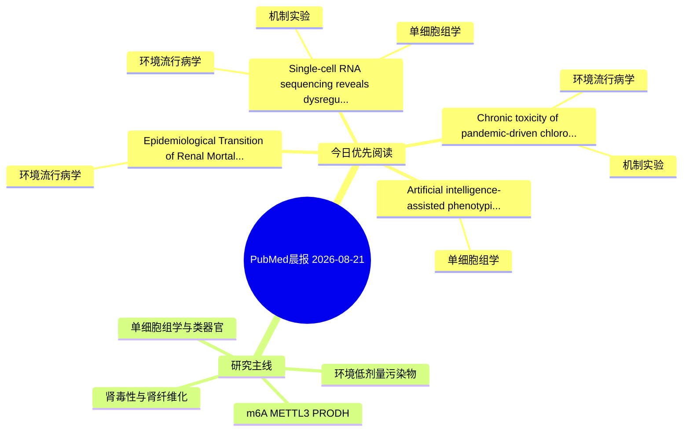

# PubMed 文献晨报｜2026-08-21

- 生成日期：2026-08-21 UTC
- 检索窗口：近 24 小时
- 高质量阈值：规则评分 ≥ 7
- 近 24 小时原始命中数：4

## 今日总体判断

今日筛选出 4 篇优先阅读文献，主要集中在：环境流行病学、机制实验、单细胞组学。

## 今日最值得读的 5 篇文章

### 1. Single-cell RNA sequencing reveals dysregulation of innate immune signaling in early-life respiratory syncytial virus infection with subsequent low-level cadmium exposure.

- 题目：Single-cell RNA sequencing reveals dysregulation of innate immune signaling in early-life respiratory syncytial virus infection with subsequent low-level cadmium exposure.
- 期刊：Toxicology reports
- 年份：2026
- PMID：[42620461](https://pubmed.ncbi.nlm.nih.gov/42620461/)
- DOI：[10.1016/j.toxrep.2026.102325](https://doi.org/10.1016/j.toxrep.2026.102325)
- 分类：环境流行病学、机制实验、单细胞组学
- 规则评分：14
- 研究对象：小鼠或大鼠肾损伤模型
- 核心方法：单细胞或空间组学
- 主要发现：摘要提示研究重点涉及环境污染物暴露、肾纤维化、单细胞或空间组学；结论线索为：Extensive differential expression also occurred in other cell types involved in alveolar repair, and analysis of cell-cell signaling revealed a significant strengthening of galectin-9 signaling between endothelial and innate immune cells only with eRSV+Cd.
- 为什么值得读：同时连接环境暴露与机制线索；可帮助寻找细胞类型特异性机制；关键词匹配度较高

### 2. Epidemiological Transition of Renal Mortality in Chiapas (2000-2024): Autonomy of CKDu and the Rise of Hypertensive Nephropathy-A Time-Series Ecological Study.

- 题目：Epidemiological Transition of Renal Mortality in Chiapas (2000-2024): Autonomy of CKDu and the Rise of Hypertensive Nephropathy-A Time-Series Ecological Study.
- 期刊：Nephrology (Carlton, Vic.)
- 年份：2026
- PMID：[42622235](https://pubmed.ncbi.nlm.nih.gov/42622235/)
- DOI：[10.1111/nep.70269](https://doi.org/10.1111/nep.70269)
- 分类：环境流行病学
- 规则评分：13
- 研究对象：题名和摘要未明确，建议阅读全文确认
- 核心方法：基于题名/摘要的常规实验或文献分析，需阅读全文确认
- 主要发现：摘要提示研究重点涉及环境污染物暴露；结论线索为：CONCLUSION: Renal mortality in Chiapas shows a dual burden in which CKDu exhibits autonomy, consistent with chronic interstitial nephritis in agricultural communities, and supports surveillance and prevention addressing occupational and environmental determ...
- 为什么值得读：关键词匹配度较高

### 3. Chronic toxicity of pandemic-driven chloroquine diphosphate use in aquatic ecosystems: zebrafish (Danio rerio) as a model species.

- 题目：Chronic toxicity of pandemic-driven chloroquine diphosphate use in aquatic ecosystems: zebrafish (Danio rerio) as a model species.
- 期刊：Ecotoxicology (London, England)
- 年份：2026
- PMID：[42622704](https://pubmed.ncbi.nlm.nih.gov/42622704/)
- DOI：[10.1007/s10646-026-03128-2](https://doi.org/10.1007/s10646-026-03128-2)
- 分类：环境流行病学、机制实验
- 规则评分：9
- 研究对象：题名和摘要未明确，建议阅读全文确认
- 核心方法：基于题名/摘要的常规实验或文献分析，需阅读全文确认
- 主要发现：摘要提示研究重点涉及环境污染物暴露；结论线索为：These findings indicate that CQD may induce early biochemical and structural alterations in fish at environmentally relevant levels.
- 为什么值得读：同时连接环境暴露与机制线索

### 4. Artificial intelligence-assisted phenotypic monitoring and diagnostic of wastewater microbiome management towards sustainability.

- 题目：Artificial intelligence-assisted phenotypic monitoring and diagnostic of wastewater microbiome management towards sustainability.
- 期刊：Water research
- 年份：2026
- PMID：[42624068](https://pubmed.ncbi.nlm.nih.gov/42624068/)
- DOI：[10.1016/j.watres.2026.126624](https://doi.org/10.1016/j.watres.2026.126624)
- 分类：单细胞组学
- 规则评分：7
- 研究对象：题名和摘要未明确，建议阅读全文确认
- 核心方法：单细胞或空间组学
- 主要发现：摘要提示研究重点涉及单细胞或空间组学；结论线索为：Our results demonstrate that Ramanome-defined operational phenotypic units (OPUs) and their associated phenotypic metrics (e.g., phenotypic diversity, network structures) can serve as robust phenotypic signals for accurate WRRF performance monitoring, compl...
- 为什么值得读：可帮助寻找细胞类型特异性机制

## 分类归档

### 环境流行病学
- [Single-cell RNA sequencing reveals dysregulation of innate immune signaling in early-life respiratory syncytial virus infection with subsequent low-level cadmium exposure.](https://pubmed.ncbi.nlm.nih.gov/42620461/)（PMID: 42620461）
- [Epidemiological Transition of Renal Mortality in Chiapas (2000-2024): Autonomy of CKDu and the Rise of Hypertensive Nephropathy-A Time-Series Ecological Study.](https://pubmed.ncbi.nlm.nih.gov/42622235/)（PMID: 42622235）
- [Chronic toxicity of pandemic-driven chloroquine diphosphate use in aquatic ecosystems: zebrafish (Danio rerio) as a model species.](https://pubmed.ncbi.nlm.nih.gov/42622704/)（PMID: 42622704）

### 机制实验
- [Single-cell RNA sequencing reveals dysregulation of innate immune signaling in early-life respiratory syncytial virus infection with subsequent low-level cadmium exposure.](https://pubmed.ncbi.nlm.nih.gov/42620461/)（PMID: 42620461）
- [Chronic toxicity of pandemic-driven chloroquine diphosphate use in aquatic ecosystems: zebrafish (Danio rerio) as a model species.](https://pubmed.ncbi.nlm.nih.gov/42622704/)（PMID: 42622704）

### 单细胞组学
- [Single-cell RNA sequencing reveals dysregulation of innate immune signaling in early-life respiratory syncytial virus infection with subsequent low-level cadmium exposure.](https://pubmed.ncbi.nlm.nih.gov/42620461/)（PMID: 42620461）
- [Artificial intelligence-assisted phenotypic monitoring and diagnostic of wastewater microbiome management towards sustainability.](https://pubmed.ncbi.nlm.nih.gov/42624068/)（PMID: 42624068）

### 类器官
- 今日暂无高质量新文献。

### 肾毒性
- 今日暂无高质量新文献。

### m6A-METTL3-PRODH
- 今日暂无高质量新文献。

## 今日阅读优先级

1. Single-cell RNA sequencing reveals dysregulation of innate immune signaling in early-life respiratory syncytial virus infection with subsequent low-level cadmium exposure.（优先理由：同时连接环境暴露与机制线索；可帮助寻找细胞类型特异性机制；关键词匹配度较高）
2. Epidemiological Transition of Renal Mortality in Chiapas (2000-2024): Autonomy of CKDu and the Rise of Hypertensive Nephropathy-A Time-Series Ecological Study.（优先理由：关键词匹配度较高）
3. Chronic toxicity of pandemic-driven chloroquine diphosphate use in aquatic ecosystems: zebrafish (Danio rerio) as a model species.（优先理由：同时连接环境暴露与机制线索）
4. Artificial intelligence-assisted phenotypic monitoring and diagnostic of wastewater microbiome management towards sustainability.（优先理由：可帮助寻找细胞类型特异性机制）

## Mermaid 思维导图

