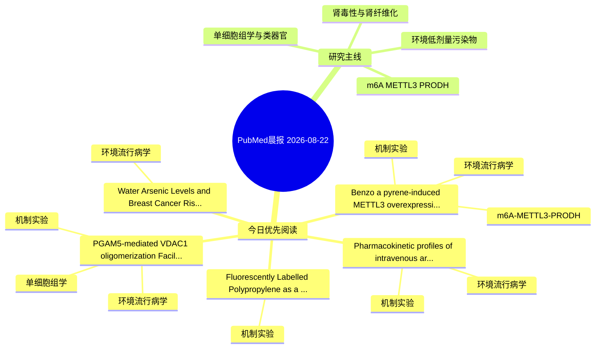

# PubMed 文献晨报｜2026-08-22

- 生成日期：2026-08-22 UTC
- 检索窗口：近 24 小时
- 高质量阈值：规则评分 ≥ 7
- 近 24 小时原始命中数：5

## 今日总体判断

今日筛选出 5 篇优先阅读文献，主要集中在：环境流行病学、机制实验、m6A-METTL3-PRODH。

## 今日最值得读的 5 篇文章

### 1. Benzo[a]pyrene-induced METTL3 overexpression accelerates renal cell carcinoma progression via m6A modification of LTB4R mRNA and enhanced Treg infiltration.

- 题目：Benzo[a]pyrene-induced METTL3 overexpression accelerates renal cell carcinoma progression via m6A modification of LTB4R mRNA and enhanced Treg infiltration.
- 期刊：Ecotoxicology and environmental safety
- 年份：2026
- PMID：[42628180](https://pubmed.ncbi.nlm.nih.gov/42628180/)
- DOI：[10.1016/j.ecoenv.2026.120685](https://doi.org/10.1016/j.ecoenv.2026.120685)
- 分类：环境流行病学、机制实验、m6A-METTL3-PRODH
- 规则评分：19
- 研究对象：人群/队列或环境暴露人群
- 核心方法：m6A RNA修饰检测；细胞与动物机制实验
- 主要发现：摘要提示研究重点涉及环境污染物暴露、m6A-METTL3/PRODH 调控；结论线索为：Our findings demonstrate that BaP exposure promotes RCC progression through METTL3-mediated m⁶A modification of LTB4R and Treg infiltration, providing new insights into the epitranscriptomic mechanisms of environmental carcinogenesis and identifying the MET...
- 为什么值得读：同时连接环境暴露与机制线索；贴近 m6A-METTL3-PRODH 调控假说；关键词匹配度较高

### 2. PGAM5-mediated VDAC1 oligomerization Facilitates Ponatinib-Induced Cardiotoxicity via Disrupting the Mitophagy-Mitochondrial unfolded protein response Synergistic Defense Crosstalk.

- 题目：PGAM5-mediated VDAC1 oligomerization Facilitates Ponatinib-Induced Cardiotoxicity via Disrupting the Mitophagy-Mitochondrial unfolded protein response Synergistic Defense Crosstalk.
- 期刊：Chemico-biological interactions
- 年份：2026
- PMID：[42628894](https://pubmed.ncbi.nlm.nih.gov/42628894/)
- DOI：[10.1016/j.cbi.2026.112310](https://doi.org/10.1016/j.cbi.2026.112310)
- 分类：环境流行病学、机制实验、单细胞组学
- 规则评分：10
- 研究对象：小鼠或大鼠肾损伤模型
- 核心方法：单细胞或空间组学；细胞与动物机制实验
- 主要发现：摘要提示研究重点涉及环境污染物暴露、单细胞或空间组学；结论线索为：CONCLUSION: These findings identify the PGAM5/VDAC1 axis as a key mechanism linking ponatinib stress to coordinated failure of MQC in the heart.
- 为什么值得读：同时连接环境暴露与机制线索；可帮助寻找细胞类型特异性机制

### 3. Water Arsenic Levels and Breast Cancer Risk in a United States-Wide Prospective Cohort.

- 题目：Water Arsenic Levels and Breast Cancer Risk in a United States-Wide Prospective Cohort.
- 期刊：Environmental pollution (Barking, Essex : 1987)
- 年份：2026
- PMID：[42628900](https://pubmed.ncbi.nlm.nih.gov/42628900/)
- DOI：[10.1016/j.envpol.2026.128984](https://doi.org/10.1016/j.envpol.2026.128984)
- 分类：环境流行病学
- 规则评分：9
- 研究对象：人群/队列或环境暴露人群
- 核心方法：环境流行病学/队列或人群数据
- 主要发现：摘要提示研究重点涉及环境污染物暴露；结论线索为：These results suggest that levels of arsenic in water in the U.S.
- 为什么值得读：与检索主题有交集，可作为背景或线索文献扫读

### 4. Pharmacokinetic profiles of intravenous arsenic trioxide versus oral realgar-indigo naturalis formula in mice.

- 题目：Pharmacokinetic profiles of intravenous arsenic trioxide versus oral realgar-indigo naturalis formula in mice.
- 期刊：Chemical communications (Cambridge, England)
- 年份：2026
- PMID：[42626851](https://pubmed.ncbi.nlm.nih.gov/42626851/)
- DOI：[10.1039/d6cc03639b](https://doi.org/10.1039/d6cc03639b)
- 分类：环境流行病学、机制实验
- 规则评分：9
- 研究对象：小鼠或大鼠肾损伤模型
- 核心方法：细胞与动物机制实验
- 主要发现：摘要提示研究重点涉及环境污染物暴露；结论线索为：In mouse heart, liver, spleen, lung and kidney tissues, iAsIII and DMAV are the predominant arsenic species with time-dependent enrichment, with oral RIF showing lower visceral arsenic accumulation than intravenous ATO after 7 days of administration.
- 为什么值得读：同时连接环境暴露与机制线索

### 5. Fluorescently Labelled Polypropylene as a Model Microplastic for Cellular Imaging.

- 题目：Fluorescently Labelled Polypropylene as a Model Microplastic for Cellular Imaging.
- 期刊：Polymer chemistry
- 年份：2026
- PMID：[42626445](https://pubmed.ncbi.nlm.nih.gov/42626445/)
- DOI：[10.1039/d6py00089d](https://doi.org/10.1039/d6py00089d)
- 分类：机制实验
- 规则评分：9
- 研究对象：人群/队列或环境暴露人群
- 核心方法：细胞与动物机制实验
- 主要发现：摘要提示研究重点涉及本方向相关问题；结论线索为：This approach provides a robust platform for definitive microplastic tracking, enabling reliable, standardised studies of polymer-cell interactions across biological systems.
- 为什么值得读：与检索主题有交集，可作为背景或线索文献扫读

## 分类归档

### 环境流行病学
- [Benzo\[a\]pyrene-induced METTL3 overexpression accelerates renal cell carcinoma progression via m6A modification of LTB4R mRNA and enhanced Treg infiltration.](https://pubmed.ncbi.nlm.nih.gov/42628180/)（PMID: 42628180）
- [PGAM5-mediated VDAC1 oligomerization Facilitates Ponatinib-Induced Cardiotoxicity via Disrupting the Mitophagy-Mitochondrial unfolded protein response Synergistic Defense Crosstalk.](https://pubmed.ncbi.nlm.nih.gov/42628894/)（PMID: 42628894）
- [Water Arsenic Levels and Breast Cancer Risk in a United States-Wide Prospective Cohort.](https://pubmed.ncbi.nlm.nih.gov/42628900/)（PMID: 42628900）
- [Pharmacokinetic profiles of intravenous arsenic trioxide versus oral realgar-indigo naturalis formula in mice.](https://pubmed.ncbi.nlm.nih.gov/42626851/)（PMID: 42626851）

### 机制实验
- [Benzo\[a\]pyrene-induced METTL3 overexpression accelerates renal cell carcinoma progression via m6A modification of LTB4R mRNA and enhanced Treg infiltration.](https://pubmed.ncbi.nlm.nih.gov/42628180/)（PMID: 42628180）
- [PGAM5-mediated VDAC1 oligomerization Facilitates Ponatinib-Induced Cardiotoxicity via Disrupting the Mitophagy-Mitochondrial unfolded protein response Synergistic Defense Crosstalk.](https://pubmed.ncbi.nlm.nih.gov/42628894/)（PMID: 42628894）
- [Pharmacokinetic profiles of intravenous arsenic trioxide versus oral realgar-indigo naturalis formula in mice.](https://pubmed.ncbi.nlm.nih.gov/42626851/)（PMID: 42626851）
- [Fluorescently Labelled Polypropylene as a Model Microplastic for Cellular Imaging.](https://pubmed.ncbi.nlm.nih.gov/42626445/)（PMID: 42626445）

### 单细胞组学
- [PGAM5-mediated VDAC1 oligomerization Facilitates Ponatinib-Induced Cardiotoxicity via Disrupting the Mitophagy-Mitochondrial unfolded protein response Synergistic Defense Crosstalk.](https://pubmed.ncbi.nlm.nih.gov/42628894/)（PMID: 42628894）

### 类器官
- 今日暂无高质量新文献。

### 肾毒性
- 今日暂无高质量新文献。

### m6A-METTL3-PRODH
- [Benzo\[a\]pyrene-induced METTL3 overexpression accelerates renal cell carcinoma progression via m6A modification of LTB4R mRNA and enhanced Treg infiltration.](https://pubmed.ncbi.nlm.nih.gov/42628180/)（PMID: 42628180）

## 今日阅读优先级

1. Benzo[a]pyrene-induced METTL3 overexpression accelerates renal cell carcinoma progression via m6A modification of LTB4R mRNA and enhanced Treg infiltration.（优先理由：同时连接环境暴露与机制线索；贴近 m6A-METTL3-PRODH 调控假说；关键词匹配度较高）
2. PGAM5-mediated VDAC1 oligomerization Facilitates Ponatinib-Induced Cardiotoxicity via Disrupting the Mitophagy-Mitochondrial unfolded protein response Synergistic Defense Crosstalk.（优先理由：同时连接环境暴露与机制线索；可帮助寻找细胞类型特异性机制）
3. Water Arsenic Levels and Breast Cancer Risk in a United States-Wide Prospective Cohort.（优先理由：与检索主题有交集，可作为背景或线索文献扫读）
4. Pharmacokinetic profiles of intravenous arsenic trioxide versus oral realgar-indigo naturalis formula in mice.（优先理由：同时连接环境暴露与机制线索）
5. Fluorescently Labelled Polypropylene as a Model Microplastic for Cellular Imaging.（优先理由：与检索主题有交集，可作为背景或线索文献扫读）

## Mermaid 思维导图

