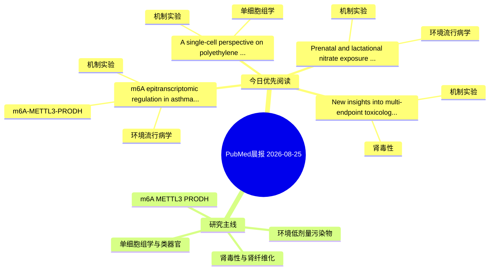

# PubMed 文献晨报｜2026-08-25

- 生成日期：2026-08-25 UTC
- 检索窗口：近 24 小时
- 高质量阈值：规则评分 ≥ 7
- 近 24 小时原始命中数：5

## 今日总体判断

今日筛选出 4 篇优先阅读文献，主要集中在：机制实验、环境流行病学、m6A-METTL3-PRODH。

## 今日最值得读的 5 篇文章

### 1. m6A epitranscriptomic regulation in asthma: mechanisms and therapeutic prospects.

- 题目：m6A epitranscriptomic regulation in asthma: mechanisms and therapeutic prospects.
- 期刊：Epigenomics
- 年份：2026
- PMID：[42635011](https://pubmed.ncbi.nlm.nih.gov/42635011/)
- DOI：[10.1080/17501911.2026.2721821](https://doi.org/10.1080/17501911.2026.2721821)
- 分类：环境流行病学、机制实验、m6A-METTL3-PRODH
- 规则评分：15
- 研究对象：患者样本或临床数据
- 核心方法：m6A RNA修饰检测
- 主要发现：摘要提示研究重点涉及环境污染物暴露、m6A-METTL3/PRODH 调控；结论线索为：Recent profiling studies and mechanistic experiments indicate that m6A patterns and m6A regulators are altered in lung tissue, airway epithelial cells, airway smooth muscle cells and immune cells in asthma.
- 为什么值得读：同时连接环境暴露与机制线索；贴近 m6A-METTL3-PRODH 调控假说；关键词匹配度较高

### 2. A single-cell perspective on polyethylene microplastic toxicity: linking fibroblast reprogramming to immune microenvironment alterations in the lung.

- 题目：A single-cell perspective on polyethylene microplastic toxicity: linking fibroblast reprogramming to immune microenvironment alterations in the lung.
- 期刊：Journal of hazardous materials
- 年份：2026
- PMID：[42636583](https://pubmed.ncbi.nlm.nih.gov/42636583/)
- DOI：[10.1016/j.jhazmat.2026.143348](https://doi.org/10.1016/j.jhazmat.2026.143348)
- 分类：机制实验、单细胞组学
- 规则评分：14
- 研究对象：人群/队列或环境暴露人群
- 核心方法：单细胞或空间组学；细胞与动物机制实验
- 主要发现：摘要提示研究重点涉及肾纤维化、单细胞或空间组学；结论线索为：CONCLUSION: This study provides a high-resolution single-cell transcriptomic atlas delineating the pulmonary response to chronic PE-MPs exposure.
- 为什么值得读：可帮助寻找细胞类型特异性机制；关键词匹配度较高

### 3. Prenatal and lactational nitrate exposure in drinking water induces modest alterations in offspring sensorimotor development, physiology and adult locomotor activity in a rat model.

- 题目：Prenatal and lactational nitrate exposure in drinking water induces modest alterations in offspring sensorimotor development, physiology and adult locomotor activity in a rat model.
- 期刊：Environmental pollution (Barking, Essex : 1987)
- 年份：2026
- PMID：[42637129](https://pubmed.ncbi.nlm.nih.gov/42637129/)
- DOI：[10.1016/j.envpol.2026.129021](https://doi.org/10.1016/j.envpol.2026.129021)
- 分类：环境流行病学、机制实验
- 规则评分：10
- 研究对象：人群/队列或环境暴露人群
- 核心方法：细胞与动物机制实验
- 主要发现：摘要提示研究重点涉及环境污染物暴露；结论线索为：Elevated plus maze and object recognition tests revealed no memory deficits or anxiety-like phenotype, although male offspring exposed to 100mg/L NO3- consistently displayed reduced locomotor activity.
- 为什么值得读：同时连接环境暴露与机制线索

### 4. New insights into multi-endpoint toxicological profiles and potential molecular mechanisms for display-related organic light-emitting/modulating materials.

- 题目：New insights into multi-endpoint toxicological profiles and potential molecular mechanisms for display-related organic light-emitting/modulating materials.
- 期刊：Ecotoxicology and environmental safety
- 年份：2026
- PMID：[42636667](https://pubmed.ncbi.nlm.nih.gov/42636667/)
- DOI：[10.1016/j.ecoenv.2026.120706](https://doi.org/10.1016/j.ecoenv.2026.120706)
- 分类：机制实验、肾毒性
- 规则评分：8
- 研究对象：题名和摘要未明确，建议阅读全文确认
- 核心方法：基于题名/摘要的常规实验或文献分析，需阅读全文确认
- 主要发现：摘要提示研究重点涉及肾毒性/肾损伤；结论线索为：Collectively, this study establishes a crucial computational framework for elucidating the potential molecular mechanism underlying DOLM-induced toxicities and offers an efficient strategy for the hazard assessment of emerging pollutants.
- 为什么值得读：与肾毒性/肾损伤主线直接相关

## 分类归档

### 环境流行病学
- [m6A epitranscriptomic regulation in asthma: mechanisms and therapeutic prospects.](https://pubmed.ncbi.nlm.nih.gov/42635011/)（PMID: 42635011）
- [Prenatal and lactational nitrate exposure in drinking water induces modest alterations in offspring sensorimotor development, physiology and adult locomotor activity in a rat model.](https://pubmed.ncbi.nlm.nih.gov/42637129/)（PMID: 42637129）

### 机制实验
- [m6A epitranscriptomic regulation in asthma: mechanisms and therapeutic prospects.](https://pubmed.ncbi.nlm.nih.gov/42635011/)（PMID: 42635011）
- [A single-cell perspective on polyethylene microplastic toxicity: linking fibroblast reprogramming to immune microenvironment alterations in the lung.](https://pubmed.ncbi.nlm.nih.gov/42636583/)（PMID: 42636583）
- [Prenatal and lactational nitrate exposure in drinking water induces modest alterations in offspring sensorimotor development, physiology and adult locomotor activity in a rat model.](https://pubmed.ncbi.nlm.nih.gov/42637129/)（PMID: 42637129）
- [New insights into multi-endpoint toxicological profiles and potential molecular mechanisms for display-related organic light-emitting/modulating materials.](https://pubmed.ncbi.nlm.nih.gov/42636667/)（PMID: 42636667）

### 单细胞组学
- [A single-cell perspective on polyethylene microplastic toxicity: linking fibroblast reprogramming to immune microenvironment alterations in the lung.](https://pubmed.ncbi.nlm.nih.gov/42636583/)（PMID: 42636583）

### 类器官
- 今日暂无高质量新文献。

### 肾毒性
- [New insights into multi-endpoint toxicological profiles and potential molecular mechanisms for display-related organic light-emitting/modulating materials.](https://pubmed.ncbi.nlm.nih.gov/42636667/)（PMID: 42636667）

### m6A-METTL3-PRODH
- [m6A epitranscriptomic regulation in asthma: mechanisms and therapeutic prospects.](https://pubmed.ncbi.nlm.nih.gov/42635011/)（PMID: 42635011）

## 今日阅读优先级

1. m6A epitranscriptomic regulation in asthma: mechanisms and therapeutic prospects.（优先理由：同时连接环境暴露与机制线索；贴近 m6A-METTL3-PRODH 调控假说；关键词匹配度较高）
2. A single-cell perspective on polyethylene microplastic toxicity: linking fibroblast reprogramming to immune microenvironment alterations in the lung.（优先理由：可帮助寻找细胞类型特异性机制；关键词匹配度较高）
3. Prenatal and lactational nitrate exposure in drinking water induces modest alterations in offspring sensorimotor development, physiology and adult locomotor activity in a rat model.（优先理由：同时连接环境暴露与机制线索）
4. New insights into multi-endpoint toxicological profiles and potential molecular mechanisms for display-related organic light-emitting/modulating materials.（优先理由：与肾毒性/肾损伤主线直接相关）

## Mermaid 思维导图

