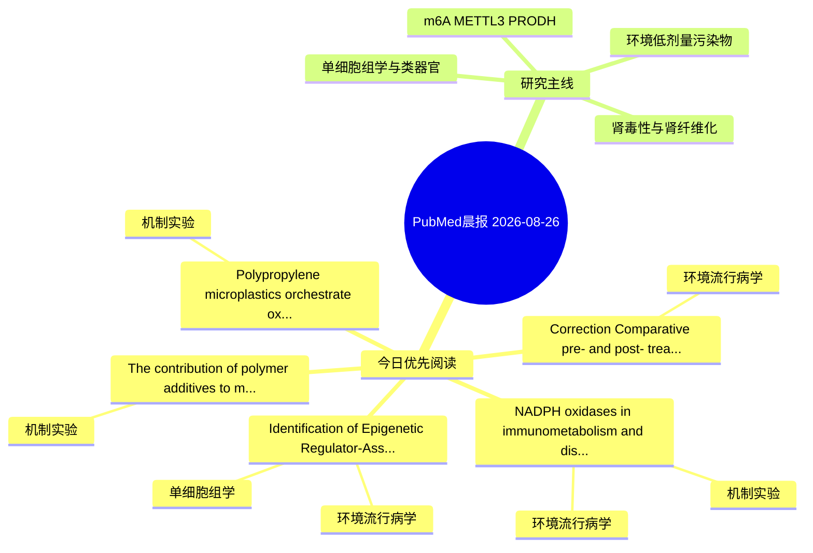

# PubMed 文献晨报｜2026-08-26

- 生成日期：2026-08-26 UTC
- 检索窗口：近 24 小时
- 高质量阈值：规则评分 ≥ 7
- 近 24 小时原始命中数：5

## 今日总体判断

今日筛选出 5 篇优先阅读文献，主要集中在：环境流行病学、机制实验、单细胞组学。

## 今日最值得读的 5 篇文章

### 1. NADPH oxidases in immunometabolism and disease pathology: mechanistic networks, pollutant triggers, and therapeutic frontiers.

- 题目：NADPH oxidases in immunometabolism and disease pathology: mechanistic networks, pollutant triggers, and therapeutic frontiers.
- 期刊：Cellular & molecular immunology
- 年份：2026
- PMID：[42637892](https://pubmed.ncbi.nlm.nih.gov/42637892/)
- DOI：[10.1038/s41423-026-01447-2](https://doi.org/10.1038/s41423-026-01447-2)
- 分类：环境流行病学、机制实验
- 规则评分：12
- 研究对象：人群/队列或环境暴露人群
- 核心方法：基于题名/摘要的常规实验或文献分析，需阅读全文确认
- 主要发现：摘要提示研究重点涉及环境污染物暴露；结论线索为：By highlighting key mechanistic gaps and translational opportunities, this review establishes NOXs as actionable nodal regulators at the intersection of immunity, metabolism, environmental exposure, and human disease.
- 为什么值得读：同时连接环境暴露与机制线索；关键词匹配度较高

### 2. Identification of Epigenetic Regulator-Associated Genes in Keloid Disease Through Integrated Bulk and Single-Cell Transcriptomics With RT-qPCR Validation.

- 题目：Identification of Epigenetic Regulator-Associated Genes in Keloid Disease Through Integrated Bulk and Single-Cell Transcriptomics With RT-qPCR Validation.
- 期刊：FASEB journal : official publication of the Federation of American Societies for Experimental Biology
- 年份：2026
- PMID：[42640683](https://pubmed.ncbi.nlm.nih.gov/42640683/)
- DOI：[10.1096/fj.202601438R](https://doi.org/10.1096/fj.202601438R)
- 分类：环境流行病学、单细胞组学
- 规则评分：10
- 研究对象：患者样本或临床数据
- 核心方法：单细胞或空间组学；细胞与动物机制实验
- 主要发现：摘要提示研究重点涉及单细胞或空间组学；结论线索为：In the present investigation, two key genes associated with epigenetic factor were obtained, which might serve as potential exploratory biomarkers and warrant further epigenetic mechanistic investigation.
- 为什么值得读：可帮助寻找细胞类型特异性机制

### 3. Polypropylene microplastics orchestrate oxidative stress microenvironment and trigger metabolic reprogramming in mouse kidney as revealed by Raman spectra and metabolomics.

- 题目：Polypropylene microplastics orchestrate oxidative stress microenvironment and trigger metabolic reprogramming in mouse kidney as revealed by Raman spectra and metabolomics.
- 期刊：Environmental pollution (Barking, Essex : 1987)
- 年份：2026
- PMID：[42641857](https://pubmed.ncbi.nlm.nih.gov/42641857/)
- DOI：[10.1016/j.envpol.2026.129000](https://doi.org/10.1016/j.envpol.2026.129000)
- 分类：机制实验
- 规则评分：9
- 研究对象：小鼠或大鼠肾损伤模型
- 核心方法：细胞与动物机制实验
- 主要发现：摘要提示研究重点涉及肾纤维化；结论线索为：Our findings provided theoretical clues on the disturbance of polypropylene-MPs on oxidative homeostasis by interacting with certain antioxidant enzymes, and the consequent renal metabolic reprogramming and renal dysfunctions.
- 为什么值得读：与检索主题有交集，可作为背景或线索文献扫读

### 4. The contribution of polymer additives to microplastic toxicity: A long-term study with Oncorhynchus mykiss exposed to polystyrene microparticles with different hexabromocyclododecane content.

- 题目：The contribution of polymer additives to microplastic toxicity: A long-term study with Oncorhynchus mykiss exposed to polystyrene microparticles with different hexabromocyclododecane content.
- 期刊：Veterinarni medicina
- 年份：2026
- PMID：[42639346](https://pubmed.ncbi.nlm.nih.gov/42639346/)
- DOI：[10.17221/95/2025-VETMED](https://doi.org/10.17221/95/2025-VETMED)
- 分类：机制实验
- 规则评分：9
- 研究对象：题名和摘要未明确，建议阅读全文确认
- 核心方法：基于题名/摘要的常规实验或文献分析，需阅读全文确认
- 主要发现：摘要提示研究重点涉及本方向相关问题；结论线索为：Overall, the study demonstrates that PS microparticles can act as vectors enhancing the bioactivity of embedded additives such as HBCD, resulting in complex multi-organ effects and emphasising the importance of assessing additive-polymer interactions when e...
- 为什么值得读：与检索主题有交集，可作为背景或线索文献扫读

### 5. Correction: Comparative pre- and post- treatment effects of aqueous Zingiber Officinale Rhizome extract on cadmium-induced renal dysfunction in wistar rats: insights into NF-kB, NrF2 and Caspase-3 pathways.

- 题目：Correction: Comparative pre- and post- treatment effects of aqueous Zingiber Officinale Rhizome extract on cadmium-induced renal dysfunction in wistar rats: insights into NF-kB, NrF2 and Caspase-3 pathways.
- 期刊：Journal of molecular histology
- 年份：2026
- PMID：[42637987](https://pubmed.ncbi.nlm.nih.gov/42637987/)
- DOI：[10.1007/s10735-026-10937-6](https://doi.org/10.1007/s10735-026-10937-6)
- 分类：环境流行病学
- 规则评分：7
- 研究对象：小鼠或大鼠肾损伤模型
- 核心方法：基于题名/摘要的常规实验或文献分析，需阅读全文确认
- 主要发现：题名和关键词提示该文关注环境污染物暴露，需要阅读全文确认具体结果。
- 为什么值得读：与检索主题有交集，可作为背景或线索文献扫读

## 分类归档

### 环境流行病学
- [NADPH oxidases in immunometabolism and disease pathology: mechanistic networks, pollutant triggers, and therapeutic frontiers.](https://pubmed.ncbi.nlm.nih.gov/42637892/)（PMID: 42637892）
- [Identification of Epigenetic Regulator-Associated Genes in Keloid Disease Through Integrated Bulk and Single-Cell Transcriptomics With RT-qPCR Validation.](https://pubmed.ncbi.nlm.nih.gov/42640683/)（PMID: 42640683）
- [Correction: Comparative pre- and post- treatment effects of aqueous Zingiber Officinale Rhizome extract on cadmium-induced renal dysfunction in wistar rats: insights into NF-kB, NrF2 and Caspase-3 pathways.](https://pubmed.ncbi.nlm.nih.gov/42637987/)（PMID: 42637987）

### 机制实验
- [NADPH oxidases in immunometabolism and disease pathology: mechanistic networks, pollutant triggers, and therapeutic frontiers.](https://pubmed.ncbi.nlm.nih.gov/42637892/)（PMID: 42637892）
- [Polypropylene microplastics orchestrate oxidative stress microenvironment and trigger metabolic reprogramming in mouse kidney as revealed by Raman spectra and metabolomics.](https://pubmed.ncbi.nlm.nih.gov/42641857/)（PMID: 42641857）
- [The contribution of polymer additives to microplastic toxicity: A long-term study with Oncorhynchus mykiss exposed to polystyrene microparticles with different hexabromocyclododecane content.](https://pubmed.ncbi.nlm.nih.gov/42639346/)（PMID: 42639346）

### 单细胞组学
- [Identification of Epigenetic Regulator-Associated Genes in Keloid Disease Through Integrated Bulk and Single-Cell Transcriptomics With RT-qPCR Validation.](https://pubmed.ncbi.nlm.nih.gov/42640683/)（PMID: 42640683）

### 类器官
- 今日暂无高质量新文献。

### 肾毒性
- 今日暂无高质量新文献。

### m6A-METTL3-PRODH
- 今日暂无高质量新文献。

## 今日阅读优先级

1. NADPH oxidases in immunometabolism and disease pathology: mechanistic networks, pollutant triggers, and therapeutic frontiers.（优先理由：同时连接环境暴露与机制线索；关键词匹配度较高）
2. Identification of Epigenetic Regulator-Associated Genes in Keloid Disease Through Integrated Bulk and Single-Cell Transcriptomics With RT-qPCR Validation.（优先理由：可帮助寻找细胞类型特异性机制）
3. Polypropylene microplastics orchestrate oxidative stress microenvironment and trigger metabolic reprogramming in mouse kidney as revealed by Raman spectra and metabolomics.（优先理由：与检索主题有交集，可作为背景或线索文献扫读）
4. The contribution of polymer additives to microplastic toxicity: A long-term study with Oncorhynchus mykiss exposed to polystyrene microparticles with different hexabromocyclododecane content.（优先理由：与检索主题有交集，可作为背景或线索文献扫读）
5. Correction: Comparative pre- and post- treatment effects of aqueous Zingiber Officinale Rhizome extract on cadmium-induced renal dysfunction in wistar rats: insights into NF-kB, NrF2 and Caspase-3 pathways.（优先理由：与检索主题有交集，可作为背景或线索文献扫读）

## Mermaid 思维导图

