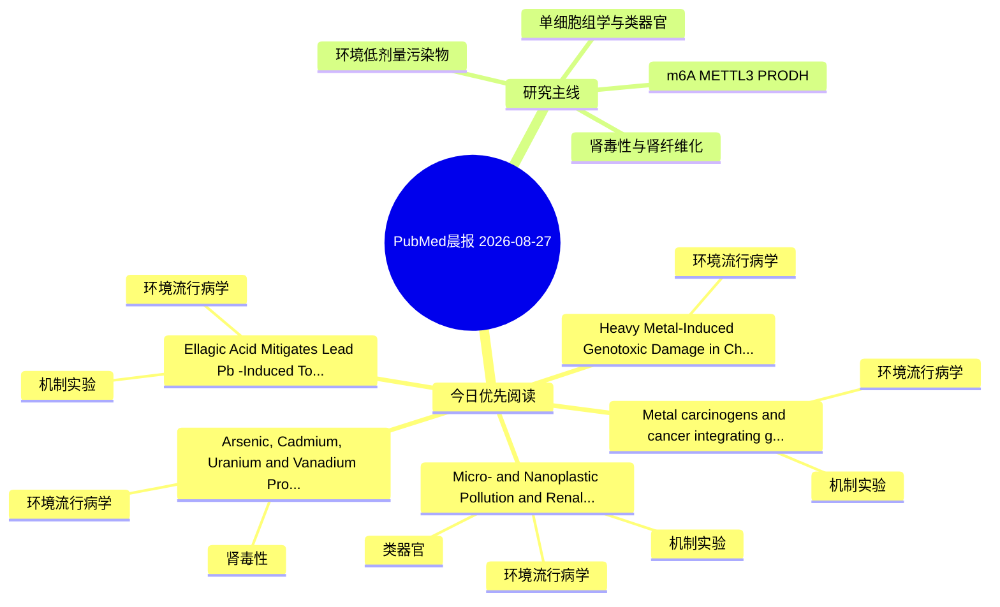

# PubMed 文献晨报｜2026-08-27

- 生成日期：2026-08-27 UTC
- 检索窗口：近 24 小时
- 高质量阈值：规则评分 ≥ 7
- 近 24 小时原始命中数：10

## 今日总体判断

今日筛选出 5 篇优先阅读文献，主要集中在：环境流行病学、机制实验、肾毒性。

## 今日最值得读的 5 篇文章

### 1. Micro- and Nanoplastic Pollution and Renal Health: Human Evidence, Mechanisms, and Clinical Implications.

- 题目：Micro- and Nanoplastic Pollution and Renal Health: Human Evidence, Mechanisms, and Clinical Implications.
- 期刊：Journal of xenobiotics
- 年份：2026
- PMID：[42646063](https://pubmed.ncbi.nlm.nih.gov/42646063/)
- DOI：[10.3390/jox16040149](https://doi.org/10.3390/jox16040149)
- 分类：环境流行病学、机制实验、类器官、肾毒性
- 规则评分：17
- 研究对象：人群/队列或环境暴露人群
- 核心方法：环境流行病学/队列或人群数据；类器官/干细胞模型
- 主要发现：摘要提示研究重点涉及肾毒性/肾损伤、类器官模型；结论线索为：Standardized methods, paired-matrix kinetics, prospective cohorts, and complete dialysis mass-balance studies are priorities.
- 为什么值得读：同时连接环境暴露与机制线索；与肾毒性/肾损伤主线直接相关；对建立更接近人体的模型有参考价值

### 2. Arsenic, Cadmium, Uranium and Vanadium Produce Shared and Distinct Gene Expression Signatures in Primary Human Renal Cells.

- 题目：Arsenic, Cadmium, Uranium and Vanadium Produce Shared and Distinct Gene Expression Signatures in Primary Human Renal Cells.
- 期刊：Toxics
- 年份：2026
- PMID：[42646929](https://pubmed.ncbi.nlm.nih.gov/42646929/)
- DOI：[10.3390/toxics14080648](https://doi.org/10.3390/toxics14080648)
- 分类：环境流行病学、肾毒性
- 规则评分：15
- 研究对象：人群/队列或环境暴露人群
- 核心方法：基于题名/摘要的常规实验或文献分析，需阅读全文确认
- 主要发现：摘要提示研究重点涉及环境污染物暴露；结论线索为：These findings demonstrate that environmentally relevant metals act through both shared mechanistic pathways and distinct, metal-specific mechanisms.
- 为什么值得读：与肾毒性/肾损伤主线直接相关；关键词匹配度较高

### 3. Heavy Metal-Induced Genotoxic Damage in Chelon auratus: Evidence from a Coastal Gulf Ecosystem.

- 题目：Heavy Metal-Induced Genotoxic Damage in Chelon auratus: Evidence from a Coastal Gulf Ecosystem.
- 期刊：Toxics
- 年份：2026
- PMID：[42647014](https://pubmed.ncbi.nlm.nih.gov/42647014/)
- DOI：[10.3390/toxics14080732](https://doi.org/10.3390/toxics14080732)
- 分类：环境流行病学
- 规则评分：12
- 研究对象：题名和摘要未明确，建议阅读全文确认
- 核心方法：环境流行病学/队列或人群数据
- 主要发现：摘要提示研究重点涉及环境污染物暴露；结论线索为：From the results of the micronucleus test performed in the present study, the highest MN frequencies (10.16 ± 0.15%) and other erythrocytic nuclear anomalies [kidney-shaped (10.36 ± 0.32%), binucleated (14.20 ± 0.10%), notched (14.63 ± 0.20%), lobed (15.43...
- 为什么值得读：关键词匹配度较高

### 4. Ellagic Acid Mitigates Lead (Pb)-Induced Toxicity in Cyprinus carpio: A Multi-Biomarker Assessment of Hematological, Immunological, and Oxidative Stress Responses Supported by Molecular Docking.

- 题目：Ellagic Acid Mitigates Lead (Pb)-Induced Toxicity in Cyprinus carpio: A Multi-Biomarker Assessment of Hematological, Immunological, and Oxidative Stress Responses Supported by Molecular Docking.
- 期刊：Antioxidants (Basel, Switzerland)
- 年份：2026
- PMID：[42650284](https://pubmed.ncbi.nlm.nih.gov/42650284/)
- DOI：[10.3390/antiox15081020](https://doi.org/10.3390/antiox15081020)
- 分类：环境流行病学、机制实验
- 规则评分：12
- 研究对象：题名和摘要未明确，建议阅读全文确认
- 核心方法：基于题名/摘要的常规实验或文献分析，需阅读全文确认
- 主要发现：摘要提示研究重点涉及环境污染物暴露；结论线索为：Overall, the findings demonstrate that Pb-induced toxicity involves coordinated disruption of redox homeostasis and immune function, whereas EA exerts a multi-target protective effect through biochemical and molecular mechanisms.
- 为什么值得读：同时连接环境暴露与机制线索；关键词匹配度较高

### 5. Metal carcinogens and cancer: integrating genetic and epigenetic perspectives.

- 题目：Metal carcinogens and cancer: integrating genetic and epigenetic perspectives.
- 期刊：Frontiers in oncology
- 年份：2026
- PMID：[42657254](https://pubmed.ncbi.nlm.nih.gov/42657254/)
- DOI：[10.3389/fonc.2026.1896466](https://doi.org/10.3389/fonc.2026.1896466)
- 分类：环境流行病学、机制实验
- 规则评分：11
- 研究对象：题名和摘要未明确，建议阅读全文确认
- 核心方法：m6A RNA修饰检测
- 主要发现：摘要提示研究重点涉及环境污染物暴露；结论线索为：These toxic metals are ubiquitously found in food, air, water, and industrial, agricultural, or pharmaceutical applications.
- 为什么值得读：同时连接环境暴露与机制线索

## 分类归档

### 环境流行病学
- [Micro- and Nanoplastic Pollution and Renal Health: Human Evidence, Mechanisms, and Clinical Implications.](https://pubmed.ncbi.nlm.nih.gov/42646063/)（PMID: 42646063）
- [Arsenic, Cadmium, Uranium and Vanadium Produce Shared and Distinct Gene Expression Signatures in Primary Human Renal Cells.](https://pubmed.ncbi.nlm.nih.gov/42646929/)（PMID: 42646929）
- [Heavy Metal-Induced Genotoxic Damage in Chelon auratus: Evidence from a Coastal Gulf Ecosystem.](https://pubmed.ncbi.nlm.nih.gov/42647014/)（PMID: 42647014）
- [Ellagic Acid Mitigates Lead (Pb)-Induced Toxicity in Cyprinus carpio: A Multi-Biomarker Assessment of Hematological, Immunological, and Oxidative Stress Responses Supported by Molecular Docking.](https://pubmed.ncbi.nlm.nih.gov/42650284/)（PMID: 42650284）
- [Metal carcinogens and cancer: integrating genetic and epigenetic perspectives.](https://pubmed.ncbi.nlm.nih.gov/42657254/)（PMID: 42657254）

### 机制实验
- [Micro- and Nanoplastic Pollution and Renal Health: Human Evidence, Mechanisms, and Clinical Implications.](https://pubmed.ncbi.nlm.nih.gov/42646063/)（PMID: 42646063）
- [Ellagic Acid Mitigates Lead (Pb)-Induced Toxicity in Cyprinus carpio: A Multi-Biomarker Assessment of Hematological, Immunological, and Oxidative Stress Responses Supported by Molecular Docking.](https://pubmed.ncbi.nlm.nih.gov/42650284/)（PMID: 42650284）
- [Metal carcinogens and cancer: integrating genetic and epigenetic perspectives.](https://pubmed.ncbi.nlm.nih.gov/42657254/)（PMID: 42657254）

### 单细胞组学
- 今日暂无高质量新文献。

### 类器官
- [Micro- and Nanoplastic Pollution and Renal Health: Human Evidence, Mechanisms, and Clinical Implications.](https://pubmed.ncbi.nlm.nih.gov/42646063/)（PMID: 42646063）

### 肾毒性
- [Micro- and Nanoplastic Pollution and Renal Health: Human Evidence, Mechanisms, and Clinical Implications.](https://pubmed.ncbi.nlm.nih.gov/42646063/)（PMID: 42646063）
- [Arsenic, Cadmium, Uranium and Vanadium Produce Shared and Distinct Gene Expression Signatures in Primary Human Renal Cells.](https://pubmed.ncbi.nlm.nih.gov/42646929/)（PMID: 42646929）

### m6A-METTL3-PRODH
- 今日暂无高质量新文献。

## 今日阅读优先级

1. Micro- and Nanoplastic Pollution and Renal Health: Human Evidence, Mechanisms, and Clinical Implications.（优先理由：同时连接环境暴露与机制线索；与肾毒性/肾损伤主线直接相关；对建立更接近人体的模型有参考价值）
2. Arsenic, Cadmium, Uranium and Vanadium Produce Shared and Distinct Gene Expression Signatures in Primary Human Renal Cells.（优先理由：与肾毒性/肾损伤主线直接相关；关键词匹配度较高）
3. Heavy Metal-Induced Genotoxic Damage in Chelon auratus: Evidence from a Coastal Gulf Ecosystem.（优先理由：关键词匹配度较高）
4. Ellagic Acid Mitigates Lead (Pb)-Induced Toxicity in Cyprinus carpio: A Multi-Biomarker Assessment of Hematological, Immunological, and Oxidative Stress Responses Supported by Molecular Docking.（优先理由：同时连接环境暴露与机制线索；关键词匹配度较高）
5. Metal carcinogens and cancer: integrating genetic and epigenetic perspectives.（优先理由：同时连接环境暴露与机制线索）

## Mermaid 思维导图

