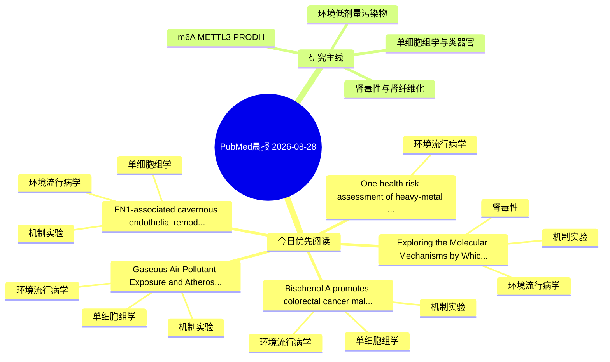

# PubMed 文献晨报｜2026-08-28

- 生成日期：2026-08-28 UTC
- 检索窗口：近 24 小时
- 高质量阈值：规则评分 ≥ 7
- 近 24 小时原始命中数：10

## 今日总体判断

今日筛选出 5 篇优先阅读文献，主要集中在：环境流行病学、机制实验、单细胞组学。

## 今日最值得读的 5 篇文章

### 1. Exploring the Molecular Mechanisms by Which DEHP Promotes the Occurrence and Progression of Kidney Stones Based on Network Toxicology and Experimental Validation.

- 题目：Exploring the Molecular Mechanisms by Which DEHP Promotes the Occurrence and Progression of Kidney Stones Based on Network Toxicology and Experimental Validation.
- 期刊：International journal of general medicine
- 年份：2026
- PMID：[42662485](https://pubmed.ncbi.nlm.nih.gov/42662485/)
- DOI：[10.2147/IJGM.S623192](https://doi.org/10.2147/IJGM.S623192)
- 分类：环境流行病学、机制实验、肾毒性
- 规则评分：20
- 研究对象：HK-2 近端肾小管上皮细胞
- 核心方法：细胞与动物机制实验
- 主要发现：摘要提示研究重点涉及环境污染物暴露；结论线索为：CONCLUSION: DEHP aggravates calcium oxalate crystal-induced renal injury and promotes kidney stones, potentially by disrupting apoptosis-autophagy homeostasis in renal tubular epithelial cells.
- 为什么值得读：同时连接环境暴露与机制线索；与肾毒性/肾损伤主线直接相关；关键词匹配度较高

### 2. Bisphenol A promotes colorectal cancer malignancy through CXCL8 upregulation associated with p38 MAPK activation: A potential link to type 2 diabetes mellitus comorbidity.

- 题目：Bisphenol A promotes colorectal cancer malignancy through CXCL8 upregulation associated with p38 MAPK activation: A potential link to type 2 diabetes mellitus comorbidity.
- 期刊：Chemico-biological interactions
- 年份：2026
- PMID：[42660439](https://pubmed.ncbi.nlm.nih.gov/42660439/)
- DOI：[10.1016/j.cbi.2026.112321](https://doi.org/10.1016/j.cbi.2026.112321)
- 分类：环境流行病学、机制实验、单细胞组学
- 规则评分：10
- 研究对象：人群/队列或环境暴露人群
- 核心方法：环境流行病学/队列或人群数据；单细胞或空间组学；细胞与动物机制实验
- 主要发现：摘要提示研究重点涉及单细胞或空间组学；结论线索为：CONCLUSIONS: BPA-induced CXCL8 upregulation is associated with CRC malignant progression and enhanced p38 MAPK signaling.
- 为什么值得读：同时连接环境暴露与机制线索；可帮助寻找细胞类型特异性机制

### 3. Gaseous Air Pollutant Exposure and Atherosclerosis: A Systematic Study Integrating Multi-Omics and Network Toxicology.

- 题目：Gaseous Air Pollutant Exposure and Atherosclerosis: A Systematic Study Integrating Multi-Omics and Network Toxicology.
- 期刊：International journal of molecular sciences
- 年份：2026
- PMID：[42653384](https://pubmed.ncbi.nlm.nih.gov/42653384/)
- DOI：[10.3390/ijms27167381](https://doi.org/10.3390/ijms27167381)
- 分类：环境流行病学、机制实验、单细胞组学
- 规则评分：10
- 研究对象：患者样本或临床数据
- 核心方法：单细胞或空间组学；细胞与动物机制实验
- 主要发现：摘要提示研究重点涉及环境污染物暴露、单细胞或空间组学；结论线索为：These findings highlight an immune-metabolic interplay centered on the RXRA-MMP9-TNF axis in Gaseous air pollution-driven atherosclerosis, supporting these molecules as candidate biomarkers for environmental health strategies.
- 为什么值得读：同时连接环境暴露与机制线索；可帮助寻找细胞类型特异性机制

### 4. FN1-associated cavernous endothelial remodeling induced by bisphenol A: relevance to erectile dysfunction and attenuation by baicalin.

- 题目：FN1-associated cavernous endothelial remodeling induced by bisphenol A: relevance to erectile dysfunction and attenuation by baicalin.
- 期刊：Frontiers in nutrition
- 年份：2026
- PMID：[42661725](https://pubmed.ncbi.nlm.nih.gov/42661725/)
- DOI：[10.3389/fnut.2026.1920479](https://doi.org/10.3389/fnut.2026.1920479)
- 分类：环境流行病学、机制实验、单细胞组学
- 规则评分：10
- 研究对象：人群/队列或环境暴露人群
- 核心方法：单细胞或空间组学；细胞与动物机制实验
- 主要发现：摘要提示研究重点涉及单细胞或空间组学；结论线索为：CONCLUSION: FN1-associated endothelial remodeling may represent one component of BPA-related endothelial injury relevant to erectile dysfunction, while baicalin may provide partial protection.
- 为什么值得读：同时连接环境暴露与机制线索；可帮助寻找细胞类型特异性机制

### 5. One health risk assessment of heavy-metal contamination in Nile tilapia (Oreochromis niloticus) from contrasting aquaculture systems in Egypt.

- 题目：One health risk assessment of heavy-metal contamination in Nile tilapia (Oreochromis niloticus) from contrasting aquaculture systems in Egypt.
- 期刊：Toxicology reports
- 年份：2026
- PMID：[42662802](https://pubmed.ncbi.nlm.nih.gov/42662802/)
- DOI：[10.1016/j.toxrep.2026.102331](https://doi.org/10.1016/j.toxrep.2026.102331)
- 分类：环境流行病学
- 规则评分：9
- 研究对象：人群/队列或环境暴露人群
- 核心方法：基于题名/摘要的常规实验或文献分析，需阅读全文确认
- 主要发现：摘要提示研究重点涉及环境污染物暴露；结论线索为：This One Health assessment supports sustainable aquaculture management in Egypt.
- 为什么值得读：与检索主题有交集，可作为背景或线索文献扫读

## 分类归档

### 环境流行病学
- [Exploring the Molecular Mechanisms by Which DEHP Promotes the Occurrence and Progression of Kidney Stones Based on Network Toxicology and Experimental Validation.](https://pubmed.ncbi.nlm.nih.gov/42662485/)（PMID: 42662485）
- [Bisphenol A promotes colorectal cancer malignancy through CXCL8 upregulation associated with p38 MAPK activation: A potential link to type 2 diabetes mellitus comorbidity.](https://pubmed.ncbi.nlm.nih.gov/42660439/)（PMID: 42660439）
- [Gaseous Air Pollutant Exposure and Atherosclerosis: A Systematic Study Integrating Multi-Omics and Network Toxicology.](https://pubmed.ncbi.nlm.nih.gov/42653384/)（PMID: 42653384）
- [FN1-associated cavernous endothelial remodeling induced by bisphenol A: relevance to erectile dysfunction and attenuation by baicalin.](https://pubmed.ncbi.nlm.nih.gov/42661725/)（PMID: 42661725）
- [One health risk assessment of heavy-metal contamination in Nile tilapia (Oreochromis niloticus) from contrasting aquaculture systems in Egypt.](https://pubmed.ncbi.nlm.nih.gov/42662802/)（PMID: 42662802）

### 机制实验
- [Exploring the Molecular Mechanisms by Which DEHP Promotes the Occurrence and Progression of Kidney Stones Based on Network Toxicology and Experimental Validation.](https://pubmed.ncbi.nlm.nih.gov/42662485/)（PMID: 42662485）
- [Bisphenol A promotes colorectal cancer malignancy through CXCL8 upregulation associated with p38 MAPK activation: A potential link to type 2 diabetes mellitus comorbidity.](https://pubmed.ncbi.nlm.nih.gov/42660439/)（PMID: 42660439）
- [Gaseous Air Pollutant Exposure and Atherosclerosis: A Systematic Study Integrating Multi-Omics and Network Toxicology.](https://pubmed.ncbi.nlm.nih.gov/42653384/)（PMID: 42653384）
- [FN1-associated cavernous endothelial remodeling induced by bisphenol A: relevance to erectile dysfunction and attenuation by baicalin.](https://pubmed.ncbi.nlm.nih.gov/42661725/)（PMID: 42661725）

### 单细胞组学
- [Bisphenol A promotes colorectal cancer malignancy through CXCL8 upregulation associated with p38 MAPK activation: A potential link to type 2 diabetes mellitus comorbidity.](https://pubmed.ncbi.nlm.nih.gov/42660439/)（PMID: 42660439）
- [Gaseous Air Pollutant Exposure and Atherosclerosis: A Systematic Study Integrating Multi-Omics and Network Toxicology.](https://pubmed.ncbi.nlm.nih.gov/42653384/)（PMID: 42653384）
- [FN1-associated cavernous endothelial remodeling induced by bisphenol A: relevance to erectile dysfunction and attenuation by baicalin.](https://pubmed.ncbi.nlm.nih.gov/42661725/)（PMID: 42661725）

### 类器官
- 今日暂无高质量新文献。

### 肾毒性
- [Exploring the Molecular Mechanisms by Which DEHP Promotes the Occurrence and Progression of Kidney Stones Based on Network Toxicology and Experimental Validation.](https://pubmed.ncbi.nlm.nih.gov/42662485/)（PMID: 42662485）

### m6A-METTL3-PRODH
- 今日暂无高质量新文献。

## 今日阅读优先级

1. Exploring the Molecular Mechanisms by Which DEHP Promotes the Occurrence and Progression of Kidney Stones Based on Network Toxicology and Experimental Validation.（优先理由：同时连接环境暴露与机制线索；与肾毒性/肾损伤主线直接相关；关键词匹配度较高）
2. Bisphenol A promotes colorectal cancer malignancy through CXCL8 upregulation associated with p38 MAPK activation: A potential link to type 2 diabetes mellitus comorbidity.（优先理由：同时连接环境暴露与机制线索；可帮助寻找细胞类型特异性机制）
3. Gaseous Air Pollutant Exposure and Atherosclerosis: A Systematic Study Integrating Multi-Omics and Network Toxicology.（优先理由：同时连接环境暴露与机制线索；可帮助寻找细胞类型特异性机制）
4. FN1-associated cavernous endothelial remodeling induced by bisphenol A: relevance to erectile dysfunction and attenuation by baicalin.（优先理由：同时连接环境暴露与机制线索；可帮助寻找细胞类型特异性机制）
5. One health risk assessment of heavy-metal contamination in Nile tilapia (Oreochromis niloticus) from contrasting aquaculture systems in Egypt.（优先理由：与检索主题有交集，可作为背景或线索文献扫读）

## Mermaid 思维导图

