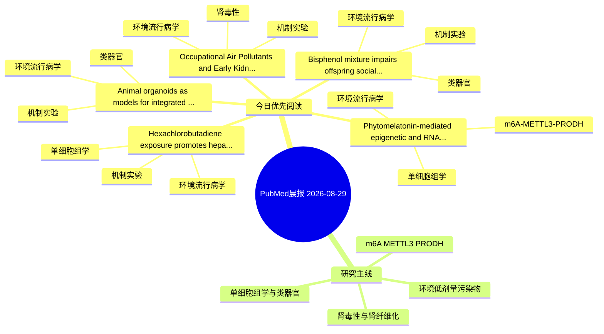

# PubMed 文献晨报｜2026-08-29

- 生成日期：2026-08-29 UTC
- 检索窗口：近 24 小时
- 高质量阈值：规则评分 ≥ 7
- 近 24 小时原始命中数：13

## 今日总体判断

今日筛选出 5 篇优先阅读文献，主要集中在：环境流行病学、机制实验、单细胞组学。

## 今日最值得读的 5 篇文章

### 1. Phytomelatonin-mediated epigenetic and RNA regulatory networks in plant abiotic stress resilience.

- 题目：Phytomelatonin-mediated epigenetic and RNA regulatory networks in plant abiotic stress resilience.
- 期刊：Plant physiology and biochemistry : PPB
- 年份：2026
- PMID：[42664688](https://pubmed.ncbi.nlm.nih.gov/42664688/)
- DOI：[10.1016/j.plaphy.2026.111692](https://doi.org/10.1016/j.plaphy.2026.111692)
- 分类：环境流行病学、单细胞组学、m6A-METTL3-PRODH
- 规则评分：14
- 研究对象：题名和摘要未明确，建议阅读全文确认
- 核心方法：单细胞或空间组学；m6A RNA修饰检测
- 主要发现：摘要提示研究重点涉及环境污染物暴露、m6A-METTL3/PRODH 调控、单细胞或空间组学；结论线索为：Finally, we outline how single-cell multi-omics, targeted epigenome editing, epitranscriptomic profiling and field-scale validation of priming strategies can transform this conceptual framework into testable mechanisms and crop-improvement strategies.
- 为什么值得读：可帮助寻找细胞类型特异性机制；贴近 m6A-METTL3-PRODH 调控假说；关键词匹配度较高

### 2. Occupational Air Pollutants and Early Kidney Injury: Insights from Oxidative Stress and KIM-1 Biomonitoring in Iron and Steel Industry Workers.

- 题目：Occupational Air Pollutants and Early Kidney Injury: Insights from Oxidative Stress and KIM-1 Biomonitoring in Iron and Steel Industry Workers.
- 期刊：Journal of occupational and environmental medicine
- 年份：2026
- PMID：[42664436](https://pubmed.ncbi.nlm.nih.gov/42664436/)
- DOI：[10.1097/JOM.0000000000003871](https://doi.org/10.1097/JOM.0000000000003871)
- 分类：环境流行病学、机制实验、肾毒性
- 规则评分：12
- 研究对象：题名和摘要未明确，建议阅读全文确认
- 核心方法：环境流行病学/队列或人群数据
- 主要发现：摘要提示研究重点涉及环境污染物暴露、肾毒性/肾损伤；结论线索为：CONCLUSION: Occupational exposure to air pollutants may adversely affect renal function, even when exposure levels comply with established regulatory standards.
- 为什么值得读：同时连接环境暴露与机制线索；与肾毒性/肾损伤主线直接相关；关键词匹配度较高

### 3. Hexachlorobutadiene exposure promotes hepatocellular carcinoma progression via CD8+ T dysfunction and VDR-mediated PI3K/AKT activation: An integrated multi-omics and experimental study.

- 题目：Hexachlorobutadiene exposure promotes hepatocellular carcinoma progression via CD8+ T dysfunction and VDR-mediated PI3K/AKT activation: An integrated multi-omics and experimental study.
- 期刊：Ecotoxicology and environmental safety
- 年份：2026
- PMID：[42664556](https://pubmed.ncbi.nlm.nih.gov/42664556/)
- DOI：[10.1016/j.ecoenv.2026.120735](https://doi.org/10.1016/j.ecoenv.2026.120735)
- 分类：环境流行病学、机制实验、单细胞组学
- 规则评分：10
- 研究对象：题名和摘要未明确，建议阅读全文确认
- 核心方法：单细胞或空间组学
- 主要发现：摘要提示研究重点涉及环境污染物暴露、单细胞或空间组学；结论线索为：Single-cell transcriptomic analysis further revealed that HCBD targets were associated with CD8⁺ T cell differentiation toward an exhaustion-associated phenotype in HCC patients, which was validated by flow cytometry showing increased expression of exhausti...
- 为什么值得读：同时连接环境暴露与机制线索；可帮助寻找细胞类型特异性机制

### 4. Bisphenol mixture impairs offspring social memory via an H4K8 Lactylation-Fyn-Microglial synaptic pruning axis.

- 题目：Bisphenol mixture impairs offspring social memory via an H4K8 Lactylation-Fyn-Microglial synaptic pruning axis.
- 期刊：Environment international
- 年份：2026
- PMID：[42664871](https://pubmed.ncbi.nlm.nih.gov/42664871/)
- DOI：[10.1016/j.envint.2026.110482](https://doi.org/10.1016/j.envint.2026.110482)
- 分类：环境流行病学、机制实验、类器官
- 规则评分：10
- 研究对象：人群/队列或环境暴露人群
- 核心方法：环境流行病学/队列或人群数据；类器官/干细胞模型
- 主要发现：摘要提示研究重点涉及类器官模型；结论线索为：Here, we show that maternal exposure to an environmentally relevant bisphenol mixture during pregnancy and lactation elicits aberrant microglial activation in male offspring, mediated by estrogen receptor β-dependent metabolic reprogramming.
- 为什么值得读：同时连接环境暴露与机制线索；对建立更接近人体的模型有参考价值

### 5. Animal organoids as models for integrated One Health research.

- 题目：Animal organoids as models for integrated One Health research.
- 期刊：One health (Amsterdam, Netherlands)
- 年份：2026
- PMID：[42662732](https://pubmed.ncbi.nlm.nih.gov/42662732/)
- DOI：[10.1016/j.onehlt.2026.101539](https://doi.org/10.1016/j.onehlt.2026.101539)
- 分类：环境流行病学、机制实验、类器官
- 规则评分：9
- 研究对象：人群/队列或环境暴露人群
- 核心方法：类器官/干细胞模型；细胞与动物机制实验
- 主要发现：摘要提示研究重点涉及环境污染物暴露、类器官模型；结论线索为：We further explore the applications of these new approach methodologies in the context of OH in studying cross-species diseases, zoonotic infections, environmental pollutant, chemical biocides toxicity, antimicrobial resistance, animal breeding, and pandemi...
- 为什么值得读：同时连接环境暴露与机制线索；对建立更接近人体的模型有参考价值

## 分类归档

### 环境流行病学
- [Phytomelatonin-mediated epigenetic and RNA regulatory networks in plant abiotic stress resilience.](https://pubmed.ncbi.nlm.nih.gov/42664688/)（PMID: 42664688）
- [Occupational Air Pollutants and Early Kidney Injury: Insights from Oxidative Stress and KIM-1 Biomonitoring in Iron and Steel Industry Workers.](https://pubmed.ncbi.nlm.nih.gov/42664436/)（PMID: 42664436）
- [Hexachlorobutadiene exposure promotes hepatocellular carcinoma progression via CD8+ T dysfunction and VDR-mediated PI3K/AKT activation: An integrated multi-omics and experimental study.](https://pubmed.ncbi.nlm.nih.gov/42664556/)（PMID: 42664556）
- [Bisphenol mixture impairs offspring social memory via an H4K8 Lactylation-Fyn-Microglial synaptic pruning axis.](https://pubmed.ncbi.nlm.nih.gov/42664871/)（PMID: 42664871）
- [Animal organoids as models for integrated One Health research.](https://pubmed.ncbi.nlm.nih.gov/42662732/)（PMID: 42662732）

### 机制实验
- [Occupational Air Pollutants and Early Kidney Injury: Insights from Oxidative Stress and KIM-1 Biomonitoring in Iron and Steel Industry Workers.](https://pubmed.ncbi.nlm.nih.gov/42664436/)（PMID: 42664436）
- [Hexachlorobutadiene exposure promotes hepatocellular carcinoma progression via CD8+ T dysfunction and VDR-mediated PI3K/AKT activation: An integrated multi-omics and experimental study.](https://pubmed.ncbi.nlm.nih.gov/42664556/)（PMID: 42664556）
- [Bisphenol mixture impairs offspring social memory via an H4K8 Lactylation-Fyn-Microglial synaptic pruning axis.](https://pubmed.ncbi.nlm.nih.gov/42664871/)（PMID: 42664871）
- [Animal organoids as models for integrated One Health research.](https://pubmed.ncbi.nlm.nih.gov/42662732/)（PMID: 42662732）

### 单细胞组学
- [Phytomelatonin-mediated epigenetic and RNA regulatory networks in plant abiotic stress resilience.](https://pubmed.ncbi.nlm.nih.gov/42664688/)（PMID: 42664688）
- [Hexachlorobutadiene exposure promotes hepatocellular carcinoma progression via CD8+ T dysfunction and VDR-mediated PI3K/AKT activation: An integrated multi-omics and experimental study.](https://pubmed.ncbi.nlm.nih.gov/42664556/)（PMID: 42664556）

### 类器官
- [Bisphenol mixture impairs offspring social memory via an H4K8 Lactylation-Fyn-Microglial synaptic pruning axis.](https://pubmed.ncbi.nlm.nih.gov/42664871/)（PMID: 42664871）
- [Animal organoids as models for integrated One Health research.](https://pubmed.ncbi.nlm.nih.gov/42662732/)（PMID: 42662732）

### 肾毒性
- [Occupational Air Pollutants and Early Kidney Injury: Insights from Oxidative Stress and KIM-1 Biomonitoring in Iron and Steel Industry Workers.](https://pubmed.ncbi.nlm.nih.gov/42664436/)（PMID: 42664436）

### m6A-METTL3-PRODH
- [Phytomelatonin-mediated epigenetic and RNA regulatory networks in plant abiotic stress resilience.](https://pubmed.ncbi.nlm.nih.gov/42664688/)（PMID: 42664688）

## 今日阅读优先级

1. Phytomelatonin-mediated epigenetic and RNA regulatory networks in plant abiotic stress resilience.（优先理由：可帮助寻找细胞类型特异性机制；贴近 m6A-METTL3-PRODH 调控假说；关键词匹配度较高）
2. Occupational Air Pollutants and Early Kidney Injury: Insights from Oxidative Stress and KIM-1 Biomonitoring in Iron and Steel Industry Workers.（优先理由：同时连接环境暴露与机制线索；与肾毒性/肾损伤主线直接相关；关键词匹配度较高）
3. Hexachlorobutadiene exposure promotes hepatocellular carcinoma progression via CD8+ T dysfunction and VDR-mediated PI3K/AKT activation: An integrated multi-omics and experimental study.（优先理由：同时连接环境暴露与机制线索；可帮助寻找细胞类型特异性机制）
4. Bisphenol mixture impairs offspring social memory via an H4K8 Lactylation-Fyn-Microglial synaptic pruning axis.（优先理由：同时连接环境暴露与机制线索；对建立更接近人体的模型有参考价值）
5. Animal organoids as models for integrated One Health research.（优先理由：同时连接环境暴露与机制线索；对建立更接近人体的模型有参考价值）

## Mermaid 思维导图

