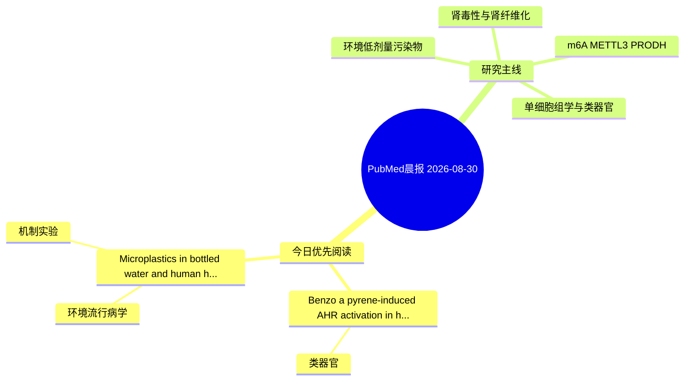

# PubMed 文献晨报｜2026-08-30

- 生成日期：2026-08-30 UTC
- 检索窗口：近 24 小时
- 高质量阈值：规则评分 ≥ 7
- 近 24 小时原始命中数：2

## 今日总体判断

今日筛选出 2 篇优先阅读文献，主要集中在：类器官、环境流行病学、机制实验。

## 今日最值得读的 5 篇文章

### 1. Benzo[a]pyrene-induced AHR activation in human ESCs primes premature neurogenesis in cerebral organoids.

- 题目：Benzo[a]pyrene-induced AHR activation in human ESCs primes premature neurogenesis in cerebral organoids.
- 期刊：Journal of hazardous materials
- 年份：2026
- PMID：[42667716](https://pubmed.ncbi.nlm.nih.gov/42667716/)
- DOI：[10.1016/j.jhazmat.2026.143419](https://doi.org/10.1016/j.jhazmat.2026.143419)
- 分类：类器官
- 规则评分：10
- 研究对象：人群/队列或环境暴露人群
- 核心方法：类器官/干细胞模型
- 主要发现：摘要提示研究重点涉及环境污染物暴露、类器官模型；结论线索为：These findings identify AHR signaling as a critical upstream mediator of BaP-induced developmental neurotoxicity and highlight the vulnerability of early pluripotent stages to environmental insults.
- 为什么值得读：对建立更接近人体的模型有参考价值

### 2. Microplastics in bottled water and human health outcomes: a systematic review of multi-organ toxicity and mechanistic pathways.

- 题目：Microplastics in bottled water and human health outcomes: a systematic review of multi-organ toxicity and mechanistic pathways.
- 期刊：Journal of environmental science and health. Part C, Toxicology and carcinogenesis
- 年份：2026
- PMID：[42667298](https://pubmed.ncbi.nlm.nih.gov/42667298/)
- DOI：[10.1080/26896583.2026.2722385](https://doi.org/10.1080/26896583.2026.2722385)
- 分类：环境流行病学、机制实验
- 规则评分：8
- 研究对象：人群/队列或环境暴露人群
- 核心方法：环境流行病学/队列或人群数据；细胞与动物机制实验
- 主要发现：摘要提示研究重点涉及本方向相关问题；结论线索为：Chronic exposure to microplastics from bottled water may contribute to multisystem toxicity through oxido-inflammatory mechanisms.
- 为什么值得读：同时连接环境暴露与机制线索

## 分类归档

### 环境流行病学
- [Microplastics in bottled water and human health outcomes: a systematic review of multi-organ toxicity and mechanistic pathways.](https://pubmed.ncbi.nlm.nih.gov/42667298/)（PMID: 42667298）

### 机制实验
- [Microplastics in bottled water and human health outcomes: a systematic review of multi-organ toxicity and mechanistic pathways.](https://pubmed.ncbi.nlm.nih.gov/42667298/)（PMID: 42667298）

### 单细胞组学
- 今日暂无高质量新文献。

### 类器官
- [Benzo\[a\]pyrene-induced AHR activation in human ESCs primes premature neurogenesis in cerebral organoids.](https://pubmed.ncbi.nlm.nih.gov/42667716/)（PMID: 42667716）

### 肾毒性
- 今日暂无高质量新文献。

### m6A-METTL3-PRODH
- 今日暂无高质量新文献。

## 今日阅读优先级

1. Benzo[a]pyrene-induced AHR activation in human ESCs primes premature neurogenesis in cerebral organoids.（优先理由：对建立更接近人体的模型有参考价值）
2. Microplastics in bottled water and human health outcomes: a systematic review of multi-organ toxicity and mechanistic pathways.（优先理由：同时连接环境暴露与机制线索）

## Mermaid 思维导图

